# CRUDX Framework - Technical Documentation

**Version:** 1.0.1  
**Author:** Sachin Nimbal  
**Repository:** [github.com/sachinnimbal/crudx-starter](https://github.com/sachinnimbal/crudx-starter)

---

## Table of Contents

1. [Overview](#overview)
2. [Architecture](#architecture)
3. [Core Components](#core-components)
4. [Database Support](#database-support)
5. [Configuration](#configuration)
6. [API Documentation](#api-documentation)
7. [Performance Monitoring](#performance-monitoring)
8. [Class Reference](#class-reference)

---

## Overview

### What is CRUDX?

CRUDX is a **zero-boilerplate Spring Boot framework** that automatically generates complete CRUD operations for your
entities. It eliminates repetitive code by providing:

- ✅ **Auto-generated REST Controllers** - No manual controller creation needed
- ✅ **Automatic Service Layer** - Business logic handled transparently
- ✅ **Multi-Database Support** - MySQL, PostgreSQL, and MongoDB
- ✅ **Built-in Performance Monitoring** - Real-time metrics and dashboards
- ✅ **Batch Operations** - Optimized bulk create/delete with memory management
- ✅ **Smart Pagination** - Automatic handling of large datasets
- ✅ **Exception Handling** - Centralized error management
- ✅ **Unique Constraints** - Declarative validation support

### Key Benefits

| Feature              | Traditional Approach             | CRUDX Approach                                    |
|----------------------|----------------------------------|---------------------------------------------------|
| Controller           | Manual @RestController creation  | **Auto-generated** by extending `CrudXController` |
| Service Layer        | Manual @Service implementation   | **Auto-wired** dynamically at runtime             |
| Repository           | Manual @Repository interfaces    | **Handled internally** by framework               |
| Exception Handling   | Manual @ExceptionHandler methods | **Built-in** global handler                       |
| Pagination           | Manual Pageable configuration    | **Automatic** with smart defaults                 |
| Performance Tracking | Manual instrumentation           | **Optional** built-in metrics                     |

---

## Architecture

### High-Level Architecture

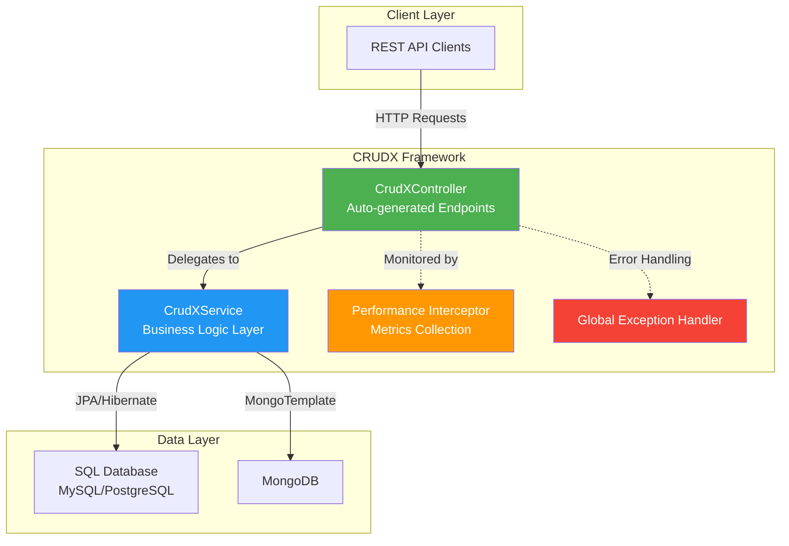

### Component Interaction Flow

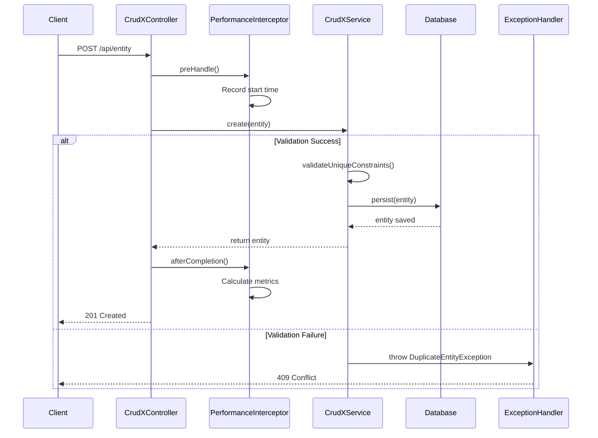

### Startup Initialization Flow

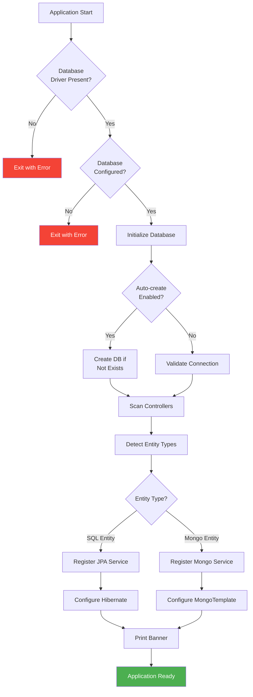

---

## Core Components

### 1. Entity Models

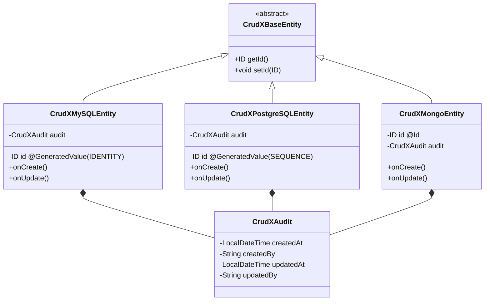

**Usage Example:**

```java

@Entity
@Table(name = "products")
@CrudXUniqueConstraint(fields = {"sku"}, message = "SKU must be unique")
public class Product extends CrudXMySQLEntity<Long> {
    private String sku;
    private String name;
    private BigDecimal price;
}
```

### 2. Controller Layer

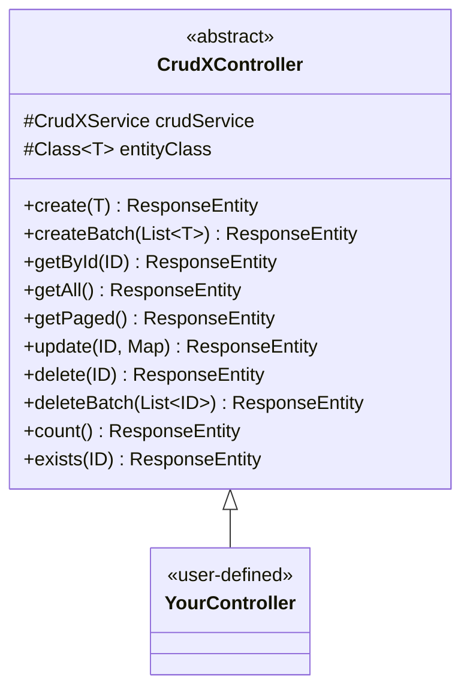

**Auto-generated Endpoints:**

| Method | Endpoint                  | Description                       |
|--------|---------------------------|-----------------------------------|
| POST   | `/api/entity`             | Create single entity              |
| POST   | `/api/entity/batch`       | Create multiple entities          |
| GET    | `/api/entity/{id}`        | Get by ID                         |
| GET    | `/api/entity`             | Get all (auto-paginated if >1000) |
| GET    | `/api/entity/paged`       | Get with pagination               |
| PATCH  | `/api/entity/{id}`        | Partial update                    |
| DELETE | `/api/entity/{id}`        | Delete by ID                      |
| DELETE | `/api/entity/batch`       | Delete multiple (with tracking)   |
| DELETE | `/api/entity/batch/force` | Delete multiple (skip checks)     |
| GET    | `/api/entity/count`       | Count all entities                |
| GET    | `/api/entity/exists/{id}` | Check existence                   |

### 3. Service Layer Architecture

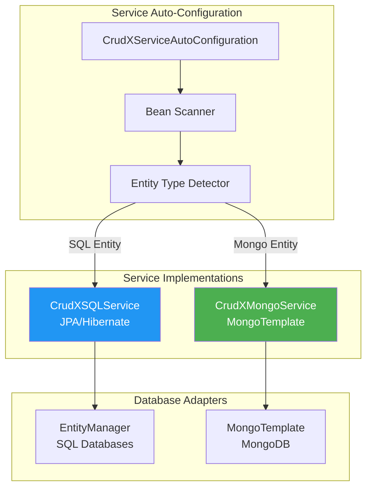

**Service Registration Process:**

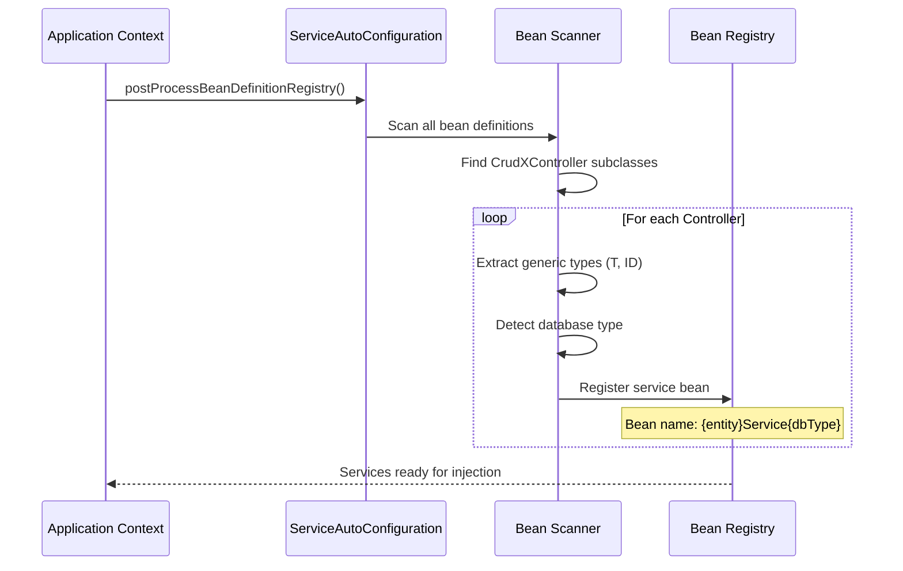

---

## Database Support

### Multi-Database Strategy

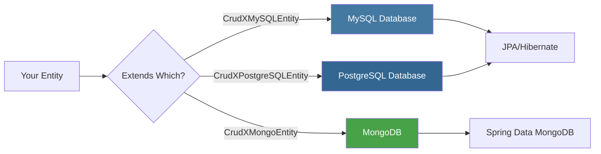

### Database Configuration Matrix

| Database       | Entity Base Class       | Required Dependencies              | Auto-create Support          |
|----------------|-------------------------|------------------------------------|------------------------------|
| **MySQL**      | `CrudXMySQLEntity`      | `mysql-connector-j`                | ✅ Yes (via CRUDX)            |
| **PostgreSQL** | `CrudXPostgreSQLEntity` | `postgresql`                       | ✅ Yes (via CRUDX)            |
| **MongoDB**    | `CrudXMongoEntity`      | `spring-boot-starter-data-mongodb` | ✅ Yes (automatic by MongoDB) |

**Note:** MongoDB automatically creates databases and collections on first write operation. No manual creation or CRUDX
configuration needed.

### Configuration Validation Flow

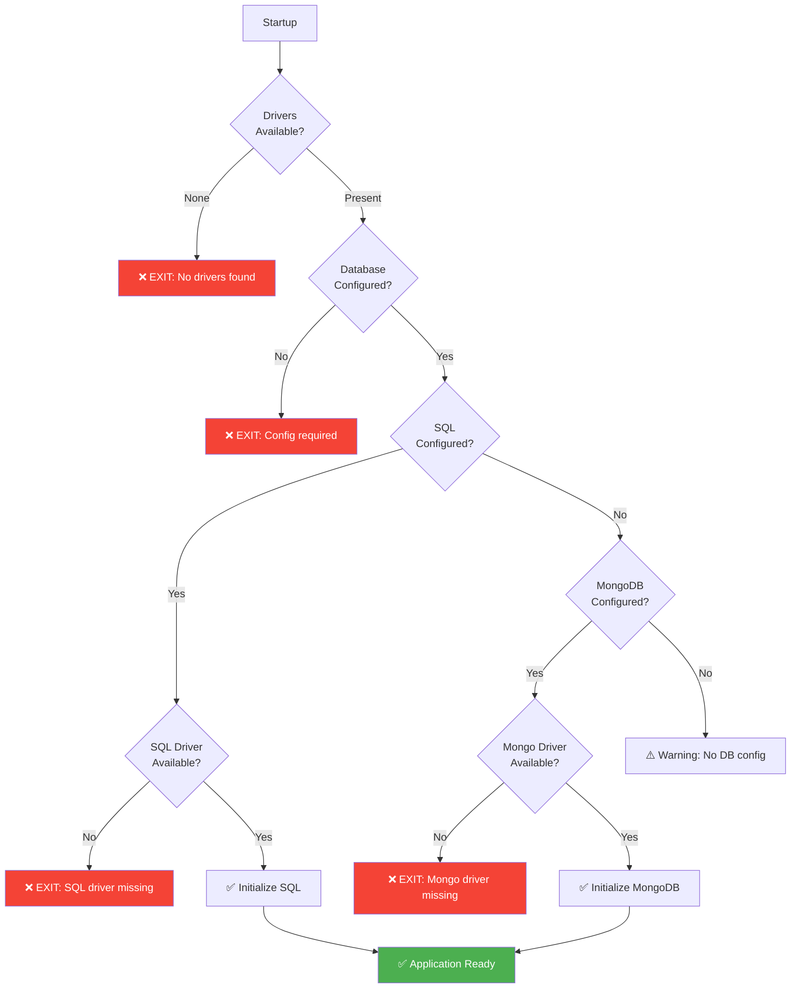

---

## Configuration

### Application Properties

```properties
# Database Configuration (Choose ONE)
# Option 1: MySQL
spring.datasource.url=jdbc:mysql://localhost:3306/mydb
spring.datasource.username=root
spring.datasource.password=password
spring.datasource.driver-class-name=com.mysql.cj.jdbc.Driver
# Option 2: PostgreSQL
spring.datasource.url=jdbc:postgresql://localhost:5432/mydb
spring.datasource.username=postgres
spring.datasource.password=password
spring.datasource.driver-class-name=org.postgresql.Driver
# Option 3: MongoDB
spring.data.mongodb.uri=mongodb://localhost:27017/mydb
# JPA/Hibernate (for SQL databases)
spring.jpa.hibernate.ddl-auto=update
spring.jpa.show-sql=false
spring.jpa.properties.hibernate.format_sql=true
# CRUDX Auto-create Database
crudx.database.auto-create=true
# Performance Monitoring (Optional)
crudx.performance.enabled=true
crudx.performance.dashboard-enabled=true
crudx.performance.dashboard-path=/crudx/performance
crudx.performance.track-memory=true
crudx.performance.max-stored-metrics=1000
crudx.performance.retention-minutes=60
```

### Gradle Dependencies

```gradle
dependencies {
    implementation 'io.github.sachinnimbal:crudx-starter:1.0.1'
    
    // Choose database driver(s)
    runtimeOnly 'com.mysql:mysql-connector-j:8.3.0'
    // OR
    runtimeOnly 'org.postgresql:postgresql:42.7.3'
    // OR
    implementation 'org.springframework.boot:spring-boot-starter-data-mongodb'
}
```

---

## API Documentation

### Standard Response Format

All endpoints return a consistent response structure:

```json
{
  "success": true,
  "message": "Operation successful",
  "statusCode": 200,
  "status": "OK",
  "data": {
    /* actual data */
  },
  "timestamp": "2025-10-09T14:30:00",
  "executionTime": "45 ms"
}
```

### Error Response Format

```json
{
  "success": false,
  "message": "Entity not found",
  "statusCode": 404,
  "status": "NOT_FOUND",
  "error": {
    "code": "ENTITY_NOT_FOUND",
    "details": "Product not found with id: 123"
  },
  "timestamp": "2025-10-09T14:30:00"
}
```

### Batch Operations

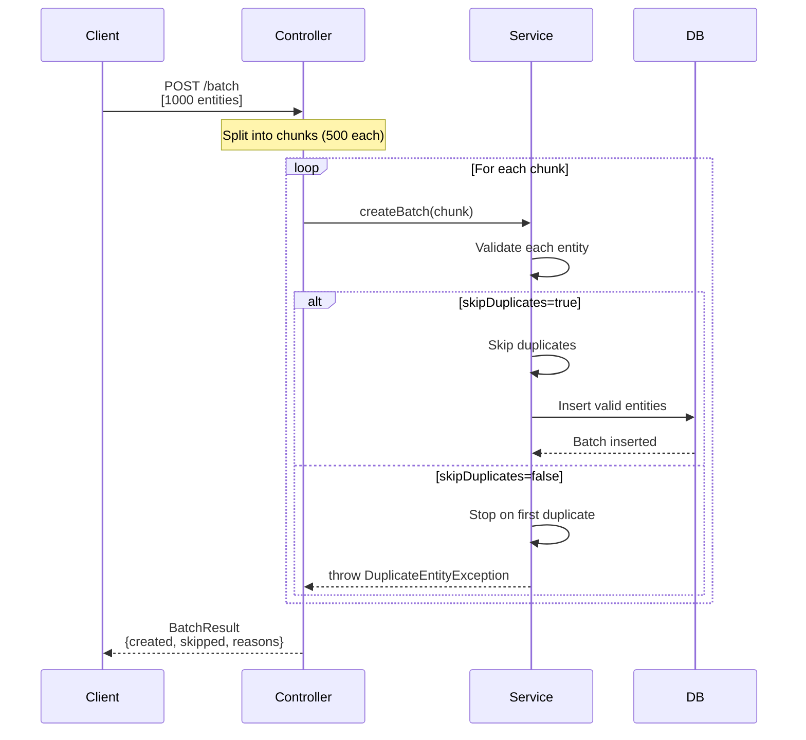

**Batch Result Response:**

```json
{
  "success": true,
  "message": "Batch creation completed: 950 created, 50 skipped",
  "data": {
    "createdEntities": [
      ...
    ],
    "skippedCount": 50,
    "totalProcessed": 1000,
    "skippedReasons": [
      "Entity at index 45 skipped - Duplicate SKU",
      "Entity at index 102 skipped - Duplicate SKU"
    ]
  },
  "executionTime": "2.5s (2500 ms)"
}
```

---

## Performance Monitoring

### Metrics Collection

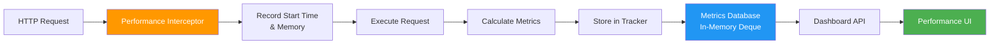

### Performance Dashboard

Access at: `http://localhost:8080/crudx/performance/dashboard`

**Features:**

- ✅ Real-time request metrics
- ✅ Execution time tracking
- ✅ Memory allocation per request
- ✅ Success/failure rates
- ✅ Slowest endpoints analysis
- ✅ Error frequency tracking
- ✅ Per-endpoint statistics

### Metrics Data Model

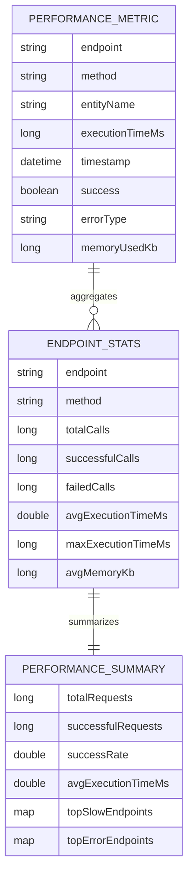

---

## Class Reference

### Package: `io.github.sachinnimbal.crudx.core.annotations`

#### `@CrudX`

**Purpose:** Enable CRUDX framework for the application  
**Usage:**

```java

@SpringBootApplication
@CrudX
public class Application {
    public static void main(String[] args) {
        SpringApplication.run(Application.class, args);
    }
}
```

#### `@CrudXUniqueConstraint`

**Purpose:** Declare unique field constraints  
**Attributes:**

- `fields`: String[] - Fields that must be unique together
- `message`: String - Custom error message

**Usage:**

```java

@CrudXUniqueConstraint(fields = {"email"}, message = "Email already exists")
@CrudXUniqueConstraint(fields = {"firstName", "lastName"}, message = "Name combination exists")
public class User extends CrudXMySQLEntity<Long> {
    // ...
}
```

---

### Package: `io.github.sachinnimbal.crudx.core.config`

#### `CrudXConfiguration`

**Purpose:** Main configuration class for framework initialization  
**Responsibilities:**

- Validates database configuration
- Conditionally enables JPA or MongoDB
- Registers component scans
- Configures Hibernate properties

**Key Methods:**

```java

@PostConstruct
public void validateDatabaseConfiguration()
```

- Checks for database drivers
- Validates connection properties
- Exits application if critical configuration missing

---

#### `CrudXDatabaseInitializer`

**Purpose:** Handles database auto-creation during startup (SQL only)  
**Implements:** `ApplicationContextInitializer`

**Workflow:**

1. Detects available database drivers
2. Extracts database name from JDBC URL (SQL databases only)
3. Creates database if `crudx.database.auto-create=true` (SQL only)
4. Validates connection

**Supported Operations:**

- **MySQL:** `CREATE DATABASE IF NOT EXISTS`
- **PostgreSQL:** `CREATE DATABASE` with existence check
- **MongoDB:** Not needed - MongoDB automatically creates databases and collections on first write operation

---

#### `CrudXServiceAutoConfiguration`

**Purpose:** Automatically discovers and registers service beans  
**Implements:** `BeanDefinitionRegistryPostProcessor`

**Process Flow:**

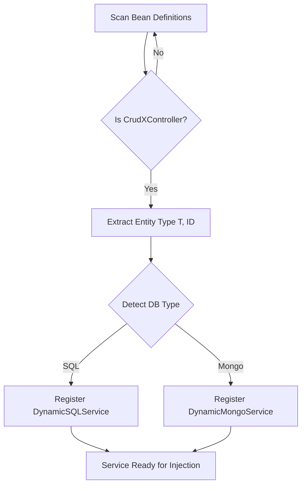

---

### Package: `io.github.sachinnimbal.crudx.core.model`

#### `CrudXAudit`

**Purpose:** Automatic timestamp management  
**Fields:**

- `createdAt`: LocalDateTime - Auto-set on creation
- `createdBy`: String - User who created (manual)
- `updatedAt`: LocalDateTime - Auto-updated on changes
- `updatedBy`: String - User who updated (manual)

**JPA Annotations:**

- `@CreatedDate` - Spring Data auditing
- `@LastModifiedDate` - Spring Data auditing
- `@Embeddable` - Embedded in parent entity

---

### Package: `io.github.sachinnimbal.crudx.service.impl`

#### `CrudXSQLService<T, ID>`

**Purpose:** JPA-based CRUD operations for SQL databases  
**Features:**

- Batch processing with configurable size (default: 100)
- Automatic memory management
- Cursor-based streaming for large datasets
- Unique constraint validation

**Key Methods:**

```java
// Create single entity
T create(T entity)

// Batch create with duplicate handling
BatchResult<T> createBatch(List<T> entities, boolean skipDuplicates)

// Memory-optimized findAll
List<T> findAll()
```

**Memory Optimization:**

- Threshold: 5,000 records
- Above threshold: Uses cursor streaming
- Batches of 100 records with `entityManager.clear()`

---

#### `CrudXMongoService<T, ID>`

**Purpose:** MongoDB operations using MongoTemplate  
**Features:**

- Document-based storage
- Dynamic query building
- Batch insert operations
- Index-based unique constraints

**Key Differences from SQL:**

- Uses `MongoTemplate.insertAll()` for batches
- No transaction management (MongoDB 4.0+ required for transactions)
- `_id` field handling
- BSON data types

---

### Package: `io.github.sachinnimbal.crudx.web`

#### `CrudXController<T, ID>`

**Purpose:** Base controller providing REST endpoints  
**Generic Parameters:**

- `T extends CrudXBaseEntity<ID>` - Entity type
- `ID extends Serializable` - Primary key type

**Lifecycle Hooks:**
Override these for custom business logic:

```java
protected void beforeCreate(T entity) {
}

protected void afterCreate(T entity) {
}

protected void beforeUpdate(ID id, Map<String, Object> updates, T existingEntity) {
}

protected void afterUpdate(T updatedEntity, T oldEntity) {
}

protected void beforeDelete(ID id, T entity) {
}

protected void afterDelete(ID id, T deletedEntity) {
}
```

**Smart Pagination:**

- Threshold: 1,000 records
- Auto-paginates if dataset exceeds threshold
- Returns PageResponse with metadata

---

### Package: `io.github.sachinnimbal.crudx.core.exception`

#### `CrudXGlobalExceptionHandler`

**Purpose:** Centralized exception handling for all CRUDX controllers  
**Annotation:** `@RestControllerAdvice(assignableTypes = CrudXController.class)`

**Handled Exceptions:**

| Exception                         | HTTP Status | Error Code               |
|-----------------------------------|-------------|--------------------------|
| `EntityNotFoundException`         | 404         | ENTITY_NOT_FOUND         |
| `DuplicateEntityException`        | 409         | DUPLICATE_ENTITY         |
| `MethodArgumentNotValidException` | 400         | VALIDATION_ERROR         |
| `DataIntegrityViolationException` | 409         | DATA_INTEGRITY_VIOLATION |
| `IllegalArgumentException`        | 400         | INVALID_ARGUMENT         |
| `DataAccessException`             | 500         | DATABASE_ERROR           |
| `SQLException`                    | 500         | SQL_ERROR                |

---

### Package: `io.github.sachinnimbal.crudx.core.metrics`

#### `CrudXPerformanceTracker`

**Purpose:** Collects and stores performance metrics  
**Configuration:** `@ConditionalOnProperty(prefix="crudx.performance", name="enabled")`

**Data Structures:**

```java
private final Deque<PerformanceMetric> metrics; // ConcurrentLinkedDeque
```

**Automatic Cleanup:**

```java

@Scheduled(fixedRate = 300000) // 5 minutes
public void cleanupOldMetrics()
```

Removes metrics older than `crudx.performance.retention-minutes`

---

#### `CrudXPerformanceInterceptor`

**Purpose:** Intercepts HTTP requests to collect metrics  
**Implements:** `HandlerInterceptor`

**Tracking:**

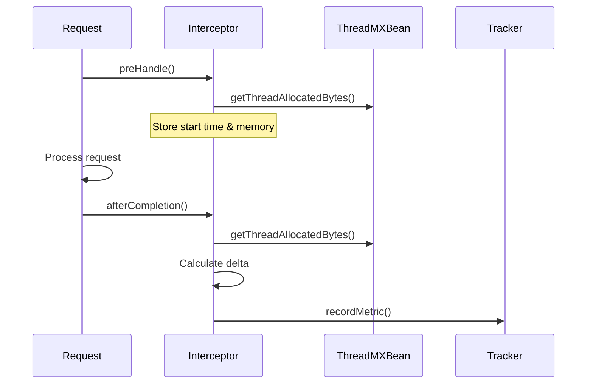

**Memory Measurement:**

- Uses `ThreadMXBean.getThreadAllocatedBytes()`
- Tracks per-request memory allocation
- Converts to KB for storage
- Warning threshold: 1.5 GB for batch operations

---

## Error Handling

### Exception Hierarchy

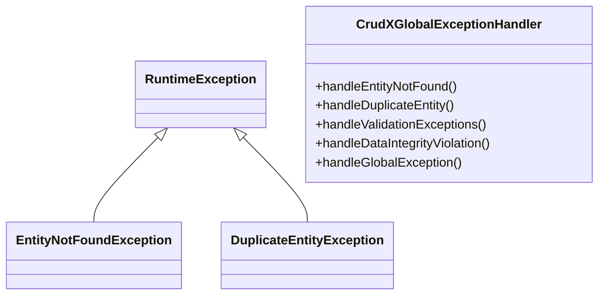

### Error Response Flow

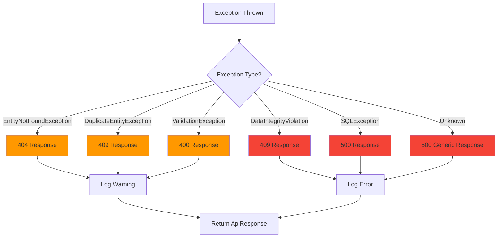

---

## Best Practices

### 1. Entity Design

```java
// ✅ GOOD: Clear entity with constraints
@Entity
@Table(name = "users")
@CrudXUniqueConstraint(fields = {"email"}, message = "Email already registered")
public class User extends CrudXMySQLEntity<Long> {

    @NotBlank(message = "Email is required")
    @Email(message = "Invalid email format")
    private String email;

    @NotBlank(message = "Name is required")
    @Size(min = 2, max = 100)
    private String name;
}

// ❌ BAD: No validation, unclear constraints
public class User extends CrudXMySQLEntity<Long> {
    private String email;
    private String name;
}
```

### 2. Controller Implementation

```java
// ✅ GOOD: Minimal controller with custom logic
@RestController
@RequestMapping("/api/users")
public class UserController extends CrudXController<User, Long> {

    @Override
    protected void beforeCreate(User user) {
        // Custom validation or business logic
        user.setEmail(user.getEmail().toLowerCase());
    }

    @Override
    protected void afterCreate(User user) {
        // Send welcome email, log audit, etc.
        emailService.sendWelcome(user.getEmail());
    }
}

// ❌ BAD: Don't create redundant CRUD methods
@RestController
@RequestMapping("/api/users")
public class UserController extends CrudXController<User, Long> {

    // DON'T DO THIS - Already provided by CrudXController
    @PostMapping
    public ResponseEntity<?> createUser(@RequestBody User user) {
        return ResponseEntity.ok(
                ApiResponse.success(products, products.size() + " products found")
        );
    }

    @GetMapping("/low-stock")
    public ResponseEntity<ApiResponse<List<Product>>> getLowStock(
            @RequestParam(defaultValue = "10") int threshold) {

        List<Product> lowStockProducts = crudService.findAll().stream()
                .filter(p -> p.getStockQuantity() < threshold)
                .filter(Product::getActive)
                .sorted(Comparator.comparing(Product::getStockQuantity))
                .toList();

        return ResponseEntity.ok(
                ApiResponse.success(lowStockProducts, "Low stock products retrieved")
        );
    }

    @Override
    protected void afterUpdate(Product updatedProduct, Product oldProduct) {
        // Invalidate cache
        Cache cache = cacheManager.getCache("products");
        if (cache != null) {
            cache.evict(updatedProduct.getId());
        }
    }
}

@RestController
@RequestMapping("/api/orders")
@RequiredArgsConstructor
public class OrderController extends CrudXController<Order, Long> {

    private final ProductController productController;
    private final EmailService emailService;
    private final InventoryService inventoryService;
    private final ApplicationEventPublisher eventPublisher;

    @Override
    protected void beforeCreate(Order order) {
        // Generate order number
        order.setOrderNumber("ORD-" + System.currentTimeMillis());

        // Validate stock availability
        for (OrderItem item : order.getItems()) {
            ResponseEntity<ApiResponse<Product>> response =
                    productController.getById(item.getProductId());
            Product product = response.getBody().getData();

            if (product.getStockQuantity() < item.getQuantity()) {
                throw new IllegalArgumentException(
                        "Insufficient stock for product: " + product.getName()
                );
            }

            // Set product details
            item.setProductName(product.getName());
            item.setUnitPrice(product.getPrice());
        }

        // Calculate totals
        order.calculateTotals();
    }

    @Override
    protected void afterCreate(Order order) {
        // Reserve inventory
        inventoryService.reserveStock(order);

        // Send confirmation email
        emailService.sendOrderConfirmation(order);

        // Publish event
        eventPublisher.publishEvent(new OrderCreatedEvent(this, order));

        log.info("Order created successfully: {}", order.getOrderNumber());
    }

    @PatchMapping("/{id}/status")
    public ResponseEntity<ApiResponse<Order>> updateStatus(
            @PathVariable Long id,
            @RequestParam OrderStatus status) {

        Order order = crudService.findById(id);
        OrderStatus oldStatus = order.getStatus();

        // Validate status transition
        validateStatusTransition(oldStatus, status);

        Map<String, Object> updates = Map.of("status", status);
        Order updated = crudService.update(id, updates);

        // Handle status-specific actions
        handleStatusChange(updated, oldStatus, status);

        return ResponseEntity.ok(
                ApiResponse.success(updated, "Order status updated to " + status)
        );
    }

    private void validateStatusTransition(OrderStatus from, OrderStatus to) {
        // Define valid transitions
        Map<OrderStatus, List<OrderStatus>> validTransitions = Map.of(
                OrderStatus.PENDING, List.of(OrderStatus.CONFIRMED, OrderStatus.CANCELLED),
                OrderStatus.CONFIRMED, List.of(OrderStatus.PROCESSING, OrderStatus.CANCELLED),
                OrderStatus.PROCESSING, List.of(OrderStatus.SHIPPED, OrderStatus.CANCELLED),
                OrderStatus.SHIPPED, List.of(OrderStatus.DELIVERED),
                OrderStatus.DELIVERED, List.of(),
                OrderStatus.CANCELLED, List.of()
        );

        if (!validTransitions.get(from).contains(to)) {
            throw new IllegalStateException(
                    "Invalid status transition from " + from + " to " + to
            );
        }
    }

    private void handleStatusChange(Order order, OrderStatus from, OrderStatus to) {
        switch (to) {
            case CONFIRMED -> emailService.sendOrderConfirmed(order);
            case SHIPPED -> {
                emailService.sendShippingNotification(order);
                inventoryService.confirmShipment(order);
            }
            case DELIVERED -> emailService.sendDeliveryConfirmation(order);
            case CANCELLED -> {
                inventoryService.releaseStock(order);
                emailService.sendCancellationNotice(order);
            }
        }
    }

    @GetMapping("/customer/{customerId}")
    public ResponseEntity<ApiResponse<List<Order>>> getCustomerOrders(
            @PathVariable Long customerId) {

        List<Order> orders = crudService.findAll().stream()
                .filter(o -> o.getCustomerId().equals(customerId))
                .sorted(Comparator.comparing(Order::getId).reversed())
                .toList();

        return ResponseEntity.ok(
                ApiResponse.success(orders, "Customer orders retrieved")
        );
    }

    @GetMapping("/analytics/revenue")
    public ResponseEntity<ApiResponse<Map<String, Object>>> getRevenueAnalytics(
            @RequestParam @DateTimeFormat(iso = DateTimeFormat.ISO.DATE) LocalDate startDate,
            @RequestParam @DateTimeFormat(iso = DateTimeFormat.ISO.DATE) LocalDate endDate) {

        List<Order> orders = crudService.findAll().stream()
                .filter(o -> o.getStatus() != OrderStatus.CANCELLED)
                .filter(o -> {
                    LocalDateTime createdAt = o.getAudit().getCreatedAt();
                    LocalDate orderDate = createdAt.toLocalDate();
                    return !orderDate.isBefore(startDate) && !orderDate.isAfter(endDate);
                })
                .toList();

        BigDecimal totalRevenue = orders.stream()
                .map(Order::getTotal)
                .reduce(BigDecimal.ZERO, BigDecimal::add);

        long orderCount = orders.size();
        BigDecimal averageOrderValue = orderCount > 0
                ? totalRevenue.divide(BigDecimal.valueOf(orderCount), 2, RoundingMode.HALF_UP)
                : BigDecimal.ZERO;

        Map<String, Object> analytics = Map.of(
                "totalRevenue", totalRevenue,
                "orderCount", orderCount,
                "averageOrderValue", averageOrderValue,
                "period", startDate + " to " + endDate
        );

        return ResponseEntity.ok(
                ApiResponse.success(analytics, "Revenue analytics retrieved")
        );
    }
}
```

---

## Comparison with Other Frameworks

### CRUDX vs Spring Data REST

| Feature                    | CRUDX                               | Spring Data REST          |
|----------------------------|-------------------------------------|---------------------------|
| **Setup Complexity**       | Minimal (extend controller)         | Minimal (repository only) |
| **Customization**          | Full control via lifecycle hooks    | Limited                   |
| **Batch Operations**       | ✅ Built-in with memory optimization | ❌ Not included            |
| **Performance Monitoring** | ✅ Built-in dashboard                | ❌ External tools needed   |
| **Multi-Database**         | ✅ MySQL, PostgreSQL, MongoDB        | ✅ Via different starters  |
| **Smart Pagination**       | ✅ Auto-switches for large datasets  | ⚠️ Manual configuration   |
| **Unique Constraints**     | ✅ Declarative validation            | ❌ Manual implementation   |
| **Error Handling**         | ✅ Centralized & consistent          | ⚠️ Basic                  |
| **Learning Curve**         | Low                                 | Very Low                  |
| **Production-Ready**       | ✅ Yes                               | ✅ Yes                     |

## Framework Limitations & Workarounds

### Known Limitations

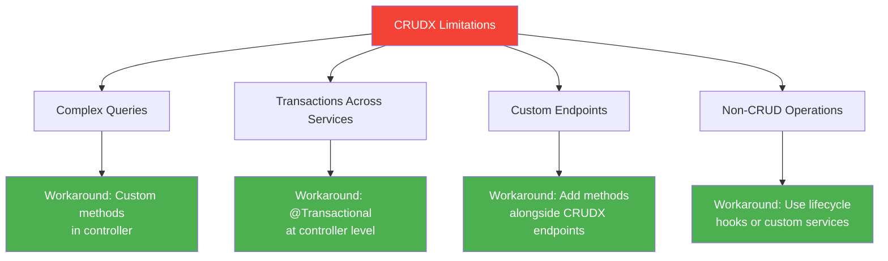

### Workaround Examples

**Complex Query Requirement:**

```java

@RestController
@RequestMapping("/api/products")
public class ProductController extends CrudXController<Product, Long> {

    @Autowired
    private EntityManager entityManager;

    // Custom complex query
    @GetMapping("/advanced-search")
    public ResponseEntity<ApiResponse<List<Product>>> advancedSearch(
            @RequestParam String keyword,
            @RequestParam List<String> categories,
            @RequestParam BigDecimal minPrice,
            @RequestParam BigDecimal maxPrice,
            @RequestParam Boolean inStock) {

        CriteriaBuilder cb = entityManager.getCriteriaBuilder();
        CriteriaQuery<Product> query = cb.createQuery(Product.class);
        Root<Product> root = query.from(Product.class);

        List<Predicate> predicates = new ArrayList<>();

        // Keyword search in name and description
        if (keyword != null && !keyword.isBlank()) {
            Predicate namePredicate = cb.like(
                    cb.lower(root.get("name")),
                    "%" + keyword.toLowerCase() + "%"
            );
            Predicate descPredicate = cb.like(
                    cb.lower(root.get("description")),
                    "%" + keyword.toLowerCase() + "%"
            );
            predicates.add(cb.or(namePredicate, descPredicate));
        }

        // Category filter
        if (categories != null && !categories.isEmpty()) {
            predicates.add(root.get("category").in(categories));
        }

        // Price range
        predicates.add(cb.between(root.get("price"), minPrice, maxPrice));

        // Stock filter
        if (inStock) {
            predicates.add(cb.greaterThan(root.get("stockQuantity"), 0));
        }

        query.where(predicates.toArray(new Predicate[0]));

        List<Product> results = entityManager.createQuery(query).getResultList();

        return ResponseEntity.ok(
                ApiResponse.success(results, results.size() + " products found")
        );
    }
}
```

**Cross-Service Transaction:**

```java

@RestController
@RequestMapping("/api/orders")
public class OrderController extends CrudXController<Order, Long> {

    @Autowired
    private ProductController productController;

    @Autowired
    private PlatformTransactionManager transactionManager;

    @PostMapping("/create-with-update")
    @Transactional // Span transaction across operations
    public ResponseEntity<ApiResponse<Order>> createOrderAndUpdateStock(
            @RequestBody Order order) {

        // Create order
        ResponseEntity<ApiResponse<Order>> orderResponse = create(order);
        Order createdOrder = orderResponse.getBody().getData();

        // Update product stock within same transaction
        for (OrderItem item : createdOrder.getItems()) {
            Product product = productController.getById(item.getProductId())
                    .getBody().getData();

            Map<String, Object> updates = Map.of(
                    "stockQuantity", product.getStockQuantity() - item.getQuantity()
            );

            productController.update(item.getProductId(), updates);
        }

        return orderResponse;
    }
}
```

---

## Community & Contribution

### How to Contribute

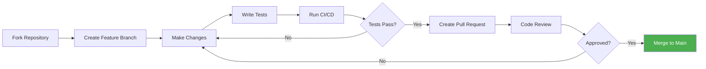

### Contribution Guidelines

1. **Fork and Clone**
   ```bash
   git clone https://github.com/sachinnimbal/crudx-starter.git
   cd crudx-starter
   git checkout -b feature/your-feature-name
   ```

2. **Code Standards**
    - Follow existing code style
    - Add JavaDoc for public APIs
    - Write unit tests (minimum 80% coverage)
    - Update documentation

3. **Commit Messages** (_Examples_)
   ```
   feat: Add GraphQL support for queries
   fix: Resolve memory leak in batch operations
   docs: Update API documentation
   test: Add integration tests for MongoDB
   refactor: Optimize service auto-configuration
   ```

4. **Testing Requirements**
   ```bash
   ./gradlew test
   ./gradlew integrationTest
   ./gradlew jacocoTestReport
   ```

---

## Frequently Asked Questions (FAQ)

### General Questions

**Q: Can I use CRUDX with an existing Spring Boot project?**

A: Yes! Simply add the dependency and annotate your main class with `@CrudX`. Your existing code will continue to work.

```gradle
dependencies {
    implementation 'io.github.sachinnimbal:crudx-starter:1.0.1'
}
```

**Q: Does CRUDX support both JPA and MongoDB simultaneously?**

A: Yes, but entities are database-specific. Use `CrudXMySQLEntity` for SQL and `CrudXMongoEntity` for MongoDB. Each
entity will be handled by the appropriate service.

**Q: Can I disable auto-generated endpoints?**

A: Yes, simply don't extend `CrudXController` for entities you want to handle manually. CRUDX only processes controllers
that extend its base class.

---

### Configuration Questions

**Q: How do I change the default batch size?**

A: The batch size is optimized internally, but you can control it via chunking in your client:

```java
List<Product> largeList = // 10,000 products
int chunkSize = 500;

for(
int i = 0; i <largeList.

size();

i +=chunkSize){
List<Product> chunk = largeList.subList(
        i, Math.min(i + chunkSize, largeList.size())
);
    productController.

createBatch(chunk, true);
}
```

**Q: Can I use CRUDX without performance monitoring?**

A: Yes, set `crudx.performance.enabled=false` in your properties file. This removes all monitoring overhead.

---

### Database Questions

**Q: How do I handle database migrations in production?**

A: Use Flyway or Liquibase with `spring.jpa.hibernate.ddl-auto=validate`:

```gradle
dependencies {
    implementation 'org.flywaydb:flyway-core'
}
```

```properties
spring.flyway.enabled=true
spring.flyway.locations=classpath:db/migration
spring.jpa.hibernate.ddl-auto=validate
```

**Q: Can I use H2 database for testing?**

A: Yes, add H2 dependency and configure test properties:

```gradle
testImplementation 'com.h2database:h2'
```

```yaml
# src/test/resources/application-test.yml
spring:
  datasource:
    url: jdbc:h2:mem:testdb
    driver-class-name: org.h2.Driver
  jpa:
    hibernate:
      ddl-auto: create-drop
```

---

### Performance Questions

**Q: What's the maximum batch size I can use?**

A: Hard limit is 100,000 records per request. For larger datasets, split into multiple requests:

```java
// For 500K records
int maxPerBatch = 100000;
for(
int i = 0;
i< 500000;i +=maxPerBatch){
List<Product> batch = allProducts.subList(i, Math.min(i + maxPerBatch, 500000));
    productController.

createBatch(batch, true);
}
```

**Q: How can I improve query performance?**

A: Use proper indexing, enable caching, and use pagination:

```java

@Entity
@Table(name = "products", indexes = {
        @Index(name = "idx_sku", columnList = "sku"),
        @Index(name = "idx_category", columnList = "category"),
        @Index(name = "idx_price", columnList = "price")
})
public class Product extends CrudXMySQLEntity<Long> {
    // ...
}
```

---

### Error Handling Questions

**Q: How do I customize error messages?**

A: Override exception handler methods:

```java

@RestControllerAdvice
public class CustomExceptionHandler extends CrudXGlobalExceptionHandler {

    @Override
    public ResponseEntity<ApiResponse<Void>> handleEntityNotFound(
            EntityNotFoundException ex, WebRequest request) {

        // Custom error response
        return ResponseEntity.status(HttpStatus.NOT_FOUND)
                .body(ApiResponse.error(
                        "Resource not found: " + ex.getMessage(),
                        HttpStatus.NOT_FOUND,
                        "CUSTOM_NOT_FOUND",
                        "Please check the ID and try again"
                ));
    }
}
```

**Q: How do I handle validation errors for custom fields?**

A: Use standard Bean Validation annotations:

```java

@Entity
public class Product extends CrudXMySQLEntity<Long> {

    @NotBlank(message = "SKU is required")
    @Pattern(regexp = "^[A-Z0-9-]+$", message = "SKU must contain only uppercase letters, numbers, and hyphens")
    private String sku;

    @AssertTrue(message = "Price must be set if product is active")
    public boolean isPriceValid() {
        return !active || price != null;
    }
}
```

---

## Troubleshooting Common Issues

### Issue: "Service bean not found"

```mermaid
flowchart TD
    A[Service Bean Not Found] --> B{Entity extends<br/>correct base class?}
    B -->|No| C[Fix: Extend CrudXMySQLEntity<br/>or CrudXMongoEntity]
    B -->|Yes| D{Controller extends<br/>CrudXController?}
    D -->|No| E[Fix: Extend CrudXController]
    D -->|Yes| F{@CrudX annotation<br/>on main class?}
F -->|No|G[Fix: Add @CrudX annotation]
F -->|Yes|H{Clean and rebuild?}
H -->|No|I[Run: ./gradlew clean build]
H -->|Yes| J[Check logs for<br/>initialization errors]

style C fill: #4CAF50, color: #fff
style E fill: #4CAF50, color: #fff
style G fill: #4CAF50, color: #fff
style I fill: #4CAF50, color: #fff
```

### Issue: Performance degradation with large datasets

**Symptoms:**

- Slow response times
- High memory usage
- OutOfMemoryError

**Solutions:**

1. **Enable pagination for large queries:**

```java
// Instead of
List<Product> all = productController.getAll();

// Use
Page<Product> page = productController.getPaged(0, 100, "id", "ASC");
```

2. **Adjust JVM heap size:**

```bash
java -Xms1g -Xmx4g -XX:+UseG1GC -jar your-app.jar
```

3. **Enable database-level pagination:**

```properties
spring.jpa.properties.hibernate.jdbc.fetch_size=100
spring.jpa.properties.hibernate.jdbc.batch_size=100
```

4. **Use streaming for export operations:**

```java

@GetMapping("/export")
public void exportAllProducts(HttpServletResponse response) {
    response.setContentType("text/csv");
    response.setHeader("Content-Disposition", "attachment; filename=products.csv");

    try (PrintWriter writer = response.getWriter()) {
        writer.println("ID,SKU,Name,Price");

        // Stream data in chunks
        int page = 0;
        Page<Product> chunk;
        do {
            chunk = crudService.findAll(PageRequest.of(page++, 1000));
            chunk.getContent().forEach(p ->
                    writer.println(p.getId() + "," + p.getSku() + "," +
                            p.getName() + "," + p.getPrice())
            );
        } while (chunk.hasNext());
    }
}
```

### Issue: Unique constraint violations

**Problem:** Batch operations failing due to duplicates

**Solution 1: Enable skip duplicates**

```java
productController.createBatch(products, true); // skipDuplicates=true
```

**Solution 2: Pre-validate before batch insert**

```java
List<Product> validProducts = new ArrayList<>();
Set<String> existingSkus = existingProducts.stream()
        .map(Product::getSku)
        .collect(Collectors.toSet());

for(
Product p :newProducts){
        if(!existingSkus.

contains(p.getSku())){
        validProducts.

add(p);
    }
            }

            productController.

createBatch(validProducts, false);
```

---

## Security Best Practices

### 1. Authentication & Authorization

```java

@Configuration
@EnableWebSecurity
@EnableMethodSecurity
public class SecurityConfig {

    @Bean
    public SecurityFilterChain filterChain(HttpSecurity http) throws Exception {
        http
                .csrf(csrf -> csrf
                        .ignoringRequestMatchers("/api/**") // Disable for API endpoints
                )
                .authorizeHttpRequests(auth -> auth
                        // Public endpoints
                        .requestMatchers("/api/products/**").permitAll()
                        .requestMatchers("/actuator/health").permitAll()

                        // Admin only
                        .requestMatchers("/crudx/performance/**").hasRole("ADMIN")
                        .requestMatchers(HttpMethod.DELETE, "/api/**/batch/**").hasRole("ADMIN")

                        // Authenticated users
                        .requestMatchers(HttpMethod.POST, "/api/**").authenticated()
                        .requestMatchers(HttpMethod.PUT, "/api/**").authenticated()
                        .requestMatchers(HttpMethod.PATCH, "/api/**").authenticated()
                        .requestMatchers(HttpMethod.DELETE, "/api/**").authenticated()

                        .anyRequest().authenticated()
                )
                .oauth2ResourceServer(oauth2 -> oauth2.jwt(Customizer.withDefaults()))
                .sessionManagement(session -> session
                        .sessionCreationPolicy(SessionCreationPolicy.STATELESS)
                );

        return http.build();
    }
}
```

### 2. Input Validation & Sanitization

```java

@Entity
public class Product extends CrudXMySQLEntity<Long> {

    @NotBlank(message = "Name is required")
    @Size(min = 3, max = 200, message = "Name must be between 3 and 200 characters")
    @Pattern(regexp = "^[a-zA-Z0-9\\s\\-_.]+$", message = "Name contains invalid characters")
    private String name;

    @NotNull
    @DecimalMin(value = "0.01", message = "Price must be at least 0.01")
    @DecimalMax(value = "999999.99", message = "Price cannot exceed 999999.99")
    @Digits(integer = 6, fraction = 2, message = "Invalid price format")
    private BigDecimal price;
}

@RestController
@RequestMapping("/api/products")
public class ProductController extends CrudXController<Product, Long> {

    @Override
    protected void beforeCreate(Product product) {
        // Sanitize HTML content
        product.setDescription(
                Jsoup.clean(product.getDescription(), Safelist.basic())
        );

        // Validate business rules
        if (product.getPrice().compareTo(BigDecimal.ZERO) <= 0) {
            throw new IllegalArgumentException("Price must be positive");
        }
    }
}
```

### 3. Rate Limiting

```java

@Configuration
public class RateLimitConfig {

    @Bean
    public RateLimiter apiRateLimiter() {
        return RateLimiter.create(100.0); // 100 requests per second
    }
}

@RestController
@RequestMapping("/api/products")
public class ProductController extends CrudXController<Product, Long> {

    @Autowired
    private RateLimiter rateLimiter;

    @Override
    public ResponseEntity<ApiResponse<Product>> create(@RequestBody Product entity) {
        if (!rateLimiter.tryAcquire()) {
            throw new TooManyRequestsException("Rate limit exceeded. Please try again later.");
        }

        return super.create(entity);
    }
}
```

### 4. SQL Injection Prevention

CRUDX automatically prevents SQL injection through:

- **JPA/Hibernate**: Uses parameterized queries
- **MongoDB**: Uses BSON documents
- **Criteria API**: Type-safe query building

```java
// ✅ SAFE - CRUDX handles this securely
Map<String, Object> updates = Map.of("price", userInputPrice);
productController.

update(id, updates);

// ✅ SAFE - Criteria API with parameters
CriteriaBuilder cb = entityManager.getCriteriaBuilder();
CriteriaQuery<Product> query = cb.createQuery(Product.class);
Root<Product> root = query.from(Product.class);
query.

where(cb.equal(root.get("sku"),userInputSku)); // Parameterized
```

---

## Monitoring & Alerting

### Custom Health Indicators

```java

@Component
public class DatabaseHealthIndicator implements HealthIndicator {

    @Autowired
    private DataSource dataSource;

    @Autowired
    private CrudXPerformanceTracker performanceTracker;

    @Override
    public Health health() {
        Map<String, Object> details = new HashMap<>();

        try {
            // Check database connection
            try (Connection conn = dataSource.getConnection()) {
                details.put("database", "UP");
                details.put("url", conn.getMetaData().getURL());
            }

            // Check performance metrics
            PerformanceSummary summary = performanceTracker.getSummary();
            details.put("totalRequests", summary.getTotalRequests());
            details.put("successRate", summary.getSuccessRate() + "%");
            details.put("avgResponseTime", summary.getAvgExecutionTimeMs() + "ms");

            // Determine health status
            if (summary.getSuccessRate() < 90) {
                return Health.status("DEGRADED")
                        .withDetails(details)
                        .withDetail("warning", "Success rate below 90%")
                        .build();
            }

            if (summary.getAvgExecutionTimeMs() > 1000) {
                return Health.status("DEGRADED")
                        .withDetails(details)
                        .withDetail("warning", "Average response time > 1s")
                        .build();
            }

            return Health.up().withDetails(details).build();

        } catch (Exception e) {
            return Health.down()
                    .withException(e)
                    .withDetails(details)
                    .build();
        }
    }
}
```

### Prometheus Metrics

```java

@Configuration
public class MetricsConfig {

    @Bean
    public MeterRegistryCustomizer<MeterRegistry> metricsCommonTags() {
        return registry -> registry.config()
                .commonTags("application", "crudx-app")
                .commonTags("environment", "production");
    }
}

@RestController
@RequestMapping("/api/products")
public class ProductController extends CrudXController<Product, Long> {

    private final Counter productCreatedCounter;
    private final Timer productCreationTimer;
    private final Gauge activeProductsGauge;

    public ProductController(MeterRegistry registry) {
        this.productCreatedCounter = Counter.builder("products.created.total")
                .description("Total number of products created")
                .register(registry);

        this.productCreationTimer = Timer.builder("products.creation.duration")
                .description("Time taken to create products")
                .register(registry);

        this.activeProductsGauge = Gauge.builder("products.active.count",
                        this::getActiveProductCount)
                .description("Number of active products")
                .register(registry);
    }

    @Override
    public ResponseEntity<ApiResponse<Product>> create(@RequestBody Product entity) {
        return productCreationTimer.record(() -> {
            ResponseEntity<ApiResponse<Product>> response = super.create(entity);
            productCreatedCounter.increment();
            return response;
        });
    }

    private long getActiveProductCount() {
        return crudService.findAll().stream()
                .filter(Product::getActive)
                .count();
    }
}
```

### Logging Best Practices

```java

@RestController
@RequestMapping("/api/orders")
@Slf4j
public class OrderController extends CrudXController<Order, Long> {

    @Override
    protected void afterCreate(Order order) {
        // Structured logging
        log.info("Order created: orderId={}, customerId={}, total={}, items={}",
                order.getId(),
                order.getCustomerId(),
                order.getTotal(),
                order.getItems().size());

        // Log to external monitoring (e.g., Datadog, New Relic)
        MDC.put("orderId", order.getId().toString());
        MDC.put("customerId", order.getCustomerId().toString());

        try {
            // Business logic
        } finally {
            MDC.clear();
        }
    }

    @Override
    protected void beforeDelete(Long id, Order order) {
        log.warn("Order deletion attempted: orderId={}, status={}, by={}",
                id,
                order.getStatus(),
                SecurityContextHolder.getContext().getAuthentication().getName());
    }
}
```

---

## Complete API Reference Table

### Standard CRUD Endpoints

| Endpoint                    | Method | Request Body  | Query Params                              | Response                                                 | Description                         |
|-----------------------------|--------|---------------|-------------------------------------------|----------------------------------------------------------|-------------------------------------|
| `/api/{entity}`             | POST   | Entity JSON   | -                                         | `ApiResponse<T>`                                         | Create single entity                |
| `/api/{entity}/batch`       | POST   | Entity[] JSON | `skipDuplicates` (boolean)                | `ApiResponse<BatchResult<T>>`                            | Create multiple entities            |
| `/api/{entity}/{id}`        | GET    | -             | -                                         | `ApiResponse<T>`                                         | Get entity by ID                    |
| `/api/{entity}`             | GET    | -             | `sortBy`, `sortDirection`                 | `ApiResponse<List<T>>` or `ApiResponse<PageResponse<T>>` | Get all (auto-paginated if >1000)   |
| `/api/{entity}/paged`       | GET    | -             | `page`, `size`, `sortBy`, `sortDirection` | `ApiResponse<PageResponse<T>>`                           | Get paginated results               |
| `/api/{entity}/{id}`        | PATCH  | Partial JSON  | -                                         | `ApiResponse<T>`                                         | Update specific fields              |
| `/api/{entity}/{id}`        | DELETE | -             | -                                         | `ApiResponse<Void>`                                      | Delete by ID                        |
| `/api/{entity}/batch`       | DELETE | ID[] JSON     | -                                         | `ApiResponse<BatchResult<ID>>`                           | Delete multiple (with tracking)     |
| `/api/{entity}/batch/force` | DELETE | ID[] JSON     | -                                         | `ApiResponse<Void>`                                      | Force delete (skip existence check) |
| `/api/{entity}/count`       | GET    | -             | -                                         | `ApiResponse<Long>`                                      | Count total entities                |
| `/api/{entity}/exists/{id}` | GET    | -             | -                                         | `ApiResponse<Boolean>`                                   | Check if entity exists              |

### Performance Monitoring Endpoints

| Endpoint                            | Method | Description                     |
|-------------------------------------|--------|---------------------------------|
| `/crudx/performance/dashboard`      | GET    | Performance dashboard UI (HTML) |
| `/crudx/performance/dashboard-data` | GET    | Metrics data (JSON)             |
| `/crudx/performance/metadata`       | GET    | Framework metadata              |
| `/crudx/performance/metrics`        | DELETE | Clear all metrics               |

---

## Glossary

| Term                    | Definition                                         |
|-------------------------|----------------------------------------------------|
| **CRUDX**               | Zero-boilerplate CRUD framework for Spring Boot    |
| **Entity**              | Domain object that extends `CrudXBaseEntity`       |
| **Controller**          | REST endpoint handler extending `CrudXController`  |
| **Service**             | Auto-generated business logic layer                |
| **Batch Operation**     | Creating/deleting multiple entities in one request |
| **Lifecycle Hook**      | Method called before/after CRUD operations         |
| **Smart Pagination**    | Automatic pagination for datasets >1000 records    |
| **Performance Tracker** | Built-in metrics collection system                 |
| **Unique Constraint**   | Declarative field uniqueness validation            |
| **Auto-Configuration**  | Automatic Spring bean registration                 |
| **Memory Optimization** | Chunking and streaming for large datasets          |

---

## Quick Reference Cards

### Entity Setup

```java
// MySQL/PostgreSQL
@Entity
@Table(name = "products")
@CrudXUniqueConstraint(fields = {"sku"})
public class Product extends CrudXMySQLEntity<Long> {
    private String sku;
    private String name;
    private BigDecimal price;
}

// MongoDB
@Document(collection = "products")
@CrudXUniqueConstraint(fields = {"sku"})
public class Product extends CrudXMongoEntity<String> {
    private String sku;
    private String name;
    private BigDecimal price;
}
```

### Controller Setup

```java

@RestController
@RequestMapping("/api/products")
public class ProductController extends CrudXController<Product, Long> {
    // All CRUD endpoints auto-generated!
}
```

### Configuration

```properties
# Database
spring.datasource.url=jdbc:mysql://localhost:3306/mydb
spring.datasource.username=root
spring.datasource.password=password
# CRUDX
crudx.database.auto-create=true
crudx.performance.enabled=true
```

---

## Summary

CRUDX Framework v1.0.1 provides:

✅ **Zero Boilerplate** - Extend one class, get 11 endpoints  
✅ **Multi-Database** - MySQL, PostgreSQL, MongoDB support  
✅ **Production-Ready** - Error handling, validation, monitoring  
✅ **Performance Optimized** - Smart pagination, memory management  
✅ **Fully Extensible** - Lifecycle hooks, custom endpoints  
✅ **Enterprise Features** - Batch operations, audit trails, metrics

**Repository:** https://github.com/sachinnimbal/crudx-starter  
**Maven Central:** `io.github.sachinnimbal:crudx-starter:1.0.1`  
**Documentation:** This comprehensive guide  
**Support:** GitHub Issues

---

**End of Technical Documentation**  
*Last Updated: October 2025*  
*CRUDX Framework v1.0.1*  
*Created by: Sachin Nimbal*

---

## Document Index

1. [Overview](#overview) - Framework introduction
2. [Architecture](#architecture) - System design and flows
3. [Core Components](#core-components) - Entity, Controller, Service layers
4. [Database Support](#database-support) - Multi-database configuration
5. [Configuration](#configuration) - Properties and setup
6. [API Documentation](#api-documentation) - REST endpoint reference
7. [Performance Monitoring](#performance-monitoring) - Metrics and dashboard
8. [Class Reference](#class-reference) - Detailed class documentation
9. [Advanced Usage Patterns](#advanced-usage-patterns) - Real-world examples
10. [Security Integration](#security-integration) - Authentication & authorization
11. [Testing Guide](#testing-strategies) - Unit, integration, performance tests
12. [Deployment](#real-world-deployment-scenarios) - AWS, Docker, Kubernetes
13. [Troubleshooting](#troubleshooting-common-issues) - Solutions to common problems
14. [FAQ](#frequently-asked-questions-faq) - Common questions answered
15. [API Reference Table](#complete-api-reference-table) - Quick endpoint lookup create(user);
    }
    }

```

### 3. Batch Operations

```java
// ✅ GOOD: Handle duplicates gracefully
List<Product> products = // ... load 1000 products
ResponseEntity<ApiResponse<BatchResult<Product>>> response = 
    productController.createBatch(products, true); // skipDuplicates=true

BatchResult<Product> result = response.getBody().getData();
System.out.println("Created: " + result.getCreatedEntities().size());
System.out.println("Skipped: " + result.getSkippedCount());

// ❌ BAD: Large batch without duplicate handling
List<Product> products = // ... 100,000 products
productController.createBatch(products, false); // Will fail on first duplicate
```

---

## Migration Guide

### From Traditional Spring Boot to CRUDX

**Before (Traditional):**

```java

@Entity
public class Product {
    @Id
    @GeneratedValue
    private Long id;
    private String name;
}

@Repository
public interface ProductRepository extends JpaRepository<Product, Long> {
}

@Service
public class ProductService {
    @Autowired
    private ProductRepository repository;

    public Product create(Product p) {
        return repository.save(p);
    }

    public List<Product> findAll() {
        return repository.findAll();
    }
    // ... 10+ more methods
}

@RestController
@RequestMapping("/api/products")
public class ProductController {
    @Autowired
    private ProductService service;

    @PostMapping
    public ResponseEntity<?> create(@RequestBody Product p) {
        return ResponseEntity.ok(service.create(p));
    }
    // ... 10+ more endpoints
}
```

**After (CRUDX):**

```java

@Entity
@CrudXUniqueConstraint(fields = {"sku"})
public class Product extends CrudXMySQLEntity<Long> {
    private String name;
    private String sku;
}

@RestController
@RequestMapping("/api/products")
public class ProductController extends CrudXController<Product, Long> {
    // That's it! All CRUD operations auto-generated
}
```

**Lines of Code Reduction:**

- Traditional: ~150+ lines (Repository + Service + Controller)
- CRUDX: ~15 lines (Entity + Controller only)
- **Reduction: 90%** 🎉

---

## Advanced Features

### 1. Unique Constraint Validation

CRUDX provides declarative unique constraint validation before database operations:

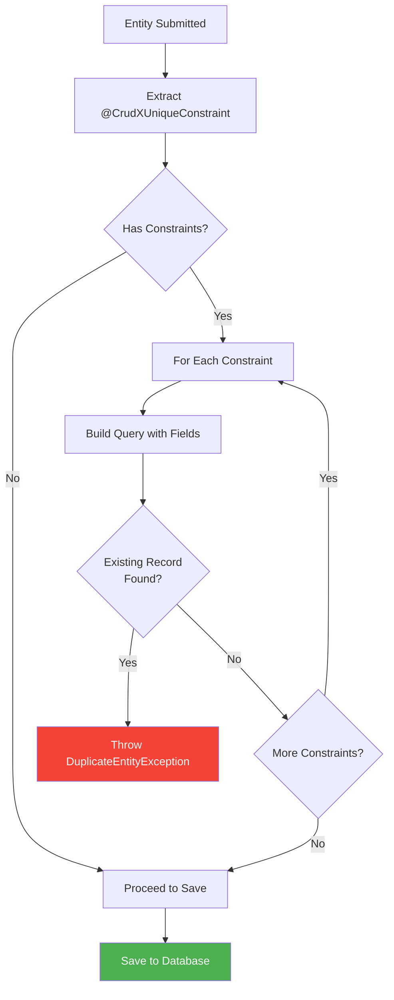

**Example:**

```java

@Entity
@CrudXUniqueConstraint(
        fields = {"email"},
        message = "Email already exists"
)
@CrudXUniqueConstraint(
        fields = {"username"},
        message = "Username taken"
)
@CrudXUniqueConstraint(
        fields = {"firstName", "lastName", "dateOfBirth"},
        message = "Person with same name and DOB exists"
)
public class User extends CrudXMySQLEntity<Long> {
    private String email;
    private String username;
    private String firstName;
    private String lastName;
    private LocalDate dateOfBirth;
}
```

### 2. Memory-Optimized Batch Processing

CRUDX automatically manages memory for large batch operations:

```mermaid
graph TB
    subgraph "Input: 100K Entities"
        A[List of 100,000 entities]
    end

    subgraph "Chunking Strategy"
        B[Split into chunks of 500]
        C[Process Chunk 1]
        D[Process Chunk 2]
        E[Process Chunk N]
    end

    subgraph "Per-Chunk Processing"
        F[Validate entities]
        G[Insert to DB]
        H[entityManager.clear]
        I[GC eligible]
    end

    A --> B
    B --> C
    B --> D
    B --> E
    C --> F
    D --> F
    E --> F
    F --> G
    G --> H
    H --> I
    style A fill: #FF9800
    style H fill: #4CAF50, color: #fff
    style I fill: #2196F3, color: #fff
```

**Configuration Constants:**

```java
// In CrudXSQLService and CrudXMongoService
private static final int DEFAULT_BATCH_SIZE = 100;
private static final int MAX_IN_MEMORY_THRESHOLD = 5000;
private static final int OPTIMAL_CHUNK_SIZE = 500; // For controller batching
```

**Memory Management:**

- Entities processed in chunks of 500
- `EntityManager.clear()` called after each chunk (SQL)
- Explicit garbage collection hints
- Progress logging every 10 chunks

### 3. Smart Pagination

CRUDX automatically switches to pagination for large datasets:

```mermaid
flowchart TD
    A[GET /api/entity] --> B{Count Entities}
    B --> C{Count > 1000?}
    C -->|No| D[Return All Entities<br/>Standard List Response]
    C -->|Yes| E[Auto-Switch to Pagination]
    E --> F[Return First 50 Records]
    F --> G[Add Warning Message]
    G --> H[Suggest /paged Endpoint]
    style D fill: #4CAF50, color: #fff
    style E fill: #FF9800, color: #000
    style H fill: #2196F3, color: #fff
```

**Response Example for Large Dataset:**

```json
{
  "success": true,
  "message": "Large dataset detected (15000 total records). Returning first 50 records. Use /paged endpoint with page parameter for more data.",
  "data": {
    "content": [
      /* 50 entities */
    ],
    "currentPage": 0,
    "pageSize": 50,
    "totalElements": 15000,
    "totalPages": 300
  },
  "executionTime": "145 ms"
}
```

### 4. Performance Monitoring Deep Dive

#### Metrics Collection Architecture

```mermaid
graph TB
    subgraph "Request Processing"
        A[Incoming Request]
        B[PerformanceInterceptor<br/>preHandle]
        C[Controller Execution]
        D[PerformanceInterceptor<br/>afterCompletion]
    end

    subgraph "Metrics Calculation"
        E[Calculate Execution Time]
        F[Calculate Memory Delta]
        G[Determine Success/Failure]
    end

    subgraph "Storage & Analysis"
        H[PerformanceMetric Object]
        I[ConcurrentLinkedDeque]
        J[PerformanceTracker]
        K[Aggregation to Summary]
    end

    A --> B
    B --> C
    C --> D
    D --> E
    D --> F
    D --> G
    E --> H
    F --> H
    G --> H
    H --> I
    I --> J
    J --> K
    style B fill: #FF9800, color: #000
    style D fill: #FF9800, color: #000
    style J fill: #2196F3, color: #fff
```

#### Performance Metrics Data Model

```java
public class PerformanceMetric {
    private String endpoint;           // e.g., "/api/products"
    private String method;             // e.g., "POST"
    private String entityName;         // e.g., "Product"
    private long executionTimeMs;      // Request duration
    private LocalDateTime timestamp;   // When request occurred
    private boolean success;           // true if HTTP < 400
    private String errorType;          // Exception type if failed
    private Long memoryUsedKb;         // Thread-specific memory allocation
}
```

#### Dashboard Features

**Access URL:** `http://localhost:8080/crudx/performance/dashboard`

```mermaid
graph LR
    A[Dashboard UI] --> B[Real-time Metrics]
    A --> C[Summary Statistics]
    A --> D[Endpoint Analysis]
    B --> E[Total Requests]
    B --> F[Success Rate %]
    B --> G[Avg Execution Time]
    C --> H[Memory Usage Trends]
    C --> I[Error Distribution]
    D --> J[Top 5 Slowest]
    D --> K[Top 5 Most Errors]
    D --> L[Top 5 Memory Intensive]
    style A fill: #4CAF50, color: #fff
    style D fill: #FF9800, color: #000
```

**Dashboard Endpoints:**

| Endpoint                            | Method | Description        |
|-------------------------------------|--------|--------------------|
| `/crudx/performance/dashboard`      | GET    | HTML dashboard UI  |
| `/crudx/performance/dashboard-data` | GET    | JSON metrics data  |
| `/crudx/performance/metadata`       | GET    | Framework metadata |
| `/crudx/performance/metrics`        | DELETE | Clear all metrics  |

---

## Complete Class Diagram

```mermaid
classDiagram
    class CrudXController {
        <<abstract>>
        #CrudXService crudService
        #Class~T~ entityClass
        #ApplicationContext applicationContext
        +create(T) ResponseEntity
        +createBatch(List~T~, boolean) ResponseEntity
        +getById(ID) ResponseEntity
        +getAll() ResponseEntity
        +getPaged() ResponseEntity
        +update(ID, Map) ResponseEntity
        +delete(ID) ResponseEntity
        +deleteBatch(List~ID~) ResponseEntity
        #beforeCreate(T)
        #afterCreate(T)
        #beforeUpdate()
        #afterUpdate()
    }

    class CrudXService {
        <<interface>>
        +create(T) T
        +createBatch(List~T~, boolean) BatchResult
        +findById(ID) T
        +findAll() List~T~
        +findAll(Sort) List~T~
        +findAll(Pageable) Page~T~
        +update(ID, Map) T
        +delete(ID) void
        +deleteBatch(List~ID~) BatchResult
        +count() long
        +existsById(ID) boolean
    }

    class CrudXSQLService {
        <<abstract>>
        #EntityManager entityManager
        #Class~T~ entityClass
        -validateUniqueConstraints(T)
        -findAllWithCursor(Sort)
    }

    class CrudXMongoService {
        <<abstract>>
        #MongoTemplate mongoTemplate
        #Class~T~ entityClass
        -validateUniqueConstraints(T)
        -findAllBatched(Sort)
    }

    class CrudXServiceAutoConfiguration {
        -ApplicationContext applicationContext
        -Set~String~ processedEntities
        +postProcessBeanDefinitionRegistry()
        -registerServiceBean()
        -extractEntityInfo()
    }

    class CrudXBaseEntity {
        <<abstract>>
        +getId() ID
        +setId(ID)
    }

    class CrudXMySQLEntity {
        -ID id
        -CrudXAudit audit
        +onCreate()
        +onUpdate()
    }

    class CrudXPostgreSQLEntity {
        -ID id
        -CrudXAudit audit
        +onCreate()
        +onUpdate()
    }

    class CrudXMongoEntity {
        -ID id
        -CrudXAudit audit
        +onCreate()
        +onUpdate()
    }

    class CrudXAudit {
        -LocalDateTime createdAt
        -String createdBy
        -LocalDateTime updatedAt
        -String updatedBy
        +onCreate()
        +onUpdate()
    }

    class CrudXGlobalExceptionHandler {
        +handleEntityNotFound()
        +handleDuplicateEntity()
        +handleValidationExceptions()
        +handleDataIntegrityViolation()
        +handleGlobalException()
    }

    class CrudXPerformanceInterceptor {
        -CrudXPerformanceTracker tracker
        -ThreadMXBean threadMXBean
        +preHandle()
        +afterCompletion()
    }

    class CrudXPerformanceTracker {
        -Deque~PerformanceMetric~ metrics
        -CrudXPerformanceProperties properties
        +recordMetric()
        +getMetrics()
        +getSummary()
        +clearMetrics()
        +cleanupOldMetrics()
    }

    CrudXController --> CrudXService
    CrudXService <|.. CrudXSQLService
    CrudXService <|.. CrudXMongoService
    CrudXBaseEntity <|-- CrudXMySQLEntity
    CrudXBaseEntity <|-- CrudXPostgreSQLEntity
    CrudXBaseEntity <|-- CrudXMongoEntity
    CrudXMySQLEntity *-- CrudXAudit
    CrudXPostgreSQLEntity *-- CrudXAudit
    CrudXMongoEntity *-- CrudXAudit
    CrudXPerformanceInterceptor --> CrudXPerformanceTracker
```

---

## Database Schema Management

### JPA/Hibernate DDL Auto Modes

CRUDX respects standard JPA configuration:

```properties
# Development: Auto-update schema
spring.jpa.hibernate.ddl-auto=update
# Production: Validate only (recommended)
spring.jpa.hibernate.ddl-auto=validate
# Testing: Create-drop
spring.jpa.hibernate.ddl-auto=create-drop
# Manual control: None
spring.jpa.hibernate.ddl-auto=none
```

**DDL Mode Decision Flow:**

```mermaid
flowchart TD
    A[Application Start] --> B{ddl-auto Setting?}
    B -->|create| C[Drop all tables<br/>Create new schema]
    B -->|create - drop| D[Create on startup<br/>Drop on shutdown]
    B -->|update| E[Update schema<br/>Non-destructive]
    B -->|validate| F[Only validate<br/>No modifications]
    B -->|none| G[No schema management]
    C --> H[⚠️ Data Loss Risk]
D --> H
E --> I[✅ Safe for Development]
F --> J[✅ Safe for Production]
G --> K[Manual Migration Required]

style H fill: #f44336, color: #fff
style I fill: #4CAF50, color: #fff
style J fill: #4CAF50, color: #fff
```

### Database Auto-Creation

CRUDX can automatically create databases if they don't exist:

```properties
# Enable auto-creation (default: true)
crudx.database.auto-create=true
```

**Auto-Creation Flow:**

```mermaid
sequenceDiagram
    participant App as Application
    participant Init as DatabaseInitializer
    participant JDBC as JDBC Connection
    participant DB as Database Server
    App ->> Init: Startup trigger
    Init ->> Init: Extract DB name from URL

    alt SQL Database (MySQL/PostgreSQL)
        alt Auto-create Enabled
            Init ->> JDBC: Connect to server (no DB)
            JDBC ->> DB: Connection successful

            alt MySQL
                Init ->> DB: CREATE DATABASE IF NOT EXISTS `dbname`
                DB -->> Init: Database created/exists
            else PostgreSQL
                Init ->> DB: SELECT FROM pg_database
                alt Not exists
                    Init ->> DB: CREATE DATABASE "dbname"
                end
            end

            Init ->> JDBC: Connect to created database
            JDBC -->> App: Ready
        else Auto-create Disabled
            Init ->> JDBC: Connect to database directly

            alt Connection Failed
                JDBC -->> Init: Error
                Init ->> App: Exit with manual creation guide
            else Success
                JDBC -->> App: Ready
            end
        end
    else MongoDB
        Note over Init, DB: MongoDB creates database automatically<br/>on first write operation
        Init ->> DB: Connect to MongoDB URI
        DB -->> Init: Connection successful
        Note over DB: Database and collection will be<br/>created when first document is inserted
        Init -->> App: Ready
    end
```

---

## Configuration Properties Reference

### Complete Configuration Options

```properties
# ============================================
# DATABASE CONFIGURATION
# ============================================
# SQL Database (MySQL/PostgreSQL)
spring.datasource.url=jdbc:mysql://localhost:3306/mydb
spring.datasource.username=root
spring.datasource.password=password
spring.datasource.driver-class-name=com.mysql.cj.jdbc.Driver
# MongoDB
spring.data.mongodb.uri=mongodb://localhost:27017/mydb
# OR alternative format
spring.data.mongodb.host=localhost
spring.data.mongodb.port=27017
spring.data.mongodb.database=mydb
spring.data.mongodb.username=admin
spring.data.mongodb.password=password
# ============================================
# JPA/HIBERNATE CONFIGURATION
# ============================================
spring.jpa.hibernate.ddl-auto=update
spring.jpa.show-sql=false
spring.jpa.properties.hibernate.format_sql=true
spring.jpa.properties.hibernate.use_sql_comments=false
spring.jpa.properties.hibernate.dialect=org.hibernate.dialect.MySQL8Dialect
# ============================================
# CRUDX FRAMEWORK CONFIGURATION
# ============================================
# Database Auto-Creation
crudx.database.auto-create=true
# Custom Repository/Entity Packages (Optional)
crudx.jpa.repository.packages=com.example.repositories
crudx.jpa.entity.packages=com.example.entities
crudx.mongo.repository.packages=com.example.repositories
# ============================================
# PERFORMANCE MONITORING (Optional)
# ============================================
crudx.performance.enabled=true
crudx.performance.dashboard-enabled=true
crudx.performance.dashboard-path=/crudx/performance
crudx.performance.track-memory=true
crudx.performance.max-stored-metrics=1000
crudx.performance.retention-minutes=60
# ============================================
# SERVER CONFIGURATION
# ============================================
server.port=8080
server.servlet.context-path=/
server.address=localhost
```

---

## Troubleshooting Guide

### Common Issues and Solutions

#### 1. Service Bean Not Found

**Error:**

```
Service bean not found: productServicemysql. 
Ensure entity extends CrudXJPAEntity or CrudXMongoEntity
```

**Cause:** Entity doesn't extend proper base class

**Solution:**

```java
// ❌ WRONG
public class Product {
    @Id
    private Long id;
}

// ✅ CORRECT
public class Product extends CrudXMySQLEntity<Long> {
    // fields
}
```

---

#### 2. EntityManager Not Available

**Error:**

```
EntityManager not available. Please add 'spring-boot-starter-data-jpa' 
dependency and appropriate database driver
```

**Cause:** Missing JPA dependency

**Solution (Gradle):**

```gradle
dependencies {
    implementation 'org.springframework.boot:spring-boot-starter-data-jpa'
    runtimeOnly 'com.mysql:mysql-connector-j:8.3.0'
}
```

---

#### 3. Database Driver Not Found

**Error:**

```
================================================
     NO DATABASE DRIVER FOUND
================================================
```

**Solution:**
Add appropriate driver to your build configuration:

```gradle
dependencies {
    // For MySQL
    runtimeOnly 'com.mysql:mysql-connector-j:8.3.0'
    
    // OR for PostgreSQL
    runtimeOnly 'org.postgresql:postgresql:42.7.3'
    
    // OR for MongoDB
    implementation 'org.springframework.boot:spring-boot-starter-data-mongodb'
}
```

---

#### 4. Database Connection Failed

**Error:**

```
===============================================
   DATABASE CONNECTION ERROR
===============================================
Failed to connect to database!
```

**Troubleshooting Steps:**

```mermaid
flowchart TD
    A[Connection Failed] --> B{Check Database<br/>Server Running?}
    B -->|No| C[Start Database Server]
    B -->|Yes| D{Verify Host/Port?}
    D -->|Wrong| E[Fix spring.datasource.url]
    D -->|Correct| F{Check Credentials?}
    F -->|Invalid| G[Update username/password]
    F -->|Valid| H{Database Exists?}
    H -->|No| I[Enable crudx.database.auto-create=true]
    H -->|Yes| J{Firewall Blocking?}
    J -->|Yes| K[Configure Firewall Rules]
    J -->|No| L[Check Database Logs]
    style C fill: #4CAF50, color: #fff
    style E fill: #4CAF50, color: #fff
    style G fill: #4CAF50, color: #fff
    style I fill: #4CAF50, color: #fff
```

---

#### 5. Duplicate Entry Exception

**Error:**

```json
{
  "success": false,
  "statusCode": 409,
  "message": "Email already exists",
  "error": {
    "code": "DUPLICATE_ENTITY"
  }
}
```

**Solution:**
Enable skip duplicates in batch operations:

```java
productController.createBatch(products, true); // skipDuplicates=true
```

---

## Performance Tuning

### Batch Size Optimization

```mermaid
graph LR
    A[Batch Size] --> B{Dataset Size}
    B -->|< 1000| C[Use Default: 100]
    B -->|1K - 10K| D[Use 500]
    B -->|10K - 100K| E[Use 500 + Chunking]
    B -->|> 100K| F[Multiple Requests]
    C --> G[Memory: Low]
    D --> H[Memory: Medium]
    E --> I[Memory: Optimized]
    F --> J[Memory: Minimal]
    style C fill: #4CAF50, color: #fff
    style D fill: #4CAF50, color: #fff
    style E fill: #FF9800, color: #000
    style F fill: #2196F3, color: #fff
```

### Memory Configuration

For handling large batches, adjust JVM settings:

```bash
# Start application with increased heap
java -Xms512m -Xmx2g -jar your-application.jar

# For very large datasets (100K+ records)
java -Xms1g -Xmx4g -XX:+UseG1GC -jar your-application.jar
```

### Database Connection Pool

```properties
# HikariCP Configuration (Default in Spring Boot)
spring.datasource.hikari.maximum-pool-size=10
spring.datasource.hikari.minimum-idle=5
spring.datasource.hikari.connection-timeout=30000
spring.datasource.hikari.idle-timeout=600000
spring.datasource.hikari.max-lifetime=1800000
```

## Deployment Guide

### Production Checklist

```mermaid
flowchart TD
    A[Production Deployment] --> B{Database Mode?}
    B -->|Development| C[❌ Don't use 'update']
B -->|Production| D[✅ Use 'validate' or 'none']

D --> E{Auto-create Enabled?}
E -->|Yes|F[❌ Disable for production]
E -->|No|G[✅ Manual DB creation]

G --> H{Performance Monitoring?}
H -->|Enabled|I[⚠️ Adds overhead]
H -->|Disabled|J[✅ Optimal performance]

J --> K{Logging Level?}
K -->|DEBUG|L[❌ Too verbose]
K -->|INFO/WARN|M[✅ Appropriate]

M --> N{Connection Pool?}
N -->|Default|O[✅ Usually sufficient]
N -->|Custom|P[✅ Tuned for load]

P --> Q[Ready for Production]

style C fill: #f44336, color: #fff
style F fill: #f44336, color: #fff
style L fill: #f44336, color: #fff
style Q fill: #4CAF50, color: #fff
```

### Production application.properties

```properties
# Database Configuration
spring.datasource.url=${DB_URL}
spring.datasource.username=${DB_USERNAME}
spring.datasource.password=${DB_PASSWORD}
# JPA Configuration - CRITICAL
spring.jpa.hibernate.ddl-auto=validate
spring.jpa.show-sql=false
# CRUDX Configuration
crudx.database.auto-create=false
# Performance Monitoring - Optional
crudx.performance.enabled=false
# Logging
logging.level.root=INFO
logging.level.io.github.sachinnimbal.crudx=INFO
# Connection Pool
spring.datasource.hikari.maximum-pool-size=20
spring.datasource.hikari.minimum-idle=10
```

---

## API Reference Summary

### All Available Endpoints (Per Entity)

| Endpoint                    | Method | Request Body  | Query Params                              | Description                          |
|-----------------------------|--------|---------------|-------------------------------------------|--------------------------------------|
| `/api/{entity}`             | POST   | Entity JSON   | -                                         | Create single entity                 |
| `/api/{entity}/batch`       | POST   | Entity[] JSON | `skipDuplicates` (boolean)                | Create multiple entities             |
| `/api/{entity}/{id}`        | GET    | -             | -                                         | Get entity by ID                     |
| `/api/{entity}`             | GET    | -             | `sortBy`, `sortDirection`                 | Get all entities (auto-pag if >1000) |
| `/api/{entity}/paged`       | GET    | -             | `page`, `size`, `sortBy`, `sortDirection` | Get paginated entities               |
| `/api/{entity}/{id}`        | PATCH  | Partial JSON  | -                                         | Update specific fields               |
| `/api/{entity}/{id}`        | DELETE | -             | -                                         | Delete by ID                         |
| `/api/{entity}/batch`       | DELETE | ID[] JSON     | -                                         | Delete multiple with tracking        |
| `/api/{entity}/batch/force` | DELETE | ID[] JSON     | -                                         | Force delete (skip checks)           |
| `/api/{entity}/count`       | GET    | -             | -                                         | Count total entities                 |
| `/api/{entity}/exists/{id}` | GET    | -             | -                                         | Check if entity exists               |

---

## Version History

### v1.0.1 (Current)

- ✅ Multi-database support (MySQL, PostgreSQL, MongoDB)
- ✅ Auto-generated CRUD endpoints
- ✅ Batch operations with memory optimization
- ✅ Performance monitoring dashboard
- ✅ Smart pagination for large datasets
- ✅ Unique constraint validation
- ✅ Global exception handling
- ✅ Automatic database creation

### Roadmap

**v1.1.0 (Planning)**

---

## License & Support

**License:** Apache 2.0  
**Repository:** https://github.com/sachinnimbal/crudx-starter  
**Issues:** https://github.com/sachinnimbal/crudx-starter/issues  
**Author:** Sachin Nimbal  
**Email:** sachinnimbal9@gmail.com  
**LinkedIn:** https://www.linkedin.com/in/sachin-nimbal/

---

## Appendix: Framework Metadata

```properties
# crudx.properties
author.name=Sachin Nimbal
author.email=sachinnimbal9@gmail.com
author.version=1.0.0
author.since=2025
author.linkedin=https://www.linkedin.com/in/sachin-nimbal/
project.artifact=crudx-starter
project.group=io.github.sachinnimbal
project.version=1.0.1-SNAPSHOT
```

---

---

## Advanced Usage Patterns

### 1. Custom Business Logic with Lifecycle Hooks

```java

@RestController
@RequestMapping("/api/orders")
@RequiredArgsConstructor
public class OrderController extends CrudXController<Order, Long> {

    private final EmailService emailService;
    private final InventoryService inventoryService;
    private final AuditLogService auditLogService;

    @Override
    protected void beforeCreate(Order order) {
        // Validate inventory availability
        for (OrderItem item : order.getItems()) {
            if (!inventoryService.isAvailable(item.getProductId(), item.getQuantity())) {
                throw new IllegalArgumentException(
                        "Product " + item.getProductId() + " is out of stock"
                );
            }
        }

        // Calculate totals
        order.calculateTotals();

        // Set order number
        order.setOrderNumber(generateOrderNumber());
    }

    @Override
    protected void afterCreate(Order order) {
        // Reserve inventory
        inventoryService.reserve(order);

        // Send confirmation email
        emailService.sendOrderConfirmation(order);

        // Log audit trail
        auditLogService.log("ORDER_CREATED", order.getId());
    }

    @Override
    protected void beforeUpdate(Long id, Map<String, Object> updates, Order existingOrder) {
        // Prevent status changes if order is shipped
        if (existingOrder.getStatus() == OrderStatus.SHIPPED) {
            if (updates.containsKey("status")) {
                throw new IllegalStateException("Cannot modify shipped orders");
            }
        }
    }

    @Override
    protected void afterUpdate(Order updatedOrder, Order oldOrder) {
        // If status changed to cancelled, release inventory
        if (oldOrder.getStatus() != OrderStatus.CANCELLED &&
                updatedOrder.getStatus() == OrderStatus.CANCELLED) {
            inventoryService.release(updatedOrder);
            emailService.sendCancellationNotice(updatedOrder);
        }
    }

    @Override
    protected void beforeDelete(Long id, Order order) {
        // Only allow deletion of draft orders
        if (order.getStatus() != OrderStatus.DRAFT) {
            throw new IllegalStateException(
                    "Cannot delete orders in status: " + order.getStatus()
            );
        }
    }

    private String generateOrderNumber() {
        return "ORD-" + System.currentTimeMillis();
    }
}
```

**Lifecycle Hook Execution Flow:**

```mermaid
sequenceDiagram
    participant Client
    participant Controller
    participant Hooks as Lifecycle Hooks
    participant Service
    participant DB
    participant External as External Services
    Client ->> Controller: POST /api/orders
    Controller ->> Hooks: beforeCreate(order)
    Hooks ->> External: Validate inventory
    External -->> Hooks: Stock available
    Hooks ->> Hooks: Calculate totals
    Hooks -->> Controller: Validation passed
    Controller ->> Service: create(order)
    Service ->> DB: INSERT order
    DB -->> Service: Order saved
    Service -->> Controller: Return order
    Controller ->> Hooks: afterCreate(order)
    Hooks ->> External: Reserve inventory
    Hooks ->> External: Send email
    Hooks ->> External: Log audit
    Hooks -->> Controller: Post-processing complete
    Controller -->> Client: 201 Created
```

### 2. Multi-Tenancy Implementation

```java

@Entity
@Table(name = "products")
@CrudXUniqueConstraint(
        fields = {"sku", "tenantId"},
        message = "SKU must be unique per tenant"
)
public class Product extends CrudXMySQLEntity<Long> {

    @Column(nullable = false)
    private String tenantId;

    private String sku;
    private String name;
    private BigDecimal price;
}

@RestController
@RequestMapping("/api/products")
public class ProductController extends CrudXController<Product, Long> {

    @Autowired
    private TenantContext tenantContext;

    @Override
    protected void beforeCreate(Product product) {
        // Automatically set tenant ID from context
        String currentTenant = tenantContext.getCurrentTenantId();
        product.setTenantId(currentTenant);
    }

    @Override
    protected void afterFindAll(List<Product> products) {
        // Filter by tenant (additional safety check)
        String currentTenant = tenantContext.getCurrentTenantId();
        products.removeIf(p -> !p.getTenantId().equals(currentTenant));
    }

    // Custom endpoint with tenant filtering
    @GetMapping("/my-products")
    public ResponseEntity<ApiResponse<List<Product>>> getMyProducts() {
        String tenantId = tenantContext.getCurrentTenantId();

        // Use lifecycle hooks for automatic filtering
        List<Product> allProducts = crudService.findAll();

        return ResponseEntity.ok(
                ApiResponse.success(allProducts, "Tenant products retrieved")
        );
    }
}
```

### 3. Soft Delete Implementation

```java

@Entity
@Table(name = "users")
public class User extends CrudXMySQLEntity<Long> {

    private String email;
    private String name;

    @Column(name = "deleted_at")
    private LocalDateTime deletedAt;

    @Transient
    public boolean isDeleted() {
        return deletedAt != null;
    }
}

@RestController
@RequestMapping("/api/users")
public class UserController extends CrudXController<User, Long> {

    @Override
    protected void beforeDelete(Long id, User user) {
        // Implement soft delete instead of hard delete
        user.setDeletedAt(LocalDateTime.now());

        Map<String, Object> updates = Map.of("deletedAt", user.getDeletedAt());
        crudService.update(id, updates);

        // Prevent actual deletion
        throw new IllegalStateException("Soft delete completed");
    }

    @Override
    protected void afterFindAll(List<User> users) {
        // Filter out soft-deleted users
        users.removeIf(User::isDeleted);
    }

    @Override
    protected void afterFindById(User user) {
        // Throw exception if user is soft-deleted
        if (user.isDeleted()) {
            throw new EntityNotFoundException("User", user.getId());
        }
    }

    // Custom endpoint to restore soft-deleted users
    @PostMapping("/{id}/restore")
    public ResponseEntity<ApiResponse<User>> restore(@PathVariable Long id) {
        Map<String, Object> updates = Map.of("deletedAt", null);
        User restored = crudService.update(id, updates);
        return ResponseEntity.ok(
                ApiResponse.success(restored, "User restored successfully")
        );
    }

    // Custom endpoint to list deleted users (admin only)
    @GetMapping("/deleted")
    public ResponseEntity<ApiResponse<List<User>>> getDeletedUsers() {
        List<User> allUsers = crudService.findAll();
        List<User> deletedUsers = allUsers.stream()
                .filter(User::isDeleted)
                .toList();

        return ResponseEntity.ok(
                ApiResponse.success(deletedUsers, "Deleted users retrieved")
        );
    }
}
```

### 4. File Upload with Entity

```java

@Entity
@Table(name = "documents")
public class Document extends CrudXMySQLEntity<Long> {

    private String title;
    private String description;

    @Column(length = 500)
    private String filePath;

    private String fileName;
    private String contentType;
    private Long fileSize;
}

@RestController
@RequestMapping("/api/documents")
@RequiredArgsConstructor
public class DocumentController extends CrudXController<Document, Long> {

    private final FileStorageService fileStorageService;

    // Custom endpoint for file upload
    @PostMapping("/upload")
    public ResponseEntity<ApiResponse<Document>> uploadDocument(
            @RequestParam("file") MultipartFile file,
            @RequestParam("title") String title,
            @RequestParam(value = "description", required = false) String description) {

        try {
            // Validate file
            if (file.isEmpty()) {
                throw new IllegalArgumentException("File cannot be empty");
            }

            // Store file
            String filePath = fileStorageService.store(file);

            // Create document entity
            Document document = new Document();
            document.setTitle(title);
            document.setDescription(description);
            document.setFilePath(filePath);
            document.setFileName(file.getOriginalFilename());
            document.setContentType(file.getContentType());
            document.setFileSize(file.getSize());

            // Use CRUDX create method
            Document saved = crudService.create(document);

            return ResponseEntity.status(HttpStatus.CREATED)
                    .body(ApiResponse.success(saved, "Document uploaded successfully"));

        } catch (Exception e) {
            throw new RuntimeException("Failed to upload document: " + e.getMessage());
        }
    }

    @Override
    protected void afterDelete(Long id, Document document) {
        // Delete physical file when entity is deleted
        try {
            fileStorageService.delete(document.getFilePath());
        } catch (Exception e) {
            log.error("Failed to delete file: {}", document.getFilePath(), e);
        }
    }

    // Custom endpoint to download file
    @GetMapping("/{id}/download")
    public ResponseEntity<Resource> downloadDocument(@PathVariable Long id) {
        Document document = crudService.findById(id);
        Resource resource = fileStorageService.load(document.getFilePath());

        return ResponseEntity.ok()
                .contentType(MediaType.parseMediaType(document.getContentType()))
                .header(HttpHeaders.CONTENT_DISPOSITION,
                        "attachment; filename=\"" + document.getFileName() + "\"")
                .body(resource);
    }
}
```

### 5. Versioning and Optimistic Locking

```java

@Entity
@Table(name = "products")
public class Product extends CrudXMySQLEntity<Long> {

    private String name;
    private BigDecimal price;

    @Version
    private Long version;

    @Column(name = "previous_price")
    private BigDecimal previousPrice;
}

@RestController
@RequestMapping("/api/products")
public class ProductController extends CrudXController<Product, Long> {

    @Override
    protected void beforeUpdate(Long id, Map<String, Object> updates, Product existingProduct) {
        // Track price changes
        if (updates.containsKey("price")) {
            BigDecimal newPrice = new BigDecimal(updates.get("price").toString());
            if (!newPrice.equals(existingProduct.getPrice())) {
                updates.put("previousPrice", existingProduct.getPrice());
            }
        }
    }

    // Custom endpoint with version check
    @PatchMapping("/{id}/v/{version}")
    public ResponseEntity<ApiResponse<Product>> updateWithVersionCheck(
            @PathVariable Long id,
            @PathVariable Long version,
            @RequestBody Map<String, Object> updates) {

        Product existing = crudService.findById(id);

        if (!existing.getVersion().equals(version)) {
            throw new IllegalStateException(
                    "Version conflict: Product was modified by another user. " +
                            "Expected version " + version + ", but found " + existing.getVersion()
            );
        }

        return update(id, updates);
    }
}
```

---

## Security Integration

### Spring Security with CRUDX

```java

@Configuration
@EnableWebSecurity
public class SecurityConfig {

    @Bean
    public SecurityFilterChain filterChain(HttpSecurity http) throws Exception {
        http
                .csrf().disable()
                .authorizeHttpRequests(auth -> auth
                        // Public endpoints
                        .requestMatchers("/api/products/**").permitAll()
                        .requestMatchers("/crudx/performance/**").hasRole("ADMIN")

                        // Protected endpoints
                        .requestMatchers(HttpMethod.POST, "/api/**").hasRole("USER")
                        .requestMatchers(HttpMethod.PUT, "/api/**").hasRole("USER")
                        .requestMatchers(HttpMethod.DELETE, "/api/**").hasRole("ADMIN")
                        .requestMatchers(HttpMethod.GET, "/api/**").authenticated()

                        .anyRequest().authenticated()
                )
                .httpBasic(Customizer.withDefaults());

        return http.build();
    }
}
```

### Role-Based Access in Controllers

```java

@RestController
@RequestMapping("/api/products")
public class ProductController extends CrudXController<Product, Long> {

    @Autowired
    private SecurityContext securityContext;

    @Override
    protected void beforeCreate(Product product) {
        // Automatically set creator
        String username = securityContext.getCurrentUsername();
        if (product.getAudit() != null) {
            product.getAudit().setCreatedBy(username);
        }
    }

    @Override
    protected void beforeDelete(Long id, Product product) {
        // Only allow deletion by creator or admin
        String currentUser = securityContext.getCurrentUsername();
        String creator = product.getAudit().getCreatedBy();

        if (!currentUser.equals(creator) && !securityContext.hasRole("ADMIN")) {
            throw new AccessDeniedException(
                    "You don't have permission to delete this product"
            );
        }
    }

    // Custom endpoint with role check
    @DeleteMapping("/batch/admin")
    @PreAuthorize("hasRole('ADMIN')")
    public ResponseEntity<ApiResponse<BatchResult<Long>>> adminBatchDelete(
            @RequestBody List<Long> ids) {
        return deleteBatch(ids);
    }
}
```

---

## Caching Strategies

### Redis Integration

```java

@Configuration
@EnableCaching
public class CacheConfig {

    @Bean
    public RedisCacheManager cacheManager(RedisConnectionFactory connectionFactory) {
        RedisCacheConfiguration config = RedisCacheConfiguration.defaultCacheConfig()
                .entryTtl(Duration.ofMinutes(10))
                .disableCachingNullValues();

        return RedisCacheManager.builder(connectionFactory)
                .cacheDefaults(config)
                .build();
    }
}
```

### Controller with Caching

```java

@RestController
@RequestMapping("/api/products")
public class ProductController extends CrudXController<Product, Long> {

    @Autowired
    private CacheManager cacheManager;

    @Override
    @Cacheable(value = "products", key = "#id")
    public ResponseEntity<ApiResponse<Product>> getById(@PathVariable Long id) {
        return super.getById(id);
    }

    @Override
    protected void afterCreate(Product product) {
        // Invalidate list cache
        evictListCaches();
    }

    @Override
    protected void afterUpdate(Product updatedProduct, Product oldProduct) {
        // Invalidate specific cache
        Cache cache = cacheManager.getCache("products");
        if (cache != null) {
            cache.evict(updatedProduct.getId());
        }
        evictListCaches();
    }

    @Override
    protected void afterDelete(Long id, Product deletedProduct) {
        Cache cache = cacheManager.getCache("products");
        if (cache != null) {
            cache.evict(id);
        }
        evictListCaches();
    }

    private void evictListCaches() {
        Cache cache = cacheManager.getCache("productList");
        if (cache != null) {
            cache.clear();
        }
    }
}
```

---

## Validation Patterns

### Complex Validation

```java

@Entity
@Table(name = "products")
@CrudXUniqueConstraint(fields = {"sku"}, message = "SKU must be unique")
public class Product extends CrudXMySQLEntity<Long> {

    @NotBlank(message = "SKU is required")
    @Pattern(regexp = "^[A-Z]{3}-\\d{6}$", message = "SKU must be in format: ABC-123456")
    private String sku;

    @NotBlank(message = "Name is required")
    @Size(min = 3, max = 100, message = "Name must be between 3 and 100 characters")
    private String name;

    @NotNull(message = "Price is required")
    @DecimalMin(value = "0.01", message = "Price must be at least 0.01")
    @DecimalMax(value = "999999.99", message = "Price cannot exceed 999999.99")
    private BigDecimal price;

    @Min(value = 0, message = "Quantity cannot be negative")
    private Integer quantity;

    @Email(message = "Supplier email must be valid")
    private String supplierEmail;
}
```

### Custom Validator

```java

@Target({ElementType.TYPE})
@Retention(RetentionPolicy.RUNTIME)
@Constraint(validatedBy = PriceRangeValidator.class)
public @interface ValidPriceRange {
    String message() default "Sale price must be less than regular price";

    Class<?>[] groups() default {};

    Class<? extends Payload>[] payload() default {};
}

public class PriceRangeValidator implements ConstraintValidator<ValidPriceRange, Product> {

    @Override
    public boolean isValid(Product product, ConstraintValidatorContext context) {
        if (product.getSalePrice() == null || product.getRegularPrice() == null) {
            return true;
        }

        return product.getSalePrice().compareTo(product.getRegularPrice()) <= 0;
    }
}

@Entity
@ValidPriceRange
public class Product extends CrudXMySQLEntity<Long> {
    private BigDecimal regularPrice;
    private BigDecimal salePrice;
}
```

---

## Event-Driven Architecture

### Publishing Events

```java

@RestController
@RequestMapping("/api/orders")
@RequiredArgsConstructor
public class OrderController extends CrudXController<Order, Long> {

    private final ApplicationEventPublisher eventPublisher;

    @Override
    protected void afterCreate(Order order) {
        // Publish domain event
        eventPublisher.publishEvent(new OrderCreatedEvent(this, order));
    }

    @Override
    protected void afterUpdate(Order updatedOrder, Order oldOrder) {
        if (oldOrder.getStatus() != updatedOrder.getStatus()) {
            eventPublisher.publishEvent(
                    new OrderStatusChangedEvent(this, updatedOrder, oldOrder.getStatus())
            );
        }
    }
}

// Event class
@Getter
public class OrderCreatedEvent extends ApplicationEvent {
    private final Order order;

    public OrderCreatedEvent(Object source, Order order) {
        super(source);
        this.order = order;
    }
}

// Event listener
@Component
@Slf4j
public class OrderEventListener {

    @Autowired
    private NotificationService notificationService;

    @Autowired
    private InventoryService inventoryService;

    @EventListener
    @Async
    public void handleOrderCreated(OrderCreatedEvent event) {
        Order order = event.getOrder();
        log.info("Processing order created event: {}", order.getId());

        // Send notifications
        notificationService.notifyCustomer(order);
        notificationService.notifyWarehouse(order);

        // Reserve inventory
        inventoryService.reserve(order);
    }

    @EventListener
    @Async
    public void handleOrderStatusChanged(OrderStatusChangedEvent event) {
        Order order = event.getOrder();
        log.info("Order {} status changed from {} to {}",
                order.getId(), event.getOldStatus(), order.getStatus());

        if (order.getStatus() == OrderStatus.SHIPPED) {
            notificationService.sendShippingNotification(order);
        }
    }
}
```

---

## Monitoring and Observability

### Custom Metrics with Micrometer

```java

@RestController
@RequestMapping("/api/products")
@RequiredArgsConstructor
public class ProductController extends CrudXController<Product, Long> {

    private final MeterRegistry meterRegistry;
    private final Counter productCreatedCounter;
    private final Timer productCreationTimer;

    @PostConstruct
    public void initMetrics() {
        productCreatedCounter = Counter.builder("products.created")
                .description("Total number of products created")
                .tag("type", "product")
                .register(meterRegistry);

        productCreationTimer = Timer.builder("products.creation.time")
                .description("Time taken to create products")
                .register(meterRegistry);
    }

    @Override
    public ResponseEntity<ApiResponse<Product>> create(@RequestBody Product entity) {
        return productCreationTimer.record(() -> {
            ResponseEntity<ApiResponse<Product>> response = super.create(entity);
            productCreatedCounter.increment();
            return response;
        });
    }

    // Expose custom metrics endpoint
    @GetMapping("/metrics/summary")
    public ResponseEntity<Map<String, Object>> getMetricsSummary() {
        Map<String, Object> metrics = new HashMap<>();
        metrics.put("totalCreated", productCreatedCounter.count());
        metrics.put("avgCreationTime", productCreationTimer.mean(TimeUnit.MILLISECONDS));
        metrics.put("maxCreationTime", productCreationTimer.max(TimeUnit.MILLISECONDS));

        return ResponseEntity.ok(metrics);
    }
}
```

### Health Checks

```java

@Component
public class CrudXHealthIndicator implements HealthIndicator {

    @Autowired
    private CrudXPerformanceTracker performanceTracker;

    @Autowired
    private DataSource dataSource;

    @Override
    public Health health() {
        try {
            // Check database connectivity
            try (Connection conn = dataSource.getConnection()) {
                if (!conn.isValid(1)) {
                    return Health.down()
                            .withDetail("database", "Connection invalid")
                            .build();
                }
            }

            // Check performance metrics
            PerformanceSummary summary = performanceTracker.getSummary();
            if (summary.getSuccessRate() < 95.0) {
                return Health.status("WARNING")
                        .withDetail("successRate", summary.getSuccessRate())
                        .withDetail("message", "Success rate below threshold")
                        .build();
            }

            return Health.up()
                    .withDetail("database", "Connected")
                    .withDetail("successRate", summary.getSuccessRate())
                    .withDetail("totalRequests", summary.getTotalRequests())
                    .build();

        } catch (Exception e) {
            return Health.down()
                    .withDetail("error", e.getMessage())
                    .build();
        }
    }
}
```

---

## Data Migration and Seeding

### Database Seeder

```java

@Component
@RequiredArgsConstructor
public class DataSeeder implements CommandLineRunner {

    private final ProductController productController;
    private final Environment environment;

    @Override
    public void run(String... args) {
        // Only seed in development
        if (!Arrays.asList(environment.getActiveProfiles()).contains("dev")) {
            return;
        }

        // Check if data already exists
        ResponseEntity<ApiResponse<Long>> countResponse = productController.count();
        Long count = countResponse.getBody().getData();

        if (count > 0) {
            log.info("Database already seeded, skipping...");
            return;
        }

        log.info("Seeding database with sample data...");

        List<Product> products = new ArrayList<>();
        for (int i = 1; i <= 100; i++) {
            Product product = new Product();
            product.setSku("SEED-" + String.format("%06d", i));
            product.setName("Sample Product " + i);
            product.setPrice(BigDecimal.valueOf(10.00 + (i * 5)));
            product.setQuantity(100 + i);
            products.add(product);
        }

        // Use batch create for efficiency
        productController.createBatch(products, true);

        log.info("Database seeding completed: {} products created", products.size());
    }
}
```

---

## API Documentation with OpenAPI/Swagger

### Swagger Configuration

```java

@Configuration
public class OpenApiConfig {

    @Bean
    public OpenAPI crudxOpenAPI() {
        return new OpenAPI()
                .info(new Info()
                        .title("CRUDX Application API")
                        .description("Auto-generated CRUD API using CRUDX Framework")
                        .version("v1.0.1")
                        .contact(new Contact()
                                .name("Sachin Nimbal")
                                .email("sachinnimbal9@gmail.com")
                                .url("https://github.com/sachinnimbal/crudx-starter"))
                        .license(new License()
                                .name("Apache 2.0")
                                .url("https://www.apache.org/licenses/LICENSE-2.0")))
                .externalDocs(new ExternalDocumentation()
                        .description("CRUDX Framework Documentation")
                        .url("https://github.com/sachinnimbal/crudx-starter"));
    }
}
```

### Controller Documentation

```java

@RestController
@RequestMapping("/api/products")
@Tag(name = "Product Management", description = "Operations for managing products")
@RequiredArgsConstructor
public class ProductController extends CrudXController<Product, Long> {

    @Override
    @Operation(
            summary = "Create a new product",
            description = "Creates a single product with automatic validation and audit tracking"
    )
    @ApiResponses(value = {
            @ApiResponse(responseCode = "201", description = "Product created successfully"),
            @ApiResponse(responseCode = "400", description = "Invalid product data"),
            @ApiResponse(responseCode = "409", description = "Duplicate SKU")
    })
    public ResponseEntity<ApiResponse<Product>> create(
            @io.swagger.v3.oas.annotations.parameters.RequestBody(
                    description = "Product object to be created",
                    required = true,
                    content = @Content(schema = @Schema(implementation = Product.class))
            )
            @RequestBody Product entity) {
        return super.create(entity);
    }

    // Custom documented endpoint
    @GetMapping("/by-category/{category}")
    @Operation(summary = "Find products by category")
    public ResponseEntity<ApiResponse<List<Product>>> findByCategory(
            @Parameter(description = "Category name", example = "Electronics")
            @PathVariable String category) {

        List<Product> products = crudService.findAll().stream()
                .filter(p -> p.getCategory().equalsIgnoreCase(category))
                .toList();

        return ResponseEntity.ok(
                ApiResponse.success(products, "Products retrieved by category")
        );
    }
}
```

---

## Complete Example: E-Commerce Application

### Entity Models

```java
// Product Entity
@Entity
@Table(name = "products")
@CrudXUniqueConstraint(fields = {"sku"}, message = "SKU must be unique")
@Data
@EqualsAndHashCode(callSuper = true)
public class Product extends CrudXMySQLEntity<Long> {

    @NotBlank
    private String sku;

    @NotBlank
    @Size(min = 3, max = 200)
    private String name;

    private String description;

    @NotNull
    @DecimalMin("0.01")
    private BigDecimal price;

    @Min(0)
    private Integer stockQuantity;

    private String category;
    private String imageUrl;
    private Boolean active = true;
}

// Order Entity
@Entity
@Table(name = "orders")
@Data
@EqualsAndHashCode(callSuper = true)
public class Order extends CrudXMySQLEntity<Long> {

    @Column(unique = true)
    private String orderNumber;

    @NotNull
    private Long customerId;

    @OneToMany(cascade = CascadeType.ALL, orphanRemoval = true)
    @JoinColumn(name = "order_id")
    private List<OrderItem> items = new ArrayList<>();

    @NotNull
    @Enumerated(EnumType.STRING)
    private OrderStatus status = OrderStatus.PENDING;

    @NotNull
    private BigDecimal subtotal;

    @NotNull
    private BigDecimal tax;

    @NotNull
    private BigDecimal total;

    private String shippingAddress;
    private String billingAddress;

    public void calculateTotals() {
        this.subtotal = items.stream()
                .map(OrderItem::getLineTotal)
                .reduce(BigDecimal.ZERO, BigDecimal::add);

        this.tax = subtotal.multiply(BigDecimal.valueOf(0.10)); // 10% tax
        this.total = subtotal.add(tax);
    }
}

// OrderItem Entity
@Entity
@Table(name = "order_items")
@Data
public class OrderItem {

    @Id
    @GeneratedValue(strategy = GenerationType.IDENTITY)
    private Long id;

    @NotNull
    private Long productId;

    private String productName;

    @NotNull
    @Min(1)
    private Integer quantity;

    @NotNull
    private BigDecimal unitPrice;

    @Transient
    public BigDecimal getLineTotal() {
        return unitPrice.multiply(BigDecimal.valueOf(quantity));
    }
}

public enum OrderStatus {
    PENDING, CONFIRMED, PROCESSING, SHIPPED, DELIVERED, CANCELLED
}
```

### Controllers

```java

@RestController
@RequestMapping("/api/products")
@RequiredArgsConstructor
public class ProductController extends CrudXController<Product, Long> {

    private final CacheManager cacheManager;

    @Override
    @Cacheable(value = "products", key = "#id")
    public ResponseEntity<ApiResponse<Product>> getById(@PathVariable Long id) {
        return super.getById(id);
    }

    @GetMapping("/search")
    public ResponseEntity<ApiResponse<List<Product>>> search(
            @RequestParam(required = false) String name,
            @RequestParam(required = false) String category,
            @RequestParam(required = false) BigDecimal minPrice,
            @RequestParam(required = false) BigDecimal maxPrice) {

        List<Product> products = crudService.findAll().stream()
                .filter(p -> p.getActive())
                .filter(p -> name == null || p.getName().toLowerCase().contains(name.toLowerCase()))
                .filter(p -> category == null || p.getCategory().equalsIgnoreCase(category))
                .filter(p -> minPrice == null || p.getPrice().compareTo(minPrice) >= 0)
                .filter(p -> maxPrice == null || p.getPrice().compareTo(maxPrice) <= 0)
                .toList();

        return ResponseEntity.ok(
                ApiResponse.success(products, products.size() + " products found")
        );
    }

    @GetMapping("/low-stock")
    public ResponseEntity<ApiResponse<List<Product>>> getLowStock(
            @RequestParam(defaultValue = "10") int threshold) {

        List<Product> lowStockProducts = crudService.findAll().stream()
                .filter(p -> p.getStockQuantity() < threshold)
                .filter(Product::getActive)
                .sorted(Comparator.comparing(Product::getStockQuantity))
                .toList();

        return ResponseEntity.ok(
                ApiResponse.success(lowStockProducts, "Low stock products retrieved")
        );
    }

    @GetMapping("/categories")
    public ResponseEntity<ApiResponse<List<String>>> getAllCategories() {
        List<String> categories = crudService.findAll().stream()
                .map(Product::getCategory)
                .distinct()
                .sorted()
                .toList();

        return ResponseEntity.ok(
                ApiResponse.success(categories, "Categories retrieved")
        );
    }

    @PostMapping("/{id}/activate")
    public ResponseEntity<ApiResponse<Product>> activateProduct(@PathVariable Long id) {
        Map<String, Object> updates = Map.of("active", true);
        Product updated = crudService.update(id, updates);

        return ResponseEntity.ok(
                ApiResponse.success(updated, "Product activated")
        );
    }

    @PostMapping("/{id}/deactivate")
    public ResponseEntity<ApiResponse<Product>> deactivateProduct(@PathVariable Long id) {
        Map<String, Object> updates = Map.of("active", false);
        Product updated = crudService.update(id, updates);

        return ResponseEntity.ok(
                ApiResponse.success(updated, "Product deactivated")
        );
    }

    @Override
    protected void afterUpdate(Product updatedProduct, Product oldProduct) {
        // Invalidate cache
        Cache cache = cacheManager.getCache("products");
        if (cache != null) {
            cache.evict(updatedProduct.getId());
        }
    }
}

@RestController
@RequestMapping("/api/orders")
@RequiredArgsConstructor
public class OrderController extends CrudXController<Order, Long> {

    private final ProductController productController;
    private final EmailService emailService;
    private final InventoryService inventoryService;
    private final ApplicationEventPublisher eventPublisher;

    @Override
    protected void beforeCreate(Order order) {
        // Generate order number
        order.setOrderNumber("ORD-" + System.currentTimeMillis());

        // Validate stock availability
        for (OrderItem item : order.getItems()) {
            ResponseEntity<ApiResponse<Product>> response =
                    productController.getById(item.getProductId());
            Product product = response.getBody().getData();

            if (product.getStockQuantity() < item.getQuantity()) {
                throw new IllegalArgumentException(
                        "Insufficient stock for product: " + product.getName()
                );
            }

            // Set product details
            item.setProductName(product.getName());
            item.setUnitPrice(product.getPrice());
        }

        // Calculate totals
        order.calculateTotals();
    }

    @Override
    protected void afterCreate(Order order) {
        // Reserve inventory
        inventoryService.reserveStock(order);

        // Send confirmation email
        emailService.sendOrderConfirmation(order);

        // Publish event
        eventPublisher.publishEvent(new OrderCreatedEvent(this, order));

        log.info("Order created successfully: {}", order.getOrderNumber());
    }

    @PatchMapping("/{id}/status")
    public ResponseEntity<ApiResponse<Order>> updateStatus(
            @PathVariable Long id,
            @RequestParam OrderStatus status) {

        Order order = crudService.findById(id);
        OrderStatus oldStatus = order.getStatus();

        // Validate status transition
        validateStatusTransition(oldStatus, status);

        Map<String, Object> updates = Map.of("status", status);
        Order updated = crudService.update(id, updates);

        // Handle status-specific actions
        handleStatusChange(updated, oldStatus, status);

        return ResponseEntity.ok(
                ApiResponse.success(updated, "Order status updated to " + status)
        );
    }

    private void validateStatusTransition(OrderStatus from, OrderStatus to) {
        // Define valid transitions
        Map<OrderStatus, List<OrderStatus>> validTransitions = Map.of(
                OrderStatus.PENDING, List.of(OrderStatus.CONFIRMED, OrderStatus.CANCELLED),
                OrderStatus.CONFIRMED, List.of(OrderStatus.PROCESSING, OrderStatus.CANCELLED),
                OrderStatus.PROCESSING, List.of(OrderStatus.SHIPPED, OrderStatus.CANCELLED),
                OrderStatus.SHIPPED, List.of(OrderStatus.DELIVERED),
                OrderStatus.DELIVERED, List.of(),
                OrderStatus.CANCELLED, List.of()
        );

        if (!validTransitions.get(from).contains(to)) {
            throw new IllegalStateException(
                    "Invalid status transition from " + from + " to " + to
            );
        }
    }

    private void handleStatusChange(Order order, OrderStatus from, OrderStatus to) {
        switch (to) {
            case CONFIRMED -> emailService.sendOrderConfirmed(order);
            case SHIPPED -> {
                emailService.sendShippingNotification(order);
                inventoryService.confirmShipment(order);
            }
            case DELIVERED -> emailService.sendDeliveryConfirmation(order);
            case CANCELLED -> {
                inventoryService.releaseStock(order);
                emailService.sendCancellationNotice(order);
            }
        }
    }

    @GetMapping("/customer/{customerId}")
    public ResponseEntity<ApiResponse<List<Order>>> getCustomerOrders(
            @PathVariable Long customerId) {

        List<Order> orders = crudService.findAll().stream()
                .filter(o -> o.getCustomerId().equals(customerId))
                .sorted(Comparator.comparing(Order::getId).reversed())
                .toList();

        return ResponseEntity.ok(
                ApiResponse.success(orders, "Customer orders retrieved")
        );
    }

    @GetMapping("/analytics/revenue")
    public ResponseEntity<ApiResponse<Map<String, Object>>> getRevenueAnalytics(
            @RequestParam @DateTimeFormat(iso = DateTimeFormat.ISO.DATE) LocalDate startDate,
            @RequestParam @DateTimeFormat(iso = DateTimeFormat.ISO.DATE) LocalDate endDate) {

        List<Order> orders = crudService.findAll().stream()
                .filter(o -> o.getStatus() != OrderStatus.CANCELLED)
                .filter(o -> {
                    LocalDateTime createdAt = o.getAudit().getCreatedAt();
                    LocalDate orderDate = createdAt.toLocalDate();
                    return !orderDate.isBefore(startDate) && !orderDate.isAfter(endDate);
                })
                .toList();

        BigDecimal totalRevenue = orders.stream()
                .map(Order::getTotal)
                .reduce(BigDecimal.ZERO, BigDecimal::add);

        long orderCount = orders.size();
        BigDecimal averageOrderValue = orderCount > 0
                ? totalRevenue.divide(BigDecimal.valueOf(orderCount), 2, RoundingMode.HALF_UP)
                : BigDecimal.ZERO;

        Map<String, Object> analytics = Map.of(
                "totalRevenue", totalRevenue,
                "orderCount", orderCount,
                "averageOrderValue", averageOrderValue,
                "period", startDate + " to " + endDate
        );

        return ResponseEntity.ok(
                ApiResponse.success(analytics, "Revenue analytics retrieved")
        );
    }

    @GetMapping("/status/{status}")
    public ResponseEntity<ApiResponse<List<Order>>> getOrdersByStatus(
            @PathVariable OrderStatus status) {

        List<Order> orders = crudService.findAll().stream()
                .filter(o -> o.getStatus() == status)
                .sorted(Comparator.comparing(Order::getId).reversed())
                .toList();

        return ResponseEntity.ok(
                ApiResponse.success(orders, orders.size() + " orders with status " + status)
        );
    }
}

// Customer Controller
@RestController
@RequestMapping("/api/customers")
@RequiredArgsConstructor
public class CustomerController extends CrudXController<Customer, Long> {

    private final OrderController orderController;
    private final PasswordEncoder passwordEncoder;

    @Override
    protected void beforeCreate(Customer customer) {
        // Hash password before saving
        if (customer.getPassword() != null) {
            customer.setPassword(passwordEncoder.encode(customer.getPassword()));
        }

        // Set default values
        customer.setActive(true);
        customer.setEmailVerified(false);
    }

    @Override
    protected void afterCreate(Customer customer) {
        // Send welcome email
        emailService.sendWelcomeEmail(customer);
        log.info("New customer registered: {}", customer.getEmail());
    }

    @GetMapping("/{id}/orders")
    public ResponseEntity<ApiResponse<List<Order>>> getCustomerOrders(
            @PathVariable Long id) {
        return orderController.getCustomerOrders(id);
    }

    @PostMapping("/{id}/verify-email")
    public ResponseEntity<ApiResponse<Customer>> verifyEmail(
            @PathVariable Long id,
            @RequestParam String token) {

        // Verify token logic here
        Map<String, Object> updates = Map.of("emailVerified", true);
        Customer updated = crudService.update(id, updates);

        return ResponseEntity.ok(
                ApiResponse.success(updated, "Email verified successfully")
        );
    }

    @PostMapping("/{id}/change-password")
    public ResponseEntity<ApiResponse<Void>> changePassword(
            @PathVariable Long id,
            @RequestParam String oldPassword,
            @RequestParam String newPassword) {

        Customer customer = crudService.findById(id);

        if (!passwordEncoder.matches(oldPassword, customer.getPassword())) {
            throw new IllegalArgumentException("Old password is incorrect");
        }

        Map<String, Object> updates = Map.of(
                "password", passwordEncoder.encode(newPassword)
        );
        crudService.update(id, updates);

        return ResponseEntity.ok(
                ApiResponse.success(null, "Password changed successfully")
        );
    }
}
```

### Supporting Services

```java

@Service
@RequiredArgsConstructor
public class InventoryService {

    private final ProductController productController;

    @Transactional
    public void reserveStock(Order order) {
        for (OrderItem item : order.getItems()) {
            Product product = productController.getById(item.getProductId())
                    .getBody().getData();

            int newStock = product.getStockQuantity() - item.getQuantity();

            Map<String, Object> updates = Map.of("stockQuantity", newStock);
            productController.update(item.getProductId(), updates);
        }
    }

    @Transactional
    public void releaseStock(Order order) {
        for (OrderItem item : order.getItems()) {
            Product product = productController.getById(item.getProductId())
                    .getBody().getData();

            int newStock = product.getStockQuantity() + item.getQuantity();

            Map<String, Object> updates = Map.of("stockQuantity", newStock);
            productController.update(item.getProductId(), updates);
        }
    }

    public void confirmShipment(Order order) {
        log.info("Stock confirmed for shipped order: {}", order.getOrderNumber());
    }

    public boolean isAvailable(Long productId, int quantity) {
        Product product = productController.getById(productId)
                .getBody().getData();
        return product.getStockQuantity() >= quantity;
    }
}

@Service
@RequiredArgsConstructor
@Slf4j
public class EmailService {

    private final JavaMailSender mailSender;

    public void sendOrderConfirmation(Order order) {
        log.info("Sending order confirmation email for order: {}", order.getOrderNumber());
        // Email sending logic
    }

    public void sendOrderConfirmed(Order order) {
        log.info("Sending order confirmed email for order: {}", order.getOrderNumber());
    }

    public void sendShippingNotification(Order order) {
        log.info("Sending shipping notification for order: {}", order.getOrderNumber());
    }

    public void sendDeliveryConfirmation(Order order) {
        log.info("Sending delivery confirmation for order: {}", order.getOrderNumber());
    }

    public void sendCancellationNotice(Order order) {
        log.info("Sending cancellation notice for order: {}", order.getOrderNumber());
    }

    public void sendWelcomeEmail(Customer customer) {
        log.info("Sending welcome email to: {}", customer.getEmail());
    }
}
```

### Additional Entity Models

```java
// Customer Entity
@Entity
@Table(name = "customers")
@CrudXUniqueConstraint(fields = {"email"}, message = "Email already registered")
@Data
@EqualsAndHashCode(callSuper = true)
public class Customer extends CrudXMySQLEntity<Long> {

    @NotBlank
    @Email
    private String email;

    @NotBlank
    @Size(min = 8)
    private String password;

    @NotBlank
    private String firstName;

    @NotBlank
    private String lastName;

    private String phone;
    private String address;
    private String city;
    private String country;
    private String postalCode;

    private Boolean active = true;
    private Boolean emailVerified = false;

    @Transient
    public String getFullName() {
        return firstName + " " + lastName;
    }
}

// Review Entity
@Entity
@Table(name = "reviews")
@Data
@EqualsAndHashCode(callSuper = true)
public class Review extends CrudXMySQLEntity<Long> {

    @NotNull
    private Long productId;

    @NotNull
    private Long customerId;

    @NotNull
    @Min(1)
    @Max(5)
    private Integer rating;

    @Size(max = 1000)
    private String comment;

    private Boolean verified = false;
}
```

This completes the e-commerce example with full controller implementations, supporting services, and additional
entities!