# CRUDX Framework - Technical Documentation

**Version:** 1.0.1  
**Author:** Sachin Nimbal  
**Repository:** [github.com/sachinnimbal/crudx-starter](https://github.com/sachinnimbal/crudx-starter)

---

## Table of Contents

1. [Overview](#overview)
2. [Architecture](#architecture)
3. [Core Components](#core-components)
4. [Database Support](#database-support)
5. [Configuration](#configuration)
6. [API Documentation](#api-documentation)
7. [Performance Monitoring](#performance-monitoring)
8. [Class Reference](#class-reference)
9. [Advanced Usage Patterns](#advanced-usage-patterns)
10. [Security Integration](#security-integration)
11. [Testing Strategies](#testing-strategies)
12. [Deployment](#deployment)
13. [Troubleshooting](#troubleshooting)
14. [FAQ](#faq)

---

## Overview

### What is CRUDX?

CRUDX is a **zero-boilerplate Spring Boot framework** that automatically generates complete CRUD operations for your entities. It eliminates repetitive code by providing:

- ✅ **Auto-generated REST Controllers** - No manual controller creation needed
- ✅ **Automatic Service Layer** - Business logic handled transparently
- ✅ **Multi-Database Support** - MySQL, PostgreSQL, and MongoDB
- ✅ **Built-in Performance Monitoring** - Real-time metrics and dashboards
- ✅ **Batch Operations** - Optimized bulk create/delete with memory management (up to 100K records) 
- ✅ **Smart Pagination** - Automatic handling of large datasets
- ✅ **Smart Auto-Validation** - Zero-config field validation with immutable field protection 
- ✅ **Exception Handling** - Centralized error management
- ✅ **Unique Constraints** - Declarative validation support
- ✅ **Swagger/OpenAPI Integration** - Auto-configured API documentation 

### Key Benefits

| Feature              | Traditional Approach             | CRUDX Approach                                    |
|----------------------|----------------------------------|---------------------------------------------------|
| Controller           | Manual @RestController creation  | **Auto-generated** by extending `CrudXController` |
| Service Layer        | Manual @Service implementation   | **Auto-wired** dynamically at runtime             |
| Repository           | Manual @Repository interfaces    | **Handled internally** by framework               |
| Exception Handling   | Manual @ExceptionHandler methods | **Built-in** global handler                       |
| Pagination           | Manual Pageable configuration    | **Automatic** with smart defaults                 |
| Validation           | Manual validation logic          | **Auto-validated** with annotations               |
| Performance Tracking | Manual instrumentation           | **Optional** built-in metrics                     |

---

## Architecture

### High-Level Architecture


### Component Interaction Flow


### Startup Initialization Flow


---

## Core Components

### 1. Entity Models


**Usage Example:**

```java
@Entity
@Table(name = "products")
@CrudXUniqueConstraint(fields = {"sku"}, message = "SKU must be unique")
public class Product extends CrudXMySQLEntity<Long> {
    private String sku;
    private String name;
    private BigDecimal price;
}
```

### 2. Controller Layer


**Auto-generated Endpoints:**

| Method | Endpoint                  | Description                       |
|--------|---------------------------|-----------------------------------|
| POST   | `/api/entity`             | Create single entity              |
| POST   | `/api/entity/batch`       | Create multiple entities          |
| GET    | `/api/entity/{id}`        | Get by ID                         |
| GET    | `/api/entity`             | Get all (auto-paginated if >1000) |
| GET    | `/api/entity/paged`       | Get with pagination               |
| PATCH  | `/api/entity/{id}`        | Partial update                    |
| DELETE | `/api/entity/{id}`        | Delete by ID                      |
| DELETE | `/api/entity/batch`       | Delete multiple (with tracking)   |
| DELETE | `/api/entity/batch/force` | Delete multiple (skip checks)     |
| GET    | `/api/entity/count`       | Count all entities                |
| GET    | `/api/entity/exists/{id}` | Check existence                   |

### 3. Service Layer Architecture


**Service Registration Process:**


---

## Core Annotations

### Package: `io.github.sachinnimbal.crudx.core.annotations`

#### `@CrudX`

**Purpose:** Enable CRUDX framework for the application  
**Usage:**

```java
@SpringBootApplication
@CrudX
public class Application {
    public static void main(String[] args) {
        SpringApplication.run(Application.class, args);
    }
}
```

#### `@CrudXUniqueConstraint`

**Purpose:** Declare unique field constraints  
**Attributes:**

- `fields`: String[] - Fields that must be unique together
- `message`: String - Custom error message

**Usage:**

```java
@Entity
@CrudXUniqueConstraint(fields = {"email"}, message = "Email already exists")
@CrudXUniqueConstraint(fields = {"firstName", "lastName"}, message = "Name combination exists")
public class User extends CrudXMySQLEntity<Long> {
    // ...
}
```

#### `@CrudXImmutable` 

**Purpose:** Marks a field as immutable - cannot be updated after entity creation

**Target:** Field (ElementType.FIELD)

**Package:** `io.github.sachinnimbal.crudx.core.annotations`

**Attributes:**

| Attribute | Type   | Required | Default                        | Description          |
|-----------|--------|----------|--------------------------------|----------------------|
| `message` | String | No       | "This field cannot be updated" | Custom error message |

**Usage:**

```java
@Entity
@Table(name = "employees")
public class Employee extends CrudXMySQLEntity<Long> {
    
    @CrudXImmutable(message = "Employee code cannot be changed after creation")
    private String employeeCode;
    
    @CrudXImmutable(message = "Hire date is permanent")
    private LocalDate hireDate;
    
    @CrudXImmutable(message = "Social Security Number cannot be modified")
    @Pattern(regexp = "\\d{3}-\\d{2}-\\d{4}")
    private String ssn;
    
    private String name;  // Can be updated
    private String email; // Can be updated
}
```

**Validation Flow:**


**Error Response Example:**

```json
{
  "success": false,
  "message": "Employee code cannot be changed after creation",
  "statusCode": 400,
  "status": "BAD_REQUEST",
  "error": {
    "code": "INVALID_ARGUMENT",
    "details": "Field 'employeeCode' is immutable: Employee code cannot be changed after creation"
  },
  "timestamp": "2025-01-15T16:00:00"
}
```

**Validation Trigger:** Automatically enforced on `PATCH /api/{entity}/{id}` operations

**Works With:** Bean Validation annotations (`@Email`, `@Size`, `@Pattern`, etc.)

---

## Database Support

### Multi-Database Strategy


### Database Configuration Matrix

| Database       | Entity Base Class       | Required Dependencies              | Auto-create Support          |
|----------------|-------------------------|------------------------------------|------------------------------|
| **MySQL**      | `CrudXMySQLEntity`      | `mysql-connector-j`                | ✅ Yes (via CRUDX)            |
| **PostgreSQL** | `CrudXPostgreSQLEntity` | `postgresql`                       | ✅ Yes (via CRUDX)            |
| **MongoDB**    | `CrudXMongoEntity`      | `spring-boot-starter-data-mongodb` | ✅ Yes (automatic by MongoDB) |

**Note:** MongoDB automatically creates databases and collections on first write operation. No manual creation or CRUDX configuration needed.

### Configuration Validation Flow

```mermaid
flowchart TD
    A[Startup] --> B{Drivers<br/>Available?}
    B -->|None| C[❌ EXIT: No drivers found]
    B -->|Present| D{Database<br/>Configured?}

    D -->|No| E[❌ EXIT: Config required]
    D -->|Yes| F{SQL<br/>Configured?}

    F -->|Yes| G{SQL Driver<br/>Available?}
    F -->|No| H{MongoDB<br/>Configured?}

    G -->|No| I[❌ EXIT: SQL driver missing]
    G -->|Yes| J[✅ Initialize SQL]

    H -->|Yes| K{Mongo Driver<br/>Available?}
    H -->|No| L[⚠️ Warning: No DB config]

    K -->|No| M[❌ EXIT: Mongo driver missing]
    K -->|Yes| N[✅ Initialize MongoDB]

    J --> O[✅ Application Ready]
    N --> O

    style C fill: #f44336, color: #fff
    style E fill: #f44336, color: #fff
    style I fill: #f44336, color: #fff
    style M fill: #f44336, color: #fff
    style O fill: #4CAF50, color: #fff
```



---

## Configuration

### Application Properties

```properties
# Database Configuration (Choose ONE)
# Option 1: MySQL
spring.datasource.url=jdbc:mysql://localhost:3306/mydb
spring.datasource.username=root
spring.datasource.password=password
spring.datasource.driver-class-name=com.mysql.cj.jdbc.Driver

# Option 2: PostgreSQL
spring.datasource.url=jdbc:postgresql://localhost:5432/mydb
spring.datasource.username=postgres
spring.datasource.password=password
spring.datasource.driver-class-name=org.postgresql.Driver

# Option 3: MongoDB
spring.data.mongodb.uri=mongodb://localhost:27017/mydb

# JPA/Hibernate (for SQL databases)
spring.jpa.hibernate.ddl-auto=update
spring.jpa.show-sql=false
spring.jpa.properties.hibernate.format_sql=true

# CRUDX Auto-create Database
crudx.database.auto-create=true

# Performance Monitoring (Optional)
crudx.performance.enabled=true
crudx.performance.dashboard-enabled=true
crudx.performance.dashboard-path=/crudx/performance
crudx.performance.track-memory=true
crudx.performance.max-stored-metrics=1000
crudx.performance.retention-minutes=60

# ============================================
# SWAGGER/OPENAPI CONFIGURATION (v1.0.1+)
# ============================================
crudx.swagger.enabled=true  # Enable Swagger UI (default: true)

# Access URLs:
# - Swagger UI: http://localhost:8080/swagger-ui.html
# - OpenAPI JSON: http://localhost:8080/v3/api-docs
```

### Gradle Dependencies

```gradle
dependencies {
    implementation 'io.github.sachinnimbal:crudx-starter:1.0.1'
    
    // Choose database driver(s)
    runtimeOnly 'com.mysql:mysql-connector-j:8.3.0'
    // OR
    runtimeOnly 'org.postgresql:postgresql:42.7.3'
    // OR
    implementation 'org.springframework.boot:spring-boot-starter-data-mongodb'
}
```

---

## API Documentation

### Standard Response Format

All endpoints return a consistent response structure:

```json
{
  "success": true,
  "message": "Operation successful",
  "statusCode": 200,
  "status": "OK",
  "data": {
    /* actual data */
  },
  "timestamp": "2025-10-09T14:30:00",
  "executionTime": "45 ms"
}
```

### Error Response Format

```json
{
  "success": false,
  "message": "Entity not found",
  "statusCode": 404,
  "status": "NOT_FOUND",
  "error": {
    "code": "ENTITY_NOT_FOUND",
    "details": "Product not found with id: 123"
  },
  "timestamp": "2025-10-09T14:30:00"
}
```

### Enhanced Batch Operations 

**Enhanced Batch Processing Limits:**

- Default chunk size: 500 records
- **Maximum per request: 100,000 records (1 Lakh)** 
- Intelligent chunking: Auto-processes in 500-record chunks
- Progress tracking: Real-time logs for large batches (>10K records) 


**Performance Characteristics:**

| Batch Size | Processing Time | Memory Usage | Chunks | Progress Logs |
|------------|----------------|--------------|--------|---------------|
| < 100      | < 100ms        | < 10 MB      | 1      | ❌ No         |
| 1,000      | ~450ms         | 10-20 MB     | 2      | ❌ No         |
| 10,000     | ~4.5s          | 100-150 MB   | 20     | ✅ Yes        |
| 100,000    | ~45s           | 1-1.5 GB     | 200    | ✅ Yes        |

**Console Output Example (Large Batch):**

```
Processing batch of 100000 entities in chunks of 500 (Memory-optimized mode)
Processing chunk 1/200: records 1-500
Flushed batch 500/100000 | Created: 498 | Skipped: 2 | Flush time: 85 ms
...
Progress: 50000/100000 records (50.0%) | Elapsed: 22500 ms | Estimated total: 45000 ms
...
Progress: 100000/100000 records (100.0%) | Elapsed: 45023 ms
Batch creation completed: 98500 created, 1500 skipped | Total time: 45023 ms | Avg time per entity: 0.450 ms | Performance: 2188 records/sec
```


**Batch Result Response:**

```json
{
  "success": true,
  "message": "Batch creation completed: 950 created, 50 skipped",
  "data": {
    "createdEntities": [...],
    "skippedCount": 50,
    "totalProcessed": 1000,
    "skippedReasons": [
      "Entity at index 45 skipped - Duplicate SKU",
      "Entity at index 102 skipped - Duplicate SKU"
    ]
  },
  "executionTime": "2.5s (2500 ms)"
}
```

---

## Smart Auto-Validation 

### Zero-Configuration Field Validation

CrudX automatically validates update requests with comprehensive field protection:

```mermaid
flowchart TD
    A[Update Request] --> B[Auto-Protected Fields Check]
    B --> C{Updating Protected Field?}
    C -->|Yes| D[❌ Reject: Cannot update id/createdAt/createdBy]
    C -->|No| E[Immutable Fields Check]
    E --> F{Has @CrudXImmutable?}
    F -->|Yes| G[❌ Reject: Field is immutable]
    F -->|No| H[Bean Validation]
    H --> I{Validation Passes?}
    I -->|No| J[❌ Reject: Validation error]
    I -->|Yes| K[Unique Constraint Check]
    K --> L{Constraint Violated?}
    L -->|Yes| M[❌ Reject: Duplicate found]
    L -->|No| N[✅ Apply Update]
    
    style D fill: #f44336, color: #fff
    style G fill: #f44336, color: #fff
    style J fill: #f44336, color: #fff
    style M fill: #f44336, color: #fff
    style N fill: #4CAF50, color: #fff
```



**Validation Layers:**

1. **Auto-Protected Fields** (Built-in, zero config)
    - SQL: `id`, `createdAt`, `created_at`, `createdBy`, `created_by`
    - MongoDB: `_id`, `id`, `createdAt`, `created_at`, `createdBy`, `created_by`

2. **Immutable Fields** (via `@CrudXImmutable`)
   ```java
   @CrudXImmutable(message = "Employee code is permanent")
   private String employeeCode;
   ```

3. **Bean Validation** (via Jakarta annotations)
   ```java
   @Email(message = "Invalid email format")
   @Size(min = 5, max = 100)
   private String email;
   ```

4. **Unique Constraints** (via `@CrudXUniqueConstraint`)
   ```java
   @CrudXUniqueConstraint(fields = {"email"}, message = "Email already exists")
   ```

**Complete Validation Example:**

```java
@Entity
@Table(name = "users")
@CrudXUniqueConstraint(fields = {"email"}, message = "Email already registered")
@CrudXUniqueConstraint(fields = {"username"}, message = "Username already taken")
public class User extends CrudXMySQLEntity<Long> {
    
    @CrudXImmutable(message = "Username cannot be changed")
    @NotBlank
    @Size(min = 3, max = 20)
    @Pattern(regexp = "^[a-zA-Z0-9_]+$", message = "Username can only contain letters, numbers, and underscores")
    private String username;
    
    @Email(message = "Please provide a valid email address")
    @Size(min = 5, max = 100)
    @NotNull
    private String email;
    
    @CrudXImmutable(message = "Registration date cannot be modified")
    private LocalDate registrationDate;
    
    @NotNull
    @Pattern(regexp = "^\\+?[1-9]\\d{1,14}$", message = "Invalid phone number format")
    private String phone;
    
    @Size(min = 2, max = 50)
    private String firstName;
    
    @Size(min = 2, max = 50)
    private String lastName;
}
```

**Validation Error Responses:**

```json
// Attempt to update immutable field
{
  "success": false,
  "message": "Field 'username' is immutable: Username cannot be changed",
  "statusCode": 400,
  "status": "BAD_REQUEST",
  "error": {
    "code": "INVALID_ARGUMENT"
  }
}

// Bean validation failure
{
  "success": false,
  "message": "Validation failed: email: Please provide a valid email address",
  "statusCode": 400,
  "status": "BAD_REQUEST"
}

// Unique constraint violation
{
  "success": false,
  "message": "Email already registered",
  "statusCode": 409,
  "status": "CONFLICT",
  "error": {
    "code": "DUPLICATE_ENTITY"
  }
}
```

---

## Performance Monitoring

### Metrics Collection


### Memory Tracking Enhancements 

**Thread-Accurate Memory Measurement:**

- Uses ThreadMXBean.getThreadAllocatedBytes() for accurate measurement 
- Thread-local memory allocation (per-request accuracy)
- Sanity checks: Values >3GB filtered as measurement errors

**Memory Measurement Comparison:**

| Metric | v1.0.0 (Old) | v1.0.1 (New) | Improvement |
|--------|--------------|--------------|-------------|
| Measurement Method | Heap-based (Runtime) | Thread-local (ThreadMXBean) | ✅ Accurate |
| Typical Request | 50-500 MB ❌ | 50-500 KB ✅ | **1000x more accurate** |
| Large Batch (10K) | 2-5 GB ❌ | 150-300 MB ✅ | **Realistic values** |
| Batch (100K) | N/A (unsupported) | 1-1.5 GB ✅ | **Now supported** |

**Memory Tracking Architecture:**


### Performance Dashboard

Access at: `http://localhost:8080/crudx/performance/dashboard`

**Features:**

- ✅ Real-time request metrics
- ✅ Execution time tracking
- ✅ Memory allocation per request (thread-accurate) 
- ✅ Success/failure rates
- ✅ Slowest endpoints analysis
- ✅ Error frequency tracking
- ✅ Per-endpoint statistics

### Performance Endpoints 

| Endpoint | Method | Description | Since |
|----------|--------|-------------|-------|
| `/crudx/performance/dashboard` | GET | Performance dashboard UI (HTML) | v1.0.0 |
| `/crudx/performance/dashboard-data` | GET | Combined summary + metrics JSON | v1.0.1 |
| `/crudx/performance/metrics` | DELETE | Clear all metrics | v1.0.0 |
| `/crudx/performance/api-docs` | GET | Interactive Swagger-style API documentation | v1.0.1 |
| `/crudx/performance/endpoints` | GET | Visual HTML table of all endpoints | v1.0.1 |

**Example Response (`/dashboard-data`):**

```json
{
  "success": true,
  "message": "Dashboard data retrieved",
  "data": {
    "summary": {
      "totalRequests": 15230,
      "successfulRequests": 14987,
      "failedRequests": 243,
      "successRate": 98.41,
      "avgExecutionTimeMs": 45.3,
      "minExecutionTimeMs": 5,
      "maxExecutionTimeMs": 45023,
      "avgMemoryKb": 128,
      "minMemoryKb": 32,
      "maxMemoryKb": 1536000,
      "topSlowEndpoints": {
        "POST /api/employees/batch": 45023,
        "GET /api/reports/complex": 890
      },
      "topMemoryEndpoints": {
        "POST /api/employees/batch": 1536000,
        "GET /api/employees": 512
      }
    },
    "metrics": [
      {
        "endpoint": "/api/employees/batch",
        "method": "POST",
        "executionTimeMs": 45023,
        "memoryUsedKb": 1536000,
        "memoryUsedMb": 1500.0,
        "memoryUsedFormatted": "1536000 KB (1500.00 MB)",
        "success": true,
        "timestamp": "2025-01-15T10:30:00"
      }
    ]
  }
}
```

### Metrics Data Model


---

## Class Reference

### Package: `io.github.sachinnimbal.crudx.core.config`

#### `CrudXConfiguration`

**Purpose:** Main configuration class for framework initialization  
**Responsibilities:**

- Validates database configuration
- Conditionally enables JPA or MongoDB
- Registers component scans
- Configures Hibernate properties

**Key Methods:**

```java
@PostConstruct
public void validateDatabaseConfiguration()
```

- Checks for database drivers
- Validates connection properties
- Exits application if critical configuration missing

---

#### `CrudXDatabaseInitializer`

**Purpose:** Handles database auto-creation during startup (SQL only)  
**Implements:** `ApplicationContextInitializer`

**Workflow:**

1. Detects available database drivers
2. Extracts database name from JDBC URL (SQL databases only)
3. Creates database if `crudx.database.auto-create=true` (SQL only)
4. Validates connection

**Supported Operations:**

- **MySQL:** `CREATE DATABASE IF NOT EXISTS`
- **PostgreSQL:** `CREATE DATABASE` with existence check
- **MongoDB:** Not needed - MongoDB automatically creates databases and collections on first write operation

---

#### `CrudXServiceAutoConfiguration`

**Purpose:** Automatically discovers and registers service beans  
**Implements:** `BeanDefinitionRegistryPostProcessor`

**Process Flow:**


---

### Package: `io.github.sachinnimbal.crudx.core.model`

#### `CrudXAudit`

**Purpose:** Automatic timestamp management  
**Fields:**

- `createdAt`: LocalDateTime - Auto-set on creation
- `createdBy`: String - User who created (manual)
- `updatedAt`: LocalDateTime - Auto-updated on changes
- `updatedBy`: String - User who updated (manual)

**JPA Annotations:**

- `@CreatedDate` - Spring Data auditing
- `@LastModifiedDate` - Spring Data auditing
- `@Embeddable` - Embedded in parent entity

---

### Package: `io.github.sachinnimbal.crudx.service.impl`

#### `CrudXSQLService<T, ID>`

**Purpose:** JPA-based CRUD operations for SQL databases  
**Features:**

- Batch processing with configurable size (default: 500) 
- Automatic memory management
- Cursor-based streaming for large datasets
- Unique constraint validation
- Immutable field protection 

**Key Methods:**

```java
// Create single entity
T create(T entity)

// Batch create with duplicate handling (up to 100K records)
BatchResult<T> createBatch(List<T> entities, boolean skipDuplicates)

// Memory-optimized findAll
List<T> findAll()
```

**Memory Optimization:**

- Threshold: 5,000 records
- Above threshold: Uses cursor streaming
- Batches of 500 records with `entityManager.clear()` 

---

#### `CrudXMongoService<T, ID>`

**Purpose:** MongoDB operations using MongoTemplate  
**Features:**

- Document-based storage
- Dynamic query building
- Batch insert operations (up to 100K records) 
- Index-based unique constraints
- Immutable field protection 

**Key Differences from SQL:**

- Uses `MongoTemplate.insertAll()` for batches
- No transaction management (MongoDB 4.0+ required for transactions)
- `_id` field handling
- BSON data types

---

### Package: `io.github.sachinnimbal.crudx.web`

#### `CrudXController<T, ID>`

**Purpose:** Base controller providing REST endpoints  
**Generic Parameters:**

- `T extends CrudXBaseEntity<ID>` - Entity type
- `ID extends Serializable` - Primary key type

**Lifecycle Hooks:**
Override these for custom business logic:

```java
protected void beforeCreate(T entity) {}

protected void afterCreate(T entity) {}

protected void beforeUpdate(ID id, Map<String, Object> updates, T existingEntity) {}

protected void afterUpdate(T updatedEntity, T oldEntity) {}

protected void beforeDelete(ID id, T entity) {}

protected void afterDelete(ID id, T deletedEntity) {}
```

**Smart Pagination:**

- Threshold: 1,000 records
- Auto-paginates if dataset exceeds threshold
- Returns PageResponse with metadata

---

### Package: `io.github.sachinnimbal.crudx.core.exception`

#### `CrudXGlobalExceptionHandler`

**Purpose:** Centralized exception handling for all CRUDX controllers  
**Annotation:** `@RestControllerAdvice(assignableTypes = CrudXController.class)`

**Handled Exceptions:**

| Exception                         | HTTP Status | Error Code               |
|-----------------------------------|-------------|--------------------------|
| `EntityNotFoundException`         | 404         | ENTITY_NOT_FOUND         |
| `DuplicateEntityException`        | 409         | DUPLICATE_ENTITY         |
| `MethodArgumentNotValidException` | 400         | VALIDATION_ERROR         |
| `DataIntegrityViolationException` | 409         | DATA_INTEGRITY_VIOLATION |
| `IllegalArgumentException`        | 400         | INVALID_ARGUMENT         |
| `DataAccessException`             | 500         | DATABASE_ERROR           |
| `SQLException`                    | 500         | SQL_ERROR                |

---

### Package: `io.github.sachinnimbal.crudx.core.metrics`

#### `CrudXPerformanceTracker`

**Purpose:** Collects and stores performance metrics  
**Configuration:** `@ConditionalOnProperty(prefix="crudx.performance", name="enabled")`

**Data Structures:**

```java
private final Deque<PerformanceMetric> metrics; // ConcurrentLinkedDeque
```

**Automatic Cleanup:**

```java
@Scheduled(fixedRate = 300000) // 5 minutes
public void cleanupOldMetrics()
```

Removes metrics older than `crudx.performance.retention-minutes`

---

#### `CrudXPerformanceInterceptor`

**Purpose:** Intercepts HTTP requests to collect metrics  
**Implements:** `HandlerInterceptor`

**Enhanced Tracking:** 


**Memory Measurement:**

- Uses `ThreadMXBean.getThreadAllocatedBytes()` 
- Tracks per-request memory allocation (thread-specific)
- Converts to KB for storage
- Filters values >3GB as measurement errors
- Warning threshold: 1.5 GB for batch operations

---

## Best Practices

### 1. Entity Design

```java
// ✅ GOOD: Clear entity with constraints
@Entity
@Table(name = "users")
@CrudXUniqueConstraint(fields = {"email"}, message = "Email already registered")
public class User extends CrudXMySQLEntity<Long> {

    @NotBlank(message = "Email is required")
    @Email(message = "Invalid email format")
    private String email;

    @NotBlank(message = "Name is required")
    @Size(min = 2, max = 100)
    private String name;
}

// ❌ BAD: No validation, unclear constraints
public class User extends CrudXMySQLEntity<Long> {
    private String email;
    private String name;
}
```

### 2. Controller Implementation

```java
// ✅ GOOD: Minimal controller with custom logic
@RestController
@RequestMapping("/api/users")
public class UserController extends CrudXController<User, Long> {

    @Override
    protected void beforeCreate(User user) {
        // Custom validation or business logic
        user.setEmail(user.getEmail().toLowerCase());
    }

    @Override
    protected void afterCreate(User user) {
        // Send welcome email, log audit, etc.
        emailService.sendWelcome(user.getEmail());
    }
}

// ❌ BAD: Don't create redundant CRUD methods
@RestController
@RequestMapping("/api/users")
public class UserController extends CrudXController<User, Long> {

    // DON'T DO THIS - Already provided by CrudXController
    @PostMapping
    public ResponseEntity<?> createUser(@RequestBody User user) {
        return create(user);
    }
}
```

### 3. Batch Operations

```java
// ✅ GOOD: Handle duplicates gracefully
List<Product> products = // ... load 1000 products
ResponseEntity<ApiResponse<BatchResult<Product>>> response = 
    productController.createBatch(products, true); // skipDuplicates=true

BatchResult<Product> result = response.getBody().getData();
System.out.println("Created: " + result.getCreatedEntities().size());
System.out.println("Skipped: " + result.getSkippedCount());

// ❌ BAD: Large batch without duplicate handling
List<Product> products = // ... 100,000 products
productController.createBatch(products, false); // Will fail on first duplicate
```

### 4. Large Batch Operations 

```java
// ✅ GOOD: Process up to 100K records in a single request
List<Employee> employees = // ... 100,000 employees
ResponseEntity<ApiResponse<BatchResult<Employee>>> response = 
    employeeController.createBatch(employees, true);

// Progress tracking automatically logs every 5,000 records
// Memory optimization handled by framework

// ⚠️ CONSIDER: For >100K records, split into multiple requests
int maxPerBatch = 100000;
for (int i = 0; i < allEmployees.size(); i += maxPerBatch) {
    List<Employee> batch = allEmployees.subList(
        i, Math.min(i + maxPerBatch, allEmployees.size())
    );
    employeeController.createBatch(batch, true);
}
```

### 5. Memory Configuration for Large Batches 

```bash
# For batches up to 10K records
java -Xms512m -Xmx1g -jar your-application.jar

# For batches up to 50K records
java -Xms1g -Xmx2g -XX:+UseG1GC -jar your-application.jar

# For batches up to 100K records
java -Xms2g -Xmx4g -XX:+UseG1GC -jar your-application.jar
```

### 6. Validation Strategy 

**Smart Validation Approach:**

- ✅ Use `@CrudXImmutable` for truly permanent fields (employee codes, SSN, hire dates)
- ✅ Combine Jakarta Bean Validation annotations (`@Email`, `@Size`, `@NotNull`, `@Pattern`)
- ✅ Add `@CrudXUniqueConstraint` for business-unique fields (email, username, SKU)
- ✅ Let CrudX auto-validate - **zero manual validation code needed**
- ✅ Use lifecycle hooks only for complex multi-field business rules
- ✅ Provide meaningful, user-friendly validation messages

**Anti-Pattern (Don't Do This):**

```java
@Override
protected void beforeUpdate(Long id, Map<String, Object> updates, Employee existing) {
    // ❌ DON'T: Manual validation for what CrudX handles automatically
    if (updates.containsKey("id")) {
        throw new IllegalArgumentException("Cannot update ID");
    }
    if (updates.containsKey("employeeCode")) {
        throw new IllegalArgumentException("Cannot update employee code");
    }
    if (updates.containsKey("email") && !isValidEmail(updates.get("email"))) {
        throw new IllegalArgumentException("Invalid email");
    }
}
```

**Best Practice (Do This Instead):**

```java
@Entity
@CrudXUniqueConstraint(fields = {"email"}, message = "Email already registered")
public class Employee extends CrudXMySQLEntity<Long> {
    
    @CrudXImmutable(message = "Employee code is permanent")
    @Pattern(regexp = "^EMP\\d{6}$", message = "Invalid employee code format")
    private String employeeCode;
    
    @Email(message = "Please provide a valid email address")
    @Size(min = 5, max = 100)
    @NotNull
    private String email;
    
    // CrudX handles ALL validation automatically!
}
```

---

## Migration Guide

### From Traditional Spring Boot to CRUDX

**Before (Traditional):**

```java
@Entity
public class Product {
    @Id
    @GeneratedValue
    private Long id;
    private String name;
}

@Repository
public interface ProductRepository extends JpaRepository<Product, Long> {
}

@Service
public class ProductService {
    @Autowired
    private ProductRepository repository;

    public Product create(Product p) {
        return repository.save(p);
    }

    public List<Product> findAll() {
        return repository.findAll();
    }
    // ... 10+ more methods
}

@RestController
@RequestMapping("/api/products")
public class ProductController {
    @Autowired
    private ProductService service;

    @PostMapping
    public ResponseEntity<?> create(@RequestBody Product p) {
        return ResponseEntity.ok(service.create(p));
    }
    // ... 10+ more endpoints
}
```

**After (CRUDX):**

```java
@Entity
@CrudXUniqueConstraint(fields = {"sku"})
public class Product extends CrudXMySQLEntity<Long> {
    private String name;
    private String sku;
}

@RestController
@RequestMapping("/api/products")
public class ProductController extends CrudXController<Product, Long> {
    // That's it! All CRUD operations auto-generated
}
```

**Lines of Code Reduction:**

- Traditional: ~150+ lines (Repository + Service + Controller)
- CRUDX: ~15 lines (Entity + Controller only)
- **Reduction: 90%** 🎉

---

## Advanced Usage Patterns

### 1. Custom Business Logic with Lifecycle Hooks

```java
@RestController
@RequestMapping("/api/orders")
@RequiredArgsConstructor
public class OrderController extends CrudXController<Order, Long> {

    private final EmailService emailService;
    private final InventoryService inventoryService;
    private final AuditLogService auditLogService;

    @Override
    protected void beforeCreate(Order order) {
        // Validate inventory availability
        for (OrderItem item : order.getItems()) {
            if (!inventoryService.isAvailable(item.getProductId(), item.getQuantity())) {
                throw new IllegalArgumentException(
                    "Product " + item.getProductId() + " is out of stock"
                );
            }
        }

        // Calculate totals
        order.calculateTotals();

        // Set order number
        order.setOrderNumber(generateOrderNumber());
    }

    @Override
    protected void afterCreate(Order order) {
        // Reserve inventory
        inventoryService.reserve(order);

        // Send confirmation email
        emailService.sendOrderConfirmation(order);

        // Log audit trail
        auditLogService.log("ORDER_CREATED", order.getId());
    }

    @Override
    protected void beforeUpdate(Long id, Map<String, Object> updates, Order existingOrder) {
        // Prevent status changes if order is shipped
        if (existingOrder.getStatus() == OrderStatus.SHIPPED) {
            if (updates.containsKey("status")) {
                throw new IllegalStateException("Cannot modify shipped orders");
            }
        }
    }

    @Override
    protected void afterUpdate(Order updatedOrder, Order oldOrder) {
        // If status changed to cancelled, release inventory
        if (oldOrder.getStatus() != OrderStatus.CANCELLED &&
            updatedOrder.getStatus() == OrderStatus.CANCELLED) {
            inventoryService.release(updatedOrder);
            emailService.sendCancellationNotice(updatedOrder);
        }
    }

    @Override
    protected void beforeDelete(Long id, Order order) {
        // Only allow deletion of draft orders
        if (order.getStatus() != OrderStatus.DRAFT) {
            throw new IllegalStateException(
                "Cannot delete orders in status: " + order.getStatus()
            );
        }
    }

    private String generateOrderNumber() {
        return "ORD-" + System.currentTimeMillis();
    }
}
```

### 2. Multi-Tenancy Implementation

```java
@Entity
@Table(name = "products")
@CrudXUniqueConstraint(
    fields = {"sku", "tenantId"},
    message = "SKU must be unique per tenant"
)
public class Product extends CrudXMySQLEntity<Long> {

    @Column(nullable = false)
    private String tenantId;

    private String sku;
    private String name;
    private BigDecimal price;
}

@RestController
@RequestMapping("/api/products")
public class ProductController extends CrudXController<Product, Long> {

    @Autowired
    private TenantContext tenantContext;

    @Override
    protected void beforeCreate(Product product) {
        // Automatically set tenant ID from context
        String currentTenant = tenantContext.getCurrentTenantId();
        product.setTenantId(currentTenant);
    }

    @Override
    protected void afterFindAll(List<Product> products) {
        // Filter by tenant (additional safety check)
        String currentTenant = tenantContext.getCurrentTenantId();
        products.removeIf(p -> !p.getTenantId().equals(currentTenant));
    }

    // Custom endpoint with tenant filtering
    @GetMapping("/my-products")
    public ResponseEntity<ApiResponse<List<Product>>> getMyProducts() {
        String tenantId = tenantContext.getCurrentTenantId();

        // Use lifecycle hooks for automatic filtering
        List<Product> allProducts = crudService.findAll();

        return ResponseEntity.ok(
            ApiResponse.success(allProducts, "Tenant products retrieved")
        );
    }
}
```

### 3. Soft Delete Implementation

```java
@Entity
@Table(name = "users")
public class User extends CrudXMySQLEntity<Long> {

    private String email;
    private String name;

    @Column(name = "deleted_at")
    private LocalDateTime deletedAt;

    @Transient
    public boolean isDeleted() {
        return deletedAt != null;
    }
}

@RestController
@RequestMapping("/api/users")
public class UserController extends CrudXController<User, Long> {

    @Override
    protected void beforeDelete(Long id, User user) {
        // Implement soft delete instead of hard delete
        user.setDeletedAt(LocalDateTime.now());

        Map<String, Object> updates = Map.of("deletedAt", user.getDeletedAt());
        crudService.update(id, updates);

        // Prevent actual deletion
        throw new IllegalStateException("Soft delete completed");
    }

    @Override
    protected void afterFindAll(List<User> users) {
        // Filter out soft-deleted users
        users.removeIf(User::isDeleted);
    }

    @Override
    protected void afterFindById(User user) {
        // Throw exception if user is soft-deleted
        if (user.isDeleted()) {
            throw new EntityNotFoundException("User", user.getId());
        }
    }

    // Custom endpoint to restore soft-deleted users
    @PostMapping("/{id}/restore")
    public ResponseEntity<ApiResponse<User>> restore(@PathVariable Long id) {
        Map<String, Object> updates = Map.of("deletedAt", null);
        User restored = crudService.update(id, updates);
        return ResponseEntity.ok(
            ApiResponse.success(restored, "User restored successfully")
        );
    }

    // Custom endpoint to list deleted users (admin only)
    @GetMapping("/deleted")
    public ResponseEntity<ApiResponse<List<User>>> getDeletedUsers() {
        List<User> allUsers = crudService.findAll();
        List<User> deletedUsers = allUsers.stream()
            .filter(User::isDeleted)
            .toList();

        return ResponseEntity.ok(
            ApiResponse.success(deletedUsers, "Deleted users retrieved")
        );
    }
}
```

### 4. File Upload with Entity

```java
@Entity
@Table(name = "documents")
public class Document extends CrudXMySQLEntity<Long> {

    private String title;
    private String description;

    @Column(length = 500)
    private String filePath;

    private String fileName;
    private String contentType;
    private Long fileSize;
}

@RestController
@RequestMapping("/api/documents")
@RequiredArgsConstructor
public class DocumentController extends CrudXController<Document, Long> {

    private final FileStorageService fileStorageService;

    // Custom endpoint for file upload
    @PostMapping("/upload")
    public ResponseEntity<ApiResponse<Document>> uploadDocument(
        @RequestParam("file") MultipartFile file,
        @RequestParam("title") String title,
        @RequestParam(value = "description", required = false) String description) {

        try {
            // Validate file
            if (file.isEmpty()) {
                throw new IllegalArgumentException("File cannot be empty");
            }

            // Store file
            String filePath = fileStorageService.store(file);

            // Create document entity
            Document document = new Document();
            document.setTitle(title);
            document.setDescription(description);
            document.setFilePath(filePath);
            document.setFileName(file.getOriginalFilename());
            document.setContentType(file.getContentType());
            document.setFileSize(file.getSize());

            // Use CRUDX create method
            Document saved = crudService.create(document);

            return ResponseEntity.status(HttpStatus.CREATED)
                .body(ApiResponse.success(saved, "Document uploaded successfully"));

        } catch (Exception e) {
            throw new RuntimeException("Failed to upload document: " + e.getMessage());
        }
    }

    @Override
    protected void afterDelete(Long id, Document document) {
        // Delete physical file when entity is deleted
        try {
            fileStorageService.delete(document.getFilePath());
        } catch (Exception e) {
            log.error("Failed to delete file: {}", document.getFilePath(), e);
        }
    }

    // Custom endpoint to download file
    @GetMapping("/{id}/download")
    public ResponseEntity<Resource> downloadDocument(@PathVariable Long id) {
        Document document = crudService.findById(id);
        Resource resource = fileStorageService.load(document.getFilePath());

        return ResponseEntity.ok()
            .contentType(MediaType.parseMediaType(document.getContentType()))
            .header(HttpHeaders.CONTENT_DISPOSITION,
                "attachment; filename=\"" + document.getFileName() + "\"")
            .body(resource);
    }
}
```

### 5. Versioning and Optimistic Locking

```java
@Entity
@Table(name = "products")
public class Product extends CrudXMySQLEntity<Long> {

    private String name;
    private BigDecimal price;

    @Version
    private Long version;

    @Column(name = "previous_price")
    private BigDecimal previousPrice;
}

@RestController
@RequestMapping("/api/products")
public class ProductController extends CrudXController<Product, Long> {

    @Override
    protected void beforeUpdate(Long id, Map<String, Object> updates, Product existingProduct) {
        // Track price changes
        if (updates.containsKey("price")) {
            BigDecimal newPrice = new BigDecimal(updates.get("price").toString());
            if (!newPrice.equals(existingProduct.getPrice())) {
                updates.put("previousPrice", existingProduct.getPrice());
            }
        }
    }

    // Custom endpoint with version check
    @PatchMapping("/{id}/v/{version}")
    public ResponseEntity<ApiResponse<Product>> updateWithVersionCheck(
        @PathVariable Long id,
        @PathVariable Long version,
        @RequestBody Map<String, Object> updates) {

        Product existing = crudService.findById(id);

        if (!existing.getVersion().equals(version)) {
            throw new IllegalStateException(
                "Version conflict: Product was modified by another user. " +
                "Expected version " + version + ", but found " + existing.getVersion()
            );
        }

        return update(id, updates);
    }
}
```

---

## Security Integration

### Spring Security with CRUDX

```java
@Configuration
@EnableWebSecurity
public class SecurityConfig {

    @Bean
    public SecurityFilterChain filterChain(HttpSecurity http) throws Exception {
        http
            .csrf().disable()
            .authorizeHttpRequests(auth -> auth
                // Public endpoints
                .requestMatchers("/api/products/**").permitAll()
                .requestMatchers("/crudx/performance/**").hasRole("ADMIN")

                // Protected endpoints
                .requestMatchers(HttpMethod.POST, "/api/**").hasRole("USER")
                .requestMatchers(HttpMethod.PUT, "/api/**").hasRole("USER")
                .requestMatchers(HttpMethod.DELETE, "/api/**").hasRole("ADMIN")
                .requestMatchers(HttpMethod.GET, "/api/**").authenticated()

                .anyRequest().authenticated()
            )
            .httpBasic(Customizer.withDefaults());

        return http.build();
    }
}
```

### Role-Based Access in Controllers

```java
@RestController
@RequestMapping("/api/products")
public class ProductController extends CrudXController<Product, Long> {

    @Autowired
    private SecurityContext securityContext;

    @Override
    protected void beforeCreate(Product product) {
        // Automatically set creator
        String username = securityContext.getCurrentUsername();
        if (product.getAudit() != null) {
            product.getAudit().setCreatedBy(username);
        }
    }

    @Override
    protected void beforeDelete(Long id, Product product) {
        // Only allow deletion by creator or admin
        String currentUser = securityContext.getCurrentUsername();
        String creator = product.getAudit().getCreatedBy();

        if (!currentUser.equals(creator) && !securityContext.hasRole("ADMIN")) {
            throw new AccessDeniedException(
                "You don't have permission to delete this product"
            );
        }
    }

    // Custom endpoint with role check
    @DeleteMapping("/batch/admin")
    @PreAuthorize("hasRole('ADMIN')")
    public ResponseEntity<ApiResponse<BatchResult<Long>>> adminBatchDelete(
        @RequestBody List<Long> ids) {
        return deleteBatch(ids);
    }
}
```

---

## Testing Strategies

### Unit Testing Controllers

```java
@WebMvcTest(ProductController.class)
class ProductControllerTest {

    @Autowired
    private MockMvc mockMvc;

    @MockBean
    private CrudXService<CrudXService<Product, Long>> crudService;

    @Test
    void testCreateProduct() throws Exception {
        Product product = new Product();
        product.setId(1L);
        product.setName("Test Product");
        product.setSku("TEST-001");
        product.setPrice(BigDecimal.valueOf(99.99));

        when(crudService.create(any(Product.class))).thenReturn(product);

        mockMvc.perform(post("/api/products")
                .contentType(MediaType.APPLICATION_JSON)
                .content("{\"name\":\"Test Product\",\"sku\":\"TEST-001\",\"price\":99.99}"))
            .andExpect(status().isCreated())
            .andExpect(jsonPath("$.success").value(true))
            .andExpect(jsonPath("$.data.name").value("Test Product"))
            .andExpect(jsonPath("$.data.sku").value("TEST-001"));

        verify(crudService, times(1)).create(any(Product.class));
    }

    @Test
    void testGetProductById() throws Exception {
        Product product = new Product();
        product.setId(1L);
        product.setName("Test Product");

        when(crudService.findById(1L)).thenReturn(product);

        mockMvc.perform(get("/api/products/1"))
            .andExpect(status().isOk())
            .andExpect(jsonPath("$.success").value(true))
            .andExpect(jsonPath("$.data.id").value(1))
            .andExpect(jsonPath("$.data.name").value("Test Product"));
    }

    @Test
    void testUpdateProduct() throws Exception {
        Product existingProduct = new Product();
        existingProduct.setId(1L);
        existingProduct.setName("Old Name");

        Product updatedProduct = new Product();
        updatedProduct.setId(1L);
        updatedProduct.setName("New Name");

        when(crudService.findById(1L)).thenReturn(existingProduct);
        when(crudService.update(eq(1L), anyMap())).thenReturn(updatedProduct);

        mockMvc.perform(patch("/api/products/1")
                .contentType(MediaType.APPLICATION_JSON)
                .content("{\"name\":\"New Name\"}"))
            .andExpect(status().isOk())
            .andExpect(jsonPath("$.success").value(true))
            .andExpect(jsonPath("$.data.name").value("New Name"));
    }

    @Test
    void testDeleteProduct() throws Exception {
        Product product = new Product();
        product.setId(1L);

        when(crudService.findById(1L)).thenReturn(product);
        doNothing().when(crudService).delete(1L);

        mockMvc.perform(delete("/api/products/1"))
            .andExpect(status().isOk())
            .andExpect(jsonPath("$.success").value(true));

        verify(crudService, times(1)).delete(1L);
    }

    @Test
    void testBatchCreate() throws Exception {
        List<Product> products = Arrays.asList(
            createProduct(1L, "Product 1", "SKU-001"),
            createProduct(2L, "Product 2", "SKU-002")
        );

        BatchResult<Product> batchResult = new BatchResult<>();
        batchResult.setCreatedEntities(products);
        batchResult.setSkippedCount(0);
        batchResult.setTotalProcessed(2);

        when(crudService.createBatch(anyList(), anyBoolean())).thenReturn(batchResult);

        mockMvc.perform(post("/api/products/batch")
                .param("skipDuplicates", "true")
                .contentType(MediaType.APPLICATION_JSON)
                .content("[{\"name\":\"Product 1\",\"sku\":\"SKU-001\"}," +
                        "{\"name\":\"Product 2\",\"sku\":\"SKU-002\"}]"))
            .andExpect(status().isCreated())
            .andExpect(jsonPath("$.success").value(true))
            .andExpect(jsonPath("$.data.totalProcessed").value(2))
            .andExpect(jsonPath("$.data.skippedCount").value(0));
    }

    private Product createProduct(Long id, String name, String sku) {
        Product product = new Product();
        product.setId(id);
        product.setName(name);
        product.setSku(sku);
        return product;
    }
}
```

### Integration Testing

```java
@SpringBootTest
@AutoConfigureMockMvc
@Transactional
class ProductControllerIntegrationTest {

    @Autowired
    private MockMvc mockMvc;

    @Autowired
    private ProductController productController;

    @Test
    void testCompleteProductLifecycle() throws Exception {
        // Create
        String createResponse = mockMvc.perform(post("/api/products")
                .contentType(MediaType.APPLICATION_JSON)
                .content("{\"name\":\"Integration Test Product\",\"sku\":\"INT-001\",\"price\":49.99}"))
            .andExpect(status().isCreated())
            .andExpect(jsonPath("$.success").value(true))
            .andReturn().getResponse().getContentAsString();

        Long productId = extractIdFromResponse(createResponse);

        // Read
        mockMvc.perform(get("/api/products/" + productId))
            .andExpect(status().isOk())
            .andExpect(jsonPath("$.data.name").value("Integration Test Product"))
            .andExpect(jsonPath("$.data.sku").value("INT-001"));

        // Update
        mockMvc.perform(patch("/api/products/" + productId)
                .contentType(MediaType.APPLICATION_JSON)
                .content("{\"name\":\"Updated Product\"}"))
            .andExpect(status().isOk())
            .andExpect(jsonPath("$.data.name").value("Updated Product"))
            .andExpect(jsonPath("$.data.sku").value("INT-001")); // SKU unchanged

        // Delete
        mockMvc.perform(delete("/api/products/" + productId))
            .andExpect(status().isOk());

        // Verify deletion
        mockMvc.perform(get("/api/products/" + productId))
            .andExpect(status().isNotFound());
    }

    @Test
    void testBatchOperations() throws Exception {
        // Create batch
        mockMvc.perform(post("/api/products/batch")
                .param("skipDuplicates", "true")
                .contentType(MediaType.APPLICATION_JSON)
                .content("[" +
                    "{\"name\":\"Batch Product 1\",\"sku\":\"BATCH-001\",\"price\":10.00}," +
                    "{\"name\":\"Batch Product 2\",\"sku\":\"BATCH-002\",\"price\":20.00}," +
                    "{\"name\":\"Batch Product 3\",\"sku\":\"BATCH-003\",\"price\":30.00}" +
                    "]"))
            .andExpect(status().isCreated())
            .andExpect(jsonPath("$.data.totalProcessed").value(3))
            .andExpect(jsonPath("$.data.createdEntities.length()").value(3));

        // Verify count
        mockMvc.perform(get("/api/products/count"))
            .andExpect(status().isOk())
            .andExpect(jsonPath("$.data").value(greaterThanOrEqualTo(3)));
    }

    @Test
    void testValidationRules() throws Exception {
        // Test missing required fields
        mockMvc.perform(post("/api/products")
                .contentType(MediaType.APPLICATION_JSON)
                .content("{\"name\":\"\"}"))
            .andExpect(status().isBadRequest())
            .andExpect(jsonPath("$.success").value(false));

        // Test duplicate SKU
        mockMvc.perform(post("/api/products")
                .contentType(MediaType.APPLICATION_JSON)
                .content("{\"name\":\"Product 1\",\"sku\":\"DUP-001\",\"price\":10.00}"))
            .andExpect(status().isCreated());

        mockMvc.perform(post("/api/products")
                .contentType(MediaType.APPLICATION_JSON)
                .content("{\"name\":\"Product 2\",\"sku\":\"DUP-001\",\"price\":20.00}"))
            .andExpect(status().isConflict())
            .andExpect(jsonPath("$.error.code").value("DUPLICATE_ENTITY"));
    }

    @Test
    void testImmutableFieldProtection() throws Exception {
        // Create employee with immutable employeeCode
        String createResponse = mockMvc.perform(post("/api/employees")
                .contentType(MediaType.APPLICATION_JSON)
                .content("{\"employeeCode\":\"EMP001234\",\"name\":\"John Doe\"}"))
            .andExpect(status().isCreated())
            .andReturn().getResponse().getContentAsString();

        Long employeeId = extractIdFromResponse(createResponse);

        // Try to update immutable field
        mockMvc.perform(patch("/api/employees/" + employeeId)
                .contentType(MediaType.APPLICATION_JSON)
                .content("{\"employeeCode\":\"EMP999999\"}"))
            .andExpect(status().isBadRequest())
            .andExpect(jsonPath("$.success").value(false))
            .andExpect(jsonPath("$.message").value(containsString("immutable")));

        // Update allowed field
        mockMvc.perform(patch("/api/employees/" + employeeId)
                .contentType(MediaType.APPLICATION_JSON)
                .content("{\"name\":\"Jane Doe\"}"))
            .andExpect(status().isOk())
            .andExpect(jsonPath("$.data.name").value("Jane Doe"))
            .andExpect(jsonPath("$.data.employeeCode").value("EMP001234"));
    }

    private Long extractIdFromResponse(String jsonResponse) throws Exception {
        ObjectMapper mapper = new ObjectMapper();
        JsonNode root = mapper.readTree(jsonResponse);
        return root.path("data").path("id").asLong();
    }
}
```

### Performance Testing

```java
@SpringBootTest
@AutoConfigureMockMvc
class PerformanceTest {

    @Autowired
    private ProductController productController;

    @Test
    void testLargeBatchCreation() {
        // Test 10K records
        List<Product> products = generateProducts(10000);

        long startTime = System.currentTimeMillis();
        ResponseEntity<ApiResponse<BatchResult<Product>>> response = 
            productController.createBatch(products, true);
        long endTime = System.currentTimeMillis();

        BatchResult<Product> result = response.getBody().getData();
        
        assertThat(result.getTotalProcessed()).isEqualTo(10000);
        assertThat(endTime - startTime).isLessThan(10000); // Less than 10 seconds
        
        System.out.println("Created 10K records in: " + (endTime - startTime) + "ms");
        System.out.println("Average time per record: " + 
            ((endTime - startTime) / 10000.0) + "ms");
    }

    @Test
    void testVeryLargeBatchCreation() {
        // Test 100K records
        List<Product> products = generateProducts(100000);

        long startTime = System.currentTimeMillis();
        ResponseEntity<ApiResponse<BatchResult<Product>>> response = 
            productController.createBatch(products, true);
        long endTime = System.currentTimeMillis();

        BatchResult<Product> result = response.getBody().getData();
        
        assertThat(result.getTotalProcessed()).isEqualTo(100000);
        assertThat(endTime - startTime).isLessThan(60000); // Less than 60 seconds
        
        System.out.println("Created 100K records in: " + (endTime - startTime) + "ms");
        System.out.println("Performance: " + 
            (100000.0 / ((endTime - startTime) / 1000.0)) + " records/sec");
    }

    @Test
    void testPaginationPerformance() {
        // Create 50K records
        List<Product> products = generateProducts(50000);
        productController.createBatch(products, true);

        long startTime = System.currentTimeMillis();
        ResponseEntity<ApiResponse<PageResponse<Product>>> response = 
            productController.getPaged(0, 1000, "id", "ASC");
        long endTime = System.currentTimeMillis();

        assertThat(response.getBody().getData().getContent()).hasSize(1000);
        assertThat(endTime - startTime).isLessThan(500); // Less than 500ms

        System.out.println("Paginated query (1000 records from 50K): " + 
            (endTime - startTime) + "ms");
    }

    @Test
    void testMemoryUsage() {
        Runtime runtime = Runtime.getRuntime();
        runtime.gc();
        
        long memoryBefore = runtime.totalMemory() - runtime.freeMemory();

        // Create 10K records
        List<Product> products = generateProducts(10000);
        productController.createBatch(products, true);

        runtime.gc();
        long memoryAfter = runtime.totalMemory() - runtime.freeMemory();
        long memoryUsed = (memoryAfter - memoryBefore) / (1024 * 1024); // MB

        System.out.println("Memory used for 10K batch: " + memoryUsed + " MB");
        assertThat(memoryUsed).isLessThan(500); // Less than 500MB
    }

    private List<Product> generateProducts(int count) {
        List<Product> products = new ArrayList<>();
        for (int i = 0; i < count; i++) {
            Product product = new Product();
            product.setSku("PERF-" + String.format("%06d", i));
            product.setName("Performance Test Product " + i);
            product.setPrice(BigDecimal.valueOf(10.00 + (i % 100)));
            products.add(product);
        }
        return products;
    }
}
```

---

## Deployment

### Production Checklist


### Production application.properties

```properties
# Database Configuration
spring.datasource.url=${DB_URL}
spring.datasource.username=${DB_USERNAME}
spring.datasource.password=${DB_PASSWORD}

# JPA Configuration - CRITICAL
spring.jpa.hibernate.ddl-auto=validate
spring.jpa.show-sql=false

# CRUDX Configuration
crudx.database.auto-create=false

# Performance Monitoring - Optional
crudx.performance.enabled=false

# Swagger - Disable in production
crudx.swagger.enabled=false

# Logging
logging.level.root=INFO
logging.level.io.github.sachinnimbal.crudx=INFO

# Connection Pool
spring.datasource.hikari.maximum-pool-size=20
spring.datasource.hikari.minimum-idle=10
```

### Docker Deployment

**Dockerfile:**

```dockerfile
FROM eclipse-temurin:17-jre-alpine

WORKDIR /app

# Copy JAR file
COPY build/libs/your-app-1.0.0.jar app.jar

# Set JVM options for batch processing
ENV JAVA_OPTS="-Xms1g -Xmx4g -XX:+UseG1GC"

EXPOSE 8080

ENTRYPOINT ["sh", "-c", "java $JAVA_OPTS -jar app.jar"]
```

**docker-compose.yml:**

```yaml
version: '3.8'

services:
  app:
    build: .
    ports:
      - "8080:8080"
    environment:
      - SPRING_DATASOURCE_URL=jdbc:mysql://mysql:3306/crudxdb
      - SPRING_DATASOURCE_USERNAME=crudxuser
      - SPRING_DATASOURCE_PASSWORD=crudxpass
      - SPRING_JPA_HIBERNATE_DDL_AUTO=validate
      - CRUDX_DATABASE_AUTO_CREATE=false
      - CRUDX_PERFORMANCE_ENABLED=true
    depends_on:
      - mysql
    networks:
      - crudx-network

  mysql:
    image: mysql:8.0
    environment:
      - MYSQL_ROOT_PASSWORD=rootpass
      - MYSQL_DATABASE=crudxdb
      - MYSQL_USER=crudxuser
      - MYSQL_PASSWORD=crudxpass
    volumes:
      - mysql-data:/var/lib/mysql
    networks:
      - crudx-network

volumes:
  mysql-data:

networks:
  crudx-network:
    driver: bridge
```

### Kubernetes Deployment

**deployment.yaml:**

```yaml
apiVersion: apps/v1
kind: Deployment
metadata:
  name: crudx-app
  labels:
    app: crudx-app
spec:
  replicas: 3
  selector:
    matchLabels:
      app: crudx-app
  template:
    metadata:
      labels:
        app: crudx-app
    spec:
      containers:
      - name: crudx-app
        image: your-registry/crudx-app:1.0.0
        ports:
        - containerPort: 8080
        env:
        - name: SPRING_DATASOURCE_URL
          valueFrom:
            configMapKeyRef:
              name: crudx-config
              key: database.url
        - name: SPRING_DATASOURCE_USERNAME
          valueFrom:
            secretKeyRef:
              name: crudx-secrets
              key: database.username
        - name: SPRING_DATASOURCE_PASSWORD
          valueFrom:
            secretKeyRef:
              name: crudx-secrets
              key: database.password
        - name: JAVA_OPTS
          value: "-Xms2g -Xmx4g -XX:+UseG1GC"
        resources:
          requests:
            memory: "2Gi"
            cpu: "1000m"
          limits:
            memory: "4Gi"
            cpu: "2000m"
        livenessProbe:
          httpGet:
            path: /actuator/health
            port: 8080
          initialDelaySeconds: 60
          periodSeconds: 10
        readinessProbe:
          httpGet:
            path: /actuator/health
            port: 8080
          initialDelaySeconds: 30
          periodSeconds: 5
---
apiVersion: v1
kind: Service
metadata:
  name: crudx-service
spec:
  selector:
    app: crudx-app
  ports:
  - protocol: TCP
    port: 80
    targetPort: 8080
  type: LoadBalancer
```

### AWS Deployment (Elastic Beanstalk)

**application.properties (AWS):**

```properties
# Database (RDS)
spring.datasource.url=${RDS_HOSTNAME}
spring.datasource.username=${RDS_USERNAME}
spring.datasource.password=${RDS_PASSWORD}

# JPA
spring.jpa.hibernate.ddl-auto=validate

# CRUDX
crudx.database.auto-create=false
crudx.performance.enabled=true

# CloudWatch Logs
logging.level.root=INFO
```

**.ebextensions/options.config:**

```yaml
option_settings:
  aws:elasticbeanstalk:application:environment:
    SERVER_PORT: 5000
    JAVA_OPTS: '-Xms2g -Xmx4g -XX:+UseG1GC'
  
  aws:elasticbeanstalk:environment:process:default:
    HealthCheckPath: /actuator/health
    HealthCheckInterval: 30
    HealthCheckTimeout: 5
    HealthyThresholdCount: 3
    UnhealthyThresholdCount: 5
```

---

## Troubleshooting

### Common Issues and Solutions

#### 1. Service Bean Not Found

**Error:**
```
Service bean not found: productServicemysql. 
Ensure entity extends CrudXJPAEntity or CrudXMongoEntity
```

**Cause:** Entity doesn't extend proper base class

**Solution:**

```java
// ❌ WRONG
public class Product {
    @Id
    private Long id;
}

// ✅ CORRECT
public class Product extends CrudXMySQLEntity<Long> {
    // fields
}
```

---

#### 2. Immutable Field Update Attempt 

**Error:**
```json
{
  "success": false,
  "message": "Field 'employeeCode' is immutable",
  "statusCode": 400
}
```

**Cause:** Attempting to update a field marked with `@CrudXImmutable`

**Solution:**

```java
// Remove the field from update request
Map<String, Object> updates = Map.of(
    "name", "New Name"  // OK
    // "employeeCode", "NEW123"  // REMOVE - This is immutable
);
```

---

#### 3. Memory Issues with Large Batches

**Error:**
```
java.lang.OutOfMemoryError: Java heap space
```

**Solution:**

```bash
# Increase heap size
java -Xms2g -Xmx4g -XX:+UseG1GC -jar your-app.jar

# Or split into smaller batches
int maxPerBatch = 50000;
for (int i = 0; i < allRecords.size(); i += maxPerBatch) {
    List<Record> batch = allRecords.subList(
        i, Math.min(i + maxPerBatch, allRecords.size())
    );
    controller.createBatch(batch, true);
}
```

---

#### 4. Database Connection Failed

**Error:**
```
===============================================
   DATABASE CONNECTION ERROR
===============================================
Failed to connect to database!
```

**Troubleshooting Steps:**


---

#### 5. Swagger UI Not Accessible 

**Error:** 404 when accessing `/swagger-ui.html`

**Solution:**

```properties
# Ensure Swagger is enabled
crudx.swagger.enabled=true

# Add Springdoc OpenAPI dependency
dependencies {
    implementation 'org.springdoc:springdoc-openapi-starter-webmvc-ui:2.2.0'
}
```

**Access URLs:**
- Swagger UI: `http://localhost:8080/swagger-ui.html`
- OpenAPI JSON: `http://localhost:8080/v3/api-docs`

---

## FAQ

### General Questions

**Q: Can I use CRUDX with an existing Spring Boot project?**

A: Yes! Simply add the dependency and annotate your main class with `@CrudX`. Your existing code will continue to work.

```gradle
dependencies {
    implementation 'io.github.sachinnimbal:crudx-starter:1.0.1'
}
```

**Q: Does CRUDX support both JPA and MongoDB simultaneously?**

A: Yes, but entities are database-specific. Use `CrudXMySQLEntity` for SQL and `CrudXMongoEntity` for MongoDB. Each entity will be handled by the appropriate service.

**Q: Can I disable auto-generated endpoints?**

A: Yes, simply don't extend `CrudXController` for entities you want to handle manually. CRUDX only processes controllers that extend its base class.

---

### Validation Questions 

**Q: How does `@CrudXImmutable` differ from `@Column(updatable = false)`?**

A: `@CrudXImmutable` provides:
- Pre-update validation at application layer
- User-friendly error messages
- Works with PATCH operations
- No database round-trip for validation

`@Column(updatable = false)` only prevents JPA from including the field in UPDATE statements.

**Q: Can I update immutable fields through direct SQL?**

A: Yes, `@CrudXImmutable` only validates through CRUDX endpoints. Direct SQL or native queries bypass this validation.

---

### Performance Questions

**Q: What's the maximum batch size I can use?**

A: **100,000 records (1 Lakh)** per request . For larger datasets:

```java
// For 500K records
int maxPerBatch = 100000;
for (int i = 0; i < 500000; i += maxPerBatch) {
    List<Product> batch = allProducts.subList(i, Math.min(i + maxPerBatch, 500000));
    productController.createBatch(batch, true);
}
```

**Q: How can I monitor batch operation progress?**

A: For batches >10K records, CRUDX automatically logs progress:

```
Progress: 50000/100000 records (50.0%) | Elapsed: 22500 ms | Estimated total: 45000 ms
```

---

### Configuration Questions

**Q: How do I change the default batch chunk size?**

A: The chunk size (500) is optimized internally. You can control processing by splitting at the client level before sending to CRUDX.

**Q: Can I use CRUDX without performance monitoring?**

A: Yes, set `crudx.performance.enabled=false`. This removes all monitoring overhead.

---

## Complete API Reference Table

### Standard CRUD Endpoints

| Endpoint                    | Method | Request Body  | Query Params                              | Response                                                 | Description                         |
|-----------------------------|--------|---------------|-------------------------------------------|----------------------------------------------------------|-------------------------------------|
| `/api/{entity}`             | POST   | Entity JSON   | -                                         | `ApiResponse<T>`                                         | Create single entity                |
| `/api/{entity}/batch`       | POST   | Entity[] JSON | `skipDuplicates` (boolean)                | `ApiResponse<BatchResult<T>>`                            | Create up to 100K entities          |
| `/api/{entity}/{id}`        | GET    | -             | -                                         | `ApiResponse<T>`                                         | Get entity by ID                    |
| `/api/{entity}`             | GET    | -             | `sortBy`, `sortDirection`                 | `ApiResponse<List<T>>` or `ApiResponse<PageResponse<T>>` | Get all (auto-pag if >1000)         |
| `/api/{entity}/paged`       | GET    | -             | `page`, `size`, `sortBy`, `sortDirection` | `ApiResponse<PageResponse<T>>`                           | Get paginated results               |
| `/api/{entity}/{id}`        | PATCH  | Partial JSON  | -                                         | `ApiResponse<T>`                                         | Update (validates immutable fields) |
| `/api/{entity}/{id}`        | DELETE | -             | -                                         | `ApiResponse<Void>`                                      | Delete by ID                        |
| `/api/{entity}/batch`       | DELETE | ID[] JSON     | -                                         | `ApiResponse<BatchResult<ID>>`                           | Delete multiple with tracking       |
| `/api/{entity}/batch/force` | DELETE | ID[] JSON     | -                                         | `ApiResponse<Void>`                                      | Force delete (skip checks)          |
| `/api/{entity}/count`       | GET    | -             | -                                         | `ApiResponse<Long>`                                      | Count total entities                |
| `/api/{entity}/exists/{id}` | GET    | -             | -                                         | `ApiResponse<Boolean>`                                   | Check if entity exists              |

---

## Version History

### v1.0.1 (Current) 

- ✅ Multi-database support (MySQL, PostgreSQL, MongoDB)
- ✅ Auto-generated CRUD endpoints
- ✅ **100,000 record batch operations** with intelligent chunking 
- ✅ **Smart auto-validation** with `@CrudXImmutable` annotation 
- ✅ **Thread-accurate memory tracking** using ThreadMXBean 
- ✅ **Progress tracking** for large batch operations 
- ✅ **Swagger/OpenAPI integration** (auto-configured) 
- ✅ Performance monitoring dashboard with 3 new endpoints 
- ✅ Smart pagination for large datasets
- ✅ Unique constraint validation
- ✅ Global exception handling
- ✅ Automatic database creation

### v1.0.0 (Initial Release)

- ✅ Core CRUD operations
- ✅ Multi-database support
- ✅ Basic batch operations (up to 1K records)
- ✅ Performance monitoring
- ✅ Smart pagination
- ✅ Unique constraints

---

## Roadmap

##  v1.1.0 (Planned)
- 🎯 DTO Support - Automatic Entity ↔ DTO mapping with complex nested objects
- 🗄️ Oracle Database Support - Enterprise-grade database with sequence support
- 🗄️ MariaDB Support - MySQL-compatible high-performance database
- 🧪 Comprehensive Test Utilities - Built-in testing helpers for unit & integration tests
- 🔍 Query Builder API - Type-safe dynamic query construction

---

## Complete Class Diagram

```mermaid
classDiagram
    class CrudXController {
        <<abstract>>
        #CrudXService crudService
        #Class~T~ entityClass
        #ApplicationContext applicationContext
        +create(T) ResponseEntity
        +createBatch(List~T~, boolean) ResponseEntity
        +getById(ID) ResponseEntity
        +getAll() ResponseEntity
        +getPaged() ResponseEntity
        +update(ID, Map) ResponseEntity
        +delete(ID) ResponseEntity
        +deleteBatch(List~ID~) ResponseEntity
        #beforeCreate(T)
        #afterCreate(T)
        #beforeUpdate()
        #afterUpdate()
    }

    class CrudXService {
        <<interface>>
        +create(T) T
        +createBatch(List~T~, boolean) BatchResult
        +findById(ID) T
        +findAll() List~T~
        +findAll(Sort) List~T~
        +findAll(Pageable) Page~T~
        +update(ID, Map) T
        +delete(ID) void
        +deleteBatch(List~ID~) BatchResult
        +count() long
        +existsById(ID) boolean
    }

    class CrudXSQLService {
        <<abstract>>
        #EntityManager entityManager
        #Class~T~ entityClass
        -validateUniqueConstraints(T)
        -validateImmutableFields(Map) NEW
        -findAllWithCursor(Sort)
    }

    class CrudXMongoService {
        <<abstract>>
        #MongoTemplate mongoTemplate
        #Class~T~ entityClass
        -validateUniqueConstraints(T)
        -validateImmutableFields(Map) NEW
        -findAllBatched(Sort)
    }

    class CrudXServiceAutoConfiguration {
        -ApplicationContext applicationContext
        -Set~String~ processedEntities
        +postProcessBeanDefinitionRegistry()
        -registerServiceBean()
        -extractEntityInfo()
    }

    class CrudXBaseEntity {
        <<abstract>>
        +getId() ID
        +setId(ID)
    }

    class CrudXMySQLEntity {
        -ID id
        -CrudXAudit audit
        +onCreate()
        +onUpdate()
    }

    class CrudXPostgreSQLEntity {
        -ID id
        -CrudXAudit audit
        +onCreate()
        +onUpdate()
    }

    class CrudXMongoEntity {
        -ID id
        -CrudXAudit audit
        +onCreate()
        +onUpdate()
    }

    class CrudXAudit {
        -LocalDateTime createdAt
        -String createdBy
        -LocalDateTime updatedAt
        -String updatedBy
        +onCreate()
        +onUpdate()
    }

    class CrudXGlobalExceptionHandler {
        +handleEntityNotFound()
        +handleDuplicateEntity()
        +handleValidationExceptions()
        +handleDataIntegrityViolation()
        +handleImmutableFieldViolation() NEW
        +handleGlobalException()
    }

    class CrudXPerformanceInterceptor {
        -CrudXPerformanceTracker tracker
        -ThreadMXBean threadMXBean NEW
        +preHandle()
        +afterCompletion()
    }

    class CrudXPerformanceTracker {
        -Deque~PerformanceMetric~ metrics
        -CrudXPerformanceProperties properties
        +recordMetric()
        +getMetrics()
        +getSummary()
        +clearMetrics()
        +cleanupOldMetrics()
    }

    CrudXController --> CrudXService
    CrudXService <|.. CrudXSQLService
    CrudXService <|.. CrudXMongoService
    CrudXBaseEntity <|-- CrudXMySQLEntity
    CrudXBaseEntity <|-- CrudXPostgreSQLEntity
    CrudXBaseEntity <|-- CrudXMongoEntity
    CrudXMySQLEntity *-- CrudXAudit
    CrudXPostgreSQLEntity *-- CrudXAudit
    CrudXMongoEntity *-- CrudXAudit
    CrudXPerformanceInterceptor --> CrudXPerformanceTracker
```

---

## Database Schema Management

### JPA/Hibernate DDL Auto Modes

CRUDX respects standard JPA configuration:

```properties
# Development: Auto-update schema
spring.jpa.hibernate.ddl-auto=update

# Production: Validate only (recommended)
spring.jpa.hibernate.ddl-auto=validate

# Testing: Create-drop
spring.jpa.hibernate.ddl-auto=create-drop

# Manual control: None
spring.jpa.hibernate.ddl-auto=none
```

**DDL Mode Decision Flow:**

```mermaid
flowchart TD
    A[Application Start] --> B{ddl-auto Setting?}
    B -->|create| C[Drop all tables<br/>Create new schema]
    B -->|create-drop| D[Create on startup<br/>Drop on shutdown]
    B -->|update| E[Update schema<br/>Non-destructive]
    B -->|validate| F[Only validate<br/>No modifications]
    B -->|none| G[No schema management]
    C --> H[⚠️ Data Loss Risk]
    D --> H
    E --> I[✅ Safe for Development]
    F --> J[✅ Safe for Production]
    G --> K[Manual Migration Required]

    style H fill: #f44336, color: #fff
    style I fill: #4CAF50, color: #fff
    style J fill: #4CAF50, color: #fff
```

### Database Auto-Creation

CRUDX can automatically create databases if they don't exist:

```properties
# Enable auto-creation (default: true)
crudx.database.auto-create=true
```

**Auto-Creation Flow:**

```mermaid
sequenceDiagram
    participant App as Application
    participant Init as DatabaseInitializer
    participant JDBC as JDBC Connection
    participant DB as Database Server
    App ->> Init: Startup trigger
    Init ->> Init: Extract DB name from URL

    alt SQL Database (MySQL/PostgreSQL)
        alt Auto-create Enabled
            Init ->> JDBC: Connect to server (no DB)
            JDBC ->> DB: Connection successful

            alt MySQL
                Init ->> DB: CREATE DATABASE IF NOT EXISTS `dbname`
                DB -->> Init: Database created/exists
            else PostgreSQL
                Init ->> DB: SELECT FROM pg_database
                alt Not exists
                    Init ->> DB: CREATE DATABASE "dbname"
                end
            end

            Init ->> JDBC: Connect to created database
            JDBC -->> App: Ready
        else Auto-create Disabled
            Init ->> JDBC: Connect to database directly

            alt Connection Failed
                JDBC -->> Init: Error
                Init ->> App: Exit with manual creation guide
            else Success
                JDBC -->> App: Ready
            end
        end
    else MongoDB
        Note over Init, DB: MongoDB creates database automatically<br/>on first write operation
        Init ->> DB: Connect to MongoDB URI
        DB -->> Init: Connection successful
        Note over DB: Database and collection will be<br/>created when first document is inserted
        Init -->> App: Ready
    end
```

---

## Comparison with Other Frameworks

### CRUDX vs Spring Data REST

| Feature                    | CRUDX                                    | Spring Data REST          |
|----------------------------|------------------------------------------|---------------------------|
| **Setup Complexity**       | Minimal (extend controller)              | Minimal (repository only) |
| **Customization**          | Full control via lifecycle hooks         | Limited                   |
| **Batch Operations**       | ✅ Built-in (up to 100K with optimization) | ❌ Not included            |
| **Performance Monitoring** | ✅ Built-in dashboard                     | ❌ External tools needed   |
| **Multi-Database**         | ✅ MySQL, PostgreSQL, MongoDB             | ✅ Via different starters  |
| **Smart Pagination**       | ✅ Auto-switches for large datasets       | ⚠️ Manual configuration   |
| **Unique Constraints**     | ✅ Declarative validation                 | ❌ Manual implementation   |
| **Immutable Fields**       | ✅ @CrudXImmutable annotation             | ❌ Manual validation       |
| **Error Handling**         | ✅ Centralized & consistent               | ⚠️ Basic                  |
| **Memory Tracking**        | ✅ Thread-accurate (ThreadMXBean)         | ❌ Not available           |
| **Swagger Integration**    | ✅ Auto-configured                        | ⚠️ Manual setup           |
| **Learning Curve**         | Low                                      | Very Low                  |
| **Production-Ready**       | ✅ Yes                                    | ✅ Yes                     |

---

## Error Handling

### Exception Hierarchy

```mermaid
classDiagram
    class RuntimeException
    class EntityNotFoundException
    class DuplicateEntityException
    class ImmutableFieldException

    RuntimeException <|-- EntityNotFoundException
    RuntimeException <|-- DuplicateEntityException
    RuntimeException <|-- ImmutableFieldException

    class CrudXGlobalExceptionHandler {
        +handleEntityNotFound()
        +handleDuplicateEntity()
        +handleValidationExceptions()
        +handleDataIntegrityViolation()
        +handleImmutableFieldViolation()
        +handleGlobalException()
    }
```

### Error Response Flow

```mermaid
flowchart TD
    A[Exception Thrown] --> B{Exception Type?}
    B -->|EntityNotFoundException| C[404 Response]
    B -->|DuplicateEntityException| D[409 Response]
    B -->|ImmutableFieldException| E[400 Response - NEW]
    B -->|ValidationException| F[400 Response]
    B -->|DataIntegrityViolation| G[409 Response]
    B -->|SQLException| H[500 Response]
    B -->|Unknown| I[500 Generic Response]
    C --> J[Log Warning]
    D --> J
    E --> J
    F --> J
    G --> K[Log Error]
    H --> K
    I --> K
    J --> L[Return ApiResponse]
    K --> L
    style C fill: #FF9800
    style D fill: #FF9800
    style E fill: #FF9800
    style F fill: #FF9800
    style G fill: #f44336
    style H fill: #f44336
    style I fill: #f44336
```

---

## Caching Strategies

### Redis Integration

```java
@Configuration
@EnableCaching
public class CacheConfig {

    @Bean
    public RedisCacheManager cacheManager(RedisConnectionFactory connectionFactory) {
        RedisCacheConfiguration config = RedisCacheConfiguration.defaultCacheConfig()
            .entryTtl(Duration.ofMinutes(10))
            .disableCachingNullValues();

        return RedisCacheManager.builder(connectionFactory)
            .cacheDefaults(config)
            .build();
    }
}
```

### Controller with Caching

```java
@RestController
@RequestMapping("/api/products")
public class ProductController extends CrudXController<Product, Long> {

    @Autowired
    private CacheManager cacheManager;

    @Override
    @Cacheable(value = "products", key = "#id")
    public ResponseEntity<ApiResponse<Product>> getById(@PathVariable Long id) {
        return super.getById(id);
    }

    @Override
    protected void afterCreate(Product product) {
        // Invalidate list cache
        evictListCaches();
    }

    @Override
    protected void afterUpdate(Product updatedProduct, Product oldProduct) {
        // Invalidate specific cache
        Cache cache = cacheManager.getCache("products");
        if (cache != null) {
            cache.evict(updatedProduct.getId());
        }
        evictListCaches();
    }

    @Override
    protected void afterDelete(Long id, Product deletedProduct) {
        Cache cache = cacheManager.getCache("products");
        if (cache != null) {
            cache.evict(id);
        }
        evictListCaches();
    }

    private void evictListCaches() {
        Cache cache = cacheManager.getCache("productList");
        if (cache != null) {
            cache.clear();
        }
    }
}
```

---

## Event-Driven Architecture

### Publishing Events

```java
@RestController
@RequestMapping("/api/orders")
@RequiredArgsConstructor
public class OrderController extends CrudXController<Order, Long> {

    private final ApplicationEventPublisher eventPublisher;

    @Override
    protected void afterCreate(Order order) {
        // Publish domain event
        eventPublisher.publishEvent(new OrderCreatedEvent(this, order));
    }

    @Override
    protected void afterUpdate(Order updatedOrder, Order oldOrder) {
        if (oldOrder.getStatus() != updatedOrder.getStatus()) {
            eventPublisher.publishEvent(
                new OrderStatusChangedEvent(this, updatedOrder, oldOrder.getStatus())
            );
        }
    }
}

// Event class
@Getter
public class OrderCreatedEvent extends ApplicationEvent {
    private final Order order;

    public OrderCreatedEvent(Object source, Order order) {
        super(source);
        this.order = order;
    }
}

// Event listener
@Component
@Slf4j
public class OrderEventListener {

    @Autowired
    private NotificationService notificationService;

    @Autowired
    private InventoryService inventoryService;

    @EventListener
    @Async
    public void handleOrderCreated(OrderCreatedEvent event) {
        Order order = event.getOrder();
        log.info("Processing order created event: {}", order.getId());

        // Send notifications
        notificationService.notifyCustomer(order);
        notificationService.notifyWarehouse(order);

        // Reserve inventory
        inventoryService.reserve(order);
    }

    @EventListener
    @Async
    public void handleOrderStatusChanged(OrderStatusChangedEvent event) {
        Order order = event.getOrder();
        log.info("Order {} status changed from {} to {}",
            order.getId(), event.getOldStatus(), order.getStatus());

        if (order.getStatus() == OrderStatus.SHIPPED) {
            notificationService.sendShippingNotification(order);
        }
    }
}
```

---

## Monitoring and Observability

### Custom Metrics with Micrometer

```java
@RestController
@RequestMapping("/api/products")
@RequiredArgsConstructor
public class ProductController extends CrudXController<Product, Long> {

    private final MeterRegistry meterRegistry;
    private final Counter productCreatedCounter;
    private final Timer productCreationTimer;

    @PostConstruct
    public void initMetrics() {
        productCreatedCounter = Counter.builder("products.created")
            .description("Total number of products created")
            .tag("type", "product")
            .register(meterRegistry);

        productCreationTimer = Timer.builder("products.creation.time")
            .description("Time taken to create products")
            .register(meterRegistry);
    }

    @Override
    public ResponseEntity<ApiResponse<Product>> create(@RequestBody Product entity) {
        return productCreationTimer.record(() -> {
            ResponseEntity<ApiResponse<Product>> response = super.create(entity);
            productCreatedCounter.increment();
            return response;
        });
    }

    // Expose custom metrics endpoint
    @GetMapping("/metrics/summary")
    public ResponseEntity<Map<String, Object>> getMetricsSummary() {
        Map<String, Object> metrics = new HashMap<>();
        metrics.put("totalCreated", productCreatedCounter.count());
        metrics.put("avgCreationTime", productCreationTimer.mean(TimeUnit.MILLISECONDS));
        metrics.put("maxCreationTime", productCreationTimer.max(TimeUnit.MILLISECONDS));

        return ResponseEntity.ok(metrics);
    }
}
```

### Health Checks

```java
@Component
public class CrudXHealthIndicator implements HealthIndicator {

    @Autowired
    private CrudXPerformanceTracker performanceTracker;

    @Autowired
    private DataSource dataSource;

    @Override
    public Health health() {
        try {
            // Check database connectivity
            try (Connection conn = dataSource.getConnection()) {
                if (!conn.isValid(1)) {
                    return Health.down()
                        .withDetail("database", "Connection invalid")
                        .build();
                }
            }

            // Check performance metrics
            PerformanceSummary summary = performanceTracker.getSummary();
            if (summary.getSuccessRate() < 95.0) {
                return Health.status("WARNING")
                    .withDetail("successRate", summary.getSuccessRate())
                    .withDetail("message", "Success rate below threshold")
                    .build();
            }

            return Health.up()
                .withDetail("database", "Connected")
                .withDetail("successRate", summary.getSuccessRate())
                .withDetail("totalRequests", summary.getTotalRequests())
                .build();

        } catch (Exception e) {
            return Health.down()
                .withDetail("error", e.getMessage())
                .build();
        }
    }
}
```

---

## Data Migration and Seeding

### Database Seeder

```java
@Component
@RequiredArgsConstructor
public class DataSeeder implements CommandLineRunner {

    private final ProductController productController;
    private final Environment environment;

    @Override
    public void run(String... args) {
        // Only seed in development
        if (!Arrays.asList(environment.getActiveProfiles()).contains("dev")) {
            return;
        }

        // Check if data already exists
        ResponseEntity<ApiResponse<Long>> countResponse = productController.count();
        Long count = countResponse.getBody().getData();

        if (count > 0) {
            log.info("Database already seeded, skipping...");
            return;
        }

        log.info("Seeding database with sample data...");

        List<Product> products = new ArrayList<>();
        for (int i = 1; i <= 100; i++) {
            Product product = new Product();
            product.setSku("SEED-" + String.format("%06d", i));
            product.setName("Sample Product " + i);
            product.setPrice(BigDecimal.valueOf(10.00 + (i * 5)));
            product.setQuantity(100 + i);
            products.add(product);
        }

        // Use batch create for efficiency
        productController.createBatch(products, true);

        log.info("Database seeding completed: {} products created", products.size());
    }
}
```

---

## API Documentation with OpenAPI/Swagger 

### Swagger Configuration

```java
@Configuration
public class OpenApiConfig {

    @Bean
    public OpenAPI crudxOpenAPI() {
        return new OpenAPI()
            .info(new Info()
                .title("CRUDX Application API")
                .description("Auto-generated CRUD API using CRUDX Framework")
                .version("v1.0.1")
                .contact(new Contact()
                    .name("Sachin Nimbal")
                    .email("sachinnimbal9@gmail.com")
                    .url("https://github.com/sachinnimbal/crudx-starter"))
                .license(new License()
                    .name("Apache 2.0")
                    .url("https://www.apache.org/licenses/LICENSE-2.0")))
            .externalDocs(new ExternalDocumentation()
                .description("CRUDX Framework Documentation")
                .url("https://github.com/sachinnimbal/crudx-starter"));
    }
}
```

### Controller Documentation

```java
@RestController
@RequestMapping("/api/products")
@Tag(name = "Product Management", description = "Operations for managing products")
@RequiredArgsConstructor
public class ProductController extends CrudXController<Product, Long> {

    @Override
    @Operation(
        summary = "Create a new product",
        description = "Creates a single product with automatic validation and audit tracking"
    )
    @ApiResponses(value = {
        @ApiResponse(responseCode = "201", description = "Product created successfully"),
        @ApiResponse(responseCode = "400", description = "Invalid product data"),
        @ApiResponse(responseCode = "409", description = "Duplicate SKU")
    })
    public ResponseEntity<ApiResponse<Product>> create(
        @io.swagger.v3.oas.annotations.parameters.RequestBody(
            description = "Product object to be created",
            required = true,
            content = @Content(schema = @Schema(implementation = Product.class))
        )
        @RequestBody Product entity) {
        return super.create(entity);
    }

    // Custom documented endpoint
    @GetMapping("/by-category/{category}")
    @Operation(summary = "Find products by category")
    public ResponseEntity<ApiResponse<List<Product>>> findByCategory(
        @Parameter(description = "Category name", example = "Electronics")
        @PathVariable String category) {

        List<Product> products = crudService.findAll().stream()
            .filter(p -> p.getCategory().equalsIgnoreCase(category))
            .toList();

        return ResponseEntity.ok(
            ApiResponse.success(products, "Products retrieved by category")
        );
    }
}
```

**Accessing Swagger UI:**

- Swagger UI: `http://localhost:8080/swagger-ui.html`
- OpenAPI JSON: `http://localhost:8080/v3/api-docs`
- API Docs (CRUDX): `http://localhost:8080/crudx/performance/api-docs`

---

## Glossary

| Term                    | Definition                                                   |
|-------------------------|--------------------------------------------------------------|
| **CRUDX**               | Zero-boilerplate CRUD framework for Spring Boot              |
| **Entity**              | Domain object that extends `CrudXBaseEntity`                 |
| **Controller**          | REST endpoint handler extending `CrudXController`            |
| **Service**             | Auto-generated business logic layer                          |
| **Batch Operation**     | Creating/deleting up to 100K entities in one request         |
| **Lifecycle Hook**      | Method called before/after CRUD operations                   |
| **Smart Pagination**    | Automatic pagination for datasets >1000 records              |
| **Performance Tracker** | Built-in metrics collection system                           |
| **Unique Constraint**   | Declarative field uniqueness validation                      |
| **Immutable Field**     | Field that cannot be updated after creation (@CrudXImmutable) |
| **Auto-Configuration**  | Automatic Spring bean registration                           |
| **Memory Optimization** | Thread-local tracking and chunking for large datasets        |
| **ThreadMXBean**        | Java management bean for thread-accurate memory measurement  |

---

## Quick Reference Cards

### Entity Setup

```java
// MySQL/PostgreSQL
@Entity
@Table(name = "products")
@CrudXUniqueConstraint(fields = {"sku"})
public class Product extends CrudXMySQLEntity<Long> {
    
    @CrudXImmutable(message = "SKU cannot be changed")
    private String sku;
    
    private String name;
    private BigDecimal price;
}

// MongoDB
@Document(collection = "products")
@CrudXUniqueConstraint(fields = {"sku"})
public class Product extends CrudXMongoEntity<String> {
    
    @CrudXImmutable(message = "SKU cannot be changed")
    private String sku;
    
    private String name;
    private BigDecimal price;
}
```

### Controller Setup

```java
@RestController
@RequestMapping("/api/products")
public class ProductController extends CrudXController<Product, Long> {
    // All CRUD endpoints auto-generated!
    // Batch operations support up to 100K records
    // Immutable fields automatically validated
}
```

### Configuration

```properties
# Database
spring.datasource.url=jdbc:mysql://localhost:3306/mydb
spring.datasource.username=root
spring.datasource.password=password

# CRUDX
crudx.database.auto-create=true
crudx.performance.enabled=true
crudx.swagger.enabled=true
```

---

## Summary

CRUDX Framework v1.0.1 provides:

✅ **Zero Boilerplate** - Extend one class, get 11 endpoints  
✅ **Multi-Database** - MySQL, PostgreSQL, MongoDB support  
✅ **Production-Ready** - Error handling, validation, monitoring  
✅ **Performance Optimized** - Smart pagination, memory management  
✅ **Fully Extensible** - Lifecycle hooks, custom endpoints  
✅ **Enterprise Features** - Batch operations (up to 100K), audit trails, metrics  
✅ **Smart Validation** - Auto-validated immutable fields, unique constraints   
✅ **Thread-Accurate Tracking** - Precise memory measurement   
✅ **Swagger Integration** - Auto-configured API documentation 

**Repository:** https://github.com/sachinnimbal/crudx-starter  
**Maven Central:** `io.github.sachinnimbal:crudx-starter:1.0.1`  
**Documentation:** This comprehensive guide  
**Support:** GitHub Issues

---

## Community & Contribution

### How to Contribute

```mermaid
flowchart LR
    A[Fork Repository] --> B[Create Feature Branch]
    B --> C[Make Changes]
    C --> D[Write Tests]
    D --> E[Run CI/CD]
    E --> F{Tests Pass?}
    F -->|Yes| G[Create Pull Request]
    F -->|No| C
    G --> H[Code Review]
    H --> I{Approved?}
    I -->|Yes| J[Merge to Main]
    I -->|No| C
    style J fill: #4CAF50, color: #fff
```

### Contribution Guidelines

1. **Fork and Clone**
   ```bash
   git clone https://github.com/sachinnimbal/crudx-starter.git
   cd crudx-starter
   git checkout -b feature/your-feature-name
   ```

2. **Code Standards**
    - Follow existing code style
    - Add JavaDoc for public APIs
    - Write unit tests (minimum 80% coverage)
    - Update documentation

3. **Commit Messages** (_Examples_)
   ```
   feat: Add GraphQL support for queries
   fix: Resolve memory leak in batch operations
   docs: Update API documentation
   test: Add integration tests for MongoDB
   refactor: Optimize service auto-configuration
   ```

4. **Testing Requirements**
   ```bash
   ./gradlew test
   ./gradlew integrationTest
   ./gradlew jacocoTestReport
   ```

---

## License & Support

**License:** Apache 2.0  
**Repository:** https://github.com/sachinnimbal/crudx-starter  
**Issues:** https://github.com/sachinnimbal/crudx-starter/issues  
**Author:** Sachin Nimbal  
**Email:** sachinnimbal9@gmail.com  
**LinkedIn:** https://www.linkedin.com/in/sachin-nimbal/

---

## Appendix: Framework Metadata

```properties
# crudx.properties
author.name=Sachin Nimbal
author.email=sachinnimbal9@gmail.com
author.version=1.0.1
author.since=2025
author.linkedin=https://www.linkedin.com/in/sachin-nimbal/
project.artifact=crudx-starter
project.group=io.github.sachinnimbal
project.version=1.0.1
```

---

**End of Technical Documentation**  
*Last Updated: October 2025*  
*CRUDX Framework v1.0.1*  
*Created by: Sachin Nimbal*

---

## Document Index

1. [Overview](#overview) - Framework introduction and key benefits
2. [Architecture](#architecture) - System design and component flows
3. [Core Components](#core-components) - Entity, Controller, Service layers
4. [Core Annotations](#core-annotations) - @CrudX, @CrudXUniqueConstraint, @CrudXImmutable
5. [Database Support](#database-support) - Multi-database configuration
6. [Configuration](#configuration) - Properties and setup
7. [API Documentation](#api-documentation) - REST endpoint reference
8. [Smart Auto-Validation](#smart-auto-validation) - Zero-config field validation
9. [Performance Monitoring](#performance-monitoring) - Metrics and dashboard
10. [Class Reference](#class-reference) - Detailed class documentation
11. [Best Practices](#best-practices) - Recommended patterns
12. [Migration Guide](#migration-guide) - From traditional Spring Boot
13. [Advanced Usage Patterns](#advanced-usage-patterns) - Real-world examples
14. [Security Integration](#security-integration) - Authentication & authorization
15. [Testing Strategies](#testing-strategies) - Unit, integration, performance tests
16. [Deployment](#deployment) - Docker, Kubernetes, AWS
17. [Troubleshooting](#troubleshooting) - Solutions to common problems
18. [FAQ](#faq) - Frequently asked questions
19. [Complete API Reference Table](#complete-api-reference-table) - Quick endpoint lookup
20. [Version History](#version-history) - Release notes and roadmap

---

**Badge Color Guide:**
-  - Completely new feature in v1.0.1
-  - Existing feature improved in v1.0.1
-  - Release information